# 系统概述

<cite>
**本文档中引用的文件**  
- [main.py](file://main.py)
- [server.py](file://server.py)
- [conf.yaml](file://conf.yaml)
- [src/workflow.py](file://src/workflow.py)
- [src/graph/builder.py](file://src/graph/builder.py)
- [src/graph/nodes.py](file://src/graph/nodes.py)
- [src/prompts/planner.md](file://src/prompts/planner.md)
- [src/tools/search.py](file://src/tools/search.py)
- [src/rag/retriever.py](file://src/rag/retriever.py)
- [src/config/configuration.py](file://src/config/configuration.py)
- [web/package.json](file://web/package.json)
- [src/server/app.py](file://src/server/app.py) - *API接口重构*
- [ENHANCED_LOGGING.md](file://ENHANCED_LOGGING.md) - *新增增强日志系统*
</cite>

## 更新摘要
**已做更改**  
- 更新了“主要功能”部分，新增“增强日志系统”功能描述
- 修正“系统启动流程”部分，反映API接口重构后的变化
- 在“架构概述”中补充了增强日志系统的集成位置
- 更新“详细组件分析”中的协调器部分，反映API接口变更
- 新增“增强日志系统”独立章节
- 所有文件引用均已更新为中文标签

## 目录
1. [引言](#引言)
2. [项目结构](#项目结构)
3. [核心组件](#核心组件)
4. [架构概述](#架构概述)
5. [详细组件分析](#详细组件分析)
6. [多智能体协作模式](#多智能体协作模式)
7. [主要功能](#主要功能)
8. [系统启动流程](#系统启动流程)
9. [配置文件作用](#配置文件作用)
10. [组件集成方式](#组件集成方式)
11. [系统架构图](#系统架构图)
12. [增强日志系统](#增强日志系统)

## 引言
deer-flow 是一个基于多智能体架构的自动化研究和内容生成系统，旨在通过结合语言模型与专用工具（如网络搜索、爬虫和 Python 代码执行）来实现深度研究。该系统构建在 LangGraph 框架之上，采用模块化的多智能体系统架构，支持灵活的状态驱动工作流。deer-flow 不仅能够生成研究报告，还能创建播客音频和简单的 PowerPoint 演示文稿，为用户提供全面的内容生成解决方案。

## 项目结构
deer-flow 项目的目录结构清晰地划分了前端、后端和配置文件等主要部分。项目根目录下包含 `src` 目录用于存放后端 Python 代码，`web` 目录用于存放前端 Next.js 代码，以及 `conf.yaml` 和 `.env` 等配置文件。

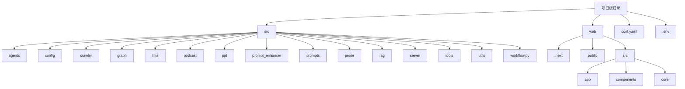

**Section sources**
- [src](file://src)
- [web](file://web)

## 核心组件
deer-flow 系统的核心组件包括协调器（Coordinator）、规划器（Planner）、研究团队（Research Team）和报告生成器（Reporter）。这些组件通过 LangGraph 框架进行通信和协作，形成一个高效的工作流。

**Section sources**
- [src/workflow.py](file://src/workflow.py)
- [src/graph/builder.py](file://src/graph/builder.py)
- [src/graph/nodes.py](file://src/graph/nodes.py)

## 架构概述
deer-flow 系统采用模块化的多智能体系统架构，基于 LangGraph 实现灵活的状态驱动工作流。系统通过消息传递机制实现组件间的通信，确保各组件能够高效协作。新增的增强日志系统覆盖全模块，提供详细的运行时信息追踪。

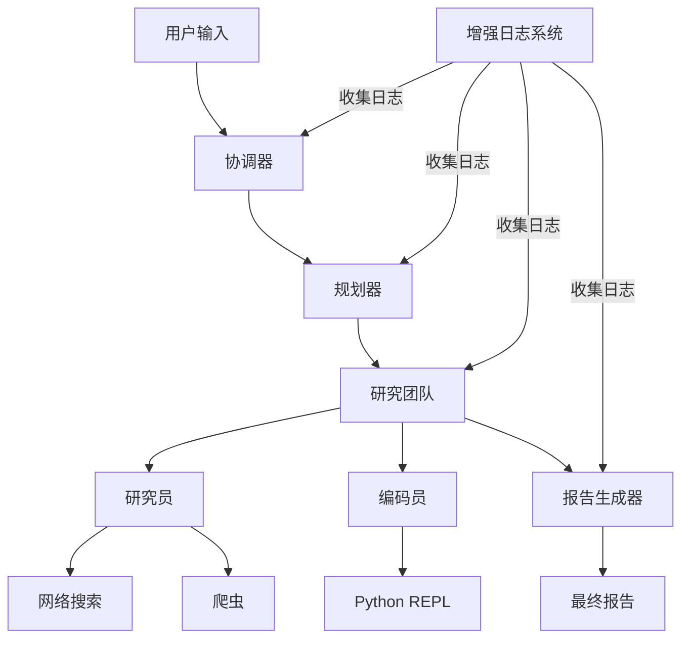

**Diagram sources**
- [src/graph/builder.py](file://src/graph/builder.py)
- [src/graph/nodes.py](file://src/graph/nodes.py)
- [ENHANCED_LOGGING.md](file://ENHANCED_LOGGING.md)

**Section sources**
- [src/graph/builder.py](file://src/graph/builder.py)
- [src/graph/nodes.py](file://src/graph/nodes.py)

## 详细组件分析
### 协调器分析
协调器是系统的入口点，负责管理工作流的生命周期。它接收用户输入并根据需要将任务委托给规划器。根据最新的代码变更，协调器的API接口已重构，简化了研究流式接口。

#### 对于对象导向组件：
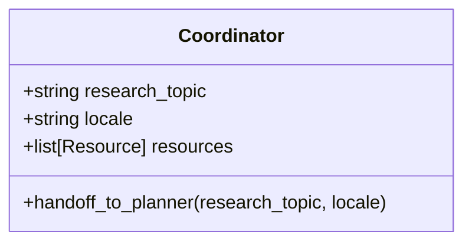

**Diagram sources**
- [src/graph/nodes.py](file://src/graph/nodes.py#L100-L120)

#### 对于API/服务组件：
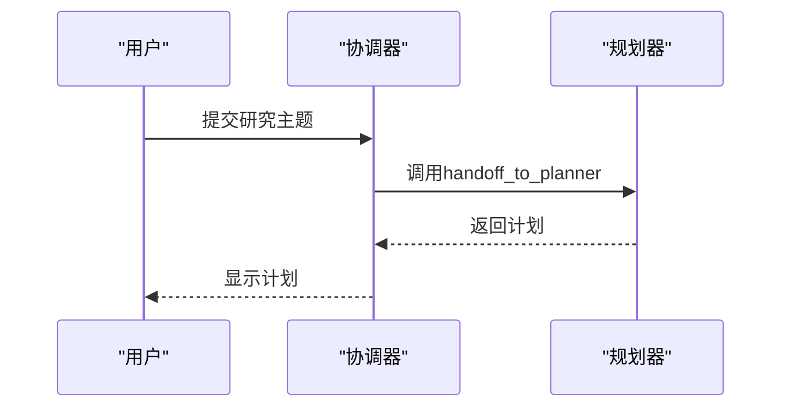

**Diagram sources**
- [src/graph/nodes.py](file://src/graph/nodes.py#L100-L120)
- [src/server/app.py](file://src/server/app.py#L1-L200) - *API接口重构*

**Section sources**
- [src/graph/nodes.py](file://src/graph/nodes.py#L100-L120)
- [src/server/app.py](file://src/server/app.py#L1-L200)

### 规划器分析
规划器负责分析研究目标并创建结构化的执行计划。它确定是否已有足够的上下文信息，或者是否需要进一步的研究。

#### 对于对象导向组件：
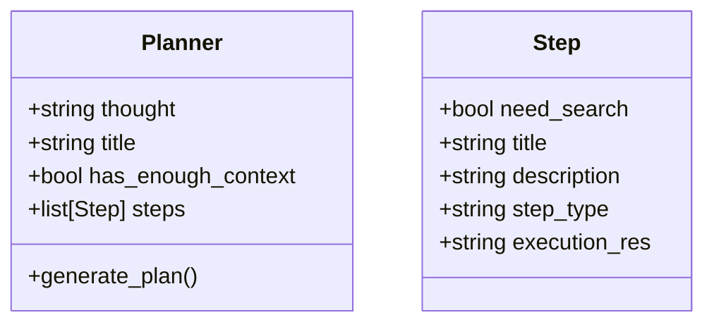

**Diagram sources**
- [src/prompts/planner_model.py](file://src/prompts/planner_model.py)
- [src/graph/nodes.py](file://src/graph/nodes.py#L122-L150)

#### 对于复杂逻辑组件：
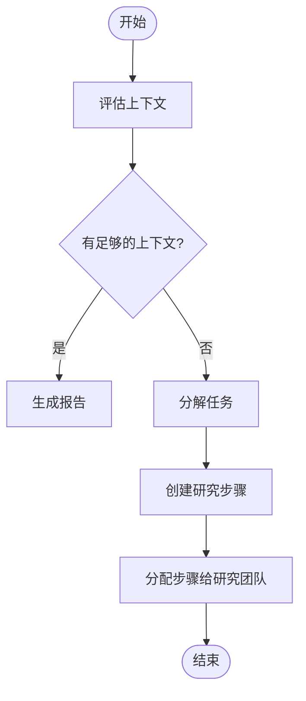

**Diagram sources**
- [src/graph/nodes.py](file://src/graph/nodes.py#L122-L150)

**Section sources**
- [src/graph/nodes.py](file://src/graph/nodes.py#L122-L150)

### 研究团队分析
研究团队由多个专业代理组成，包括研究员和编码员，它们执行规划器制定的计划。

#### 对于对象导向组件：
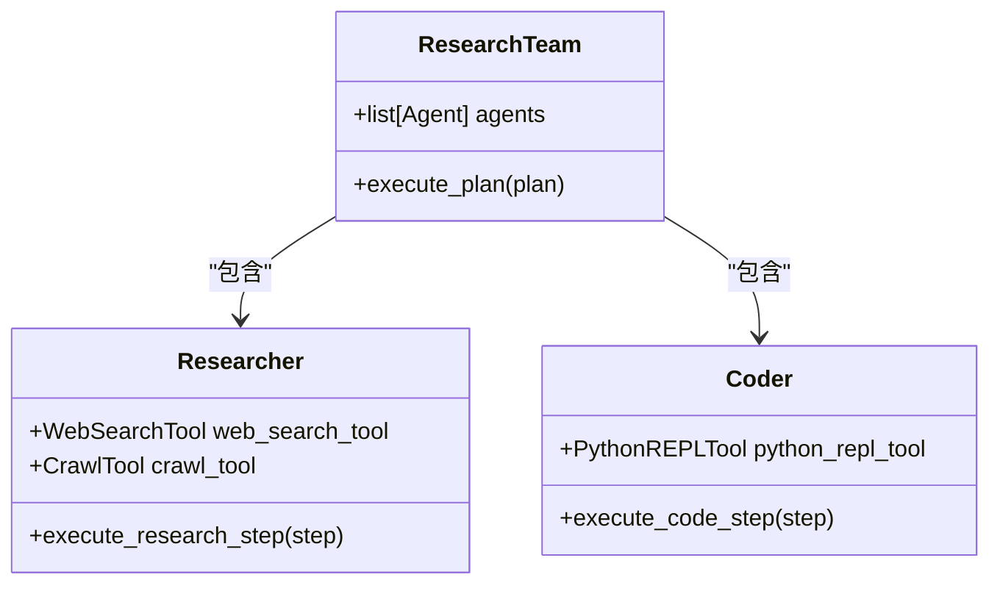

**Diagram sources**
- [src/graph/nodes.py](file://src/graph/nodes.py#L200-L250)
- [src/tools/search.py](file://src/tools/search.py)
- [src/tools/python_repl.py](file://src/tools/python_repl.py)

#### 对于API/服务组件：
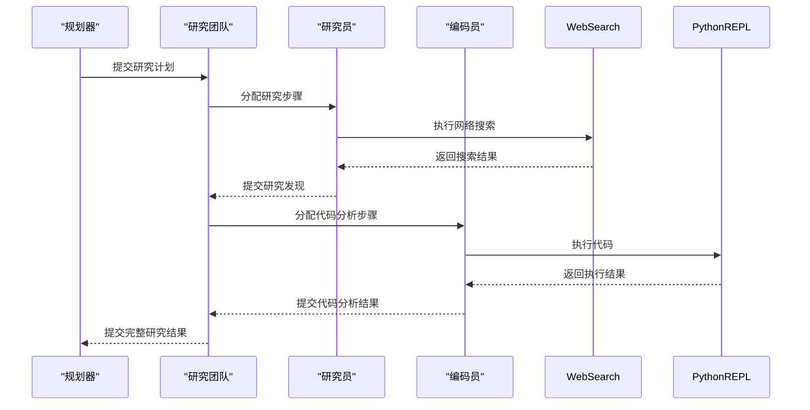

**Diagram sources**
- [src/graph/nodes.py](file://src/graph/nodes.py#L200-L250)

**Section sources**
- [src/graph/nodes.py](file://src/graph/nodes.py#L200-L250)

### 报告生成器分析
报告生成器负责聚合研究团队的发现，处理和结构化收集到的信息，并生成全面的研究报告。

#### 对于对象导向组件：
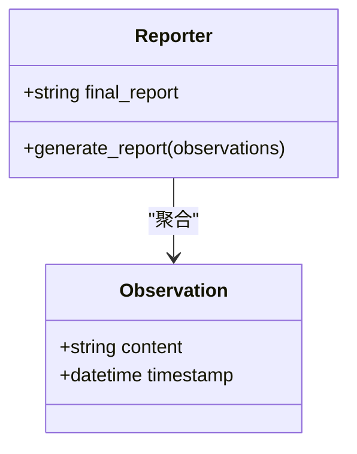

**Diagram sources**
- [src/graph/nodes.py](file://src/graph/nodes.py#L180-L200)

#### 对于复杂逻辑组件：
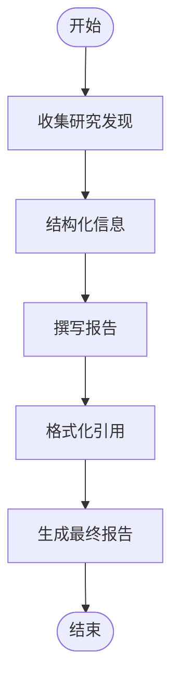

**Diagram sources**
- [src/graph/nodes.py](file://src/graph/nodes.py#L180-L200)

**Section sources**
- [src/graph/nodes.py](file://src/graph/nodes.py#L180-L200)

## 多智能体协作模式
deer-flow 系统采用多智能体协作模式，通过协调器、规划器、研究团队和报告生成器之间的协作来实现复杂任务的分解与执行。每个智能体都有特定的角色和职责，通过消息传递机制进行通信和协作。

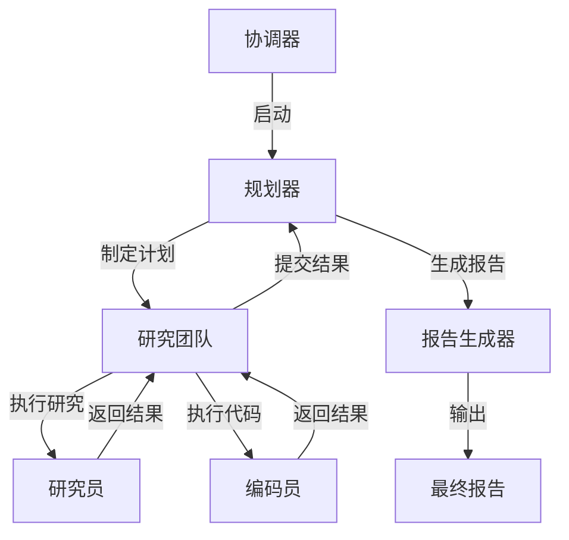

**Diagram sources**
- [src/graph/builder.py](file://src/graph/builder.py)
- [src/graph/nodes.py](file://src/graph/nodes.py)

**Section sources**
- [src/graph/builder.py](file://src/graph/builder.py)
- [src/graph/nodes.py](file://src/graph/nodes.py)

## 主要功能
deer-flow 系统支持多种主要功能，包括检索增强生成（RAG）、网络爬虫、报告/播客/PPT内容生成等。

### 检索增强生成（RAG）
系统通过RAG技术增强语言模型的生成能力，利用外部知识库提供更准确的信息。

### 网络爬虫
集成网络爬虫功能，能够从指定网页提取结构化内容。

### 内容生成
支持生成多种格式的内容，包括研究报告、播客脚本和PPT演示文稿。

### 增强日志系统
新增的增强日志系统覆盖全模块，提供详细的运行时信息追踪，便于调试和性能分析。

**Section sources**
- [ENHANCED_LOGGING.md](file://ENHANCED_LOGGING.md)
- [src/utils/enhanced_logger.py](file://src/utils/enhanced_logger.py)

## 系统启动流程
系统启动流程包括以下步骤：
1. 加载配置文件 `conf.yaml`
2. 初始化LLM客户端
3. 启动API服务器（server.py）
4. 建立工作流引擎（workflow.py）
5. 初始化各智能体组件
6. 启动增强日志系统
7. 监听用户请求

API接口已重构，简化了研究流式接口，提高了系统的响应效率。

**Section sources**
- [main.py](file://main.py)
- [server.py](file://server.py)
- [src/server/app.py](file://src/server/app.py) - *API接口重构*
- [ENHANCED_LOGGING.md](file://ENHANCED_LOGGING.md)

## 配置文件作用
`conf.yaml` 是系统的核心配置文件，主要作用包括：
- 配置LLM模型参数（基础模型和推理模型）
- 设置搜索引擎（如Tavily）的域名过滤规则
- 定义自定义搜索仓库
- 配置系统运行参数

**Section sources**
- [conf.yaml](file://conf.yaml)
- [src/config/loader.py](file://src/config/loader.py)

## 组件集成方式
系统各组件通过以下方式集成：
- 使用LangGraph构建状态驱动的工作流
- 通过Python模块导入实现组件间调用
- 利用配置文件统一管理各组件参数
- 通过API接口实现前后端通信
- 使用增强日志系统统一收集各组件日志

**Section sources**
- [src/workflow.py](file://src/workflow.py)
- [src/graph/builder.py](file://src/graph/builder.py)
- [src/server/app.py](file://src/server/app.py)

## 系统架构图
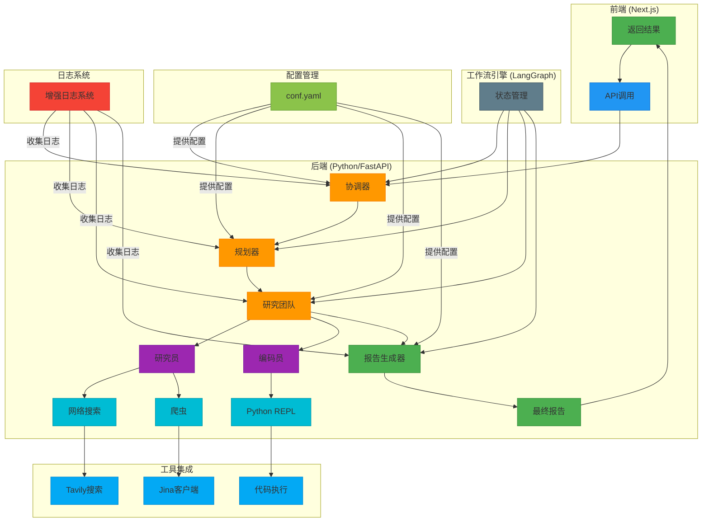

**Diagram sources**
- [src/graph/builder.py](file://src/graph/builder.py)
- [src/server/app.py](file://src/server/app.py)
- [ENHANCED_LOGGING.md](file://ENHANCED_LOGGING.md)

## 增强日志系统
增强日志系统是deer-flow的最新特性，覆盖全模块，提供详细的运行时信息追踪。该系统能够记录各智能体的决策过程、工具调用详情和系统性能指标，极大地方便了调试和优化工作。

**Section sources**
- [ENHANCED_LOGGING.md](file://ENHANCED_LOGGING.md)
- [src/utils/enhanced_logger.py](file://src/utils/enhanced_logger.py)
- [src/server/app.py](file://src/server/app.py)