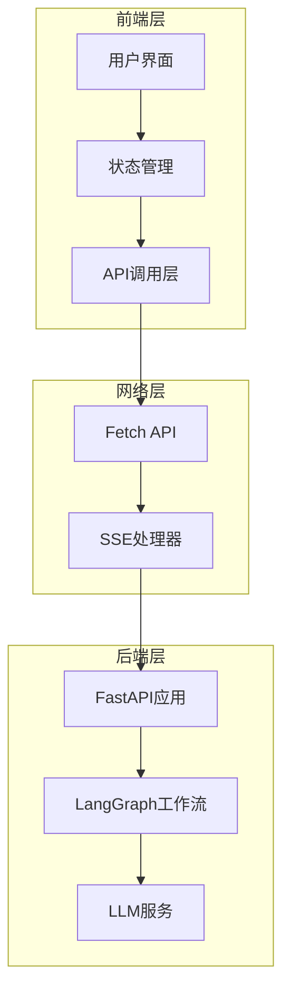
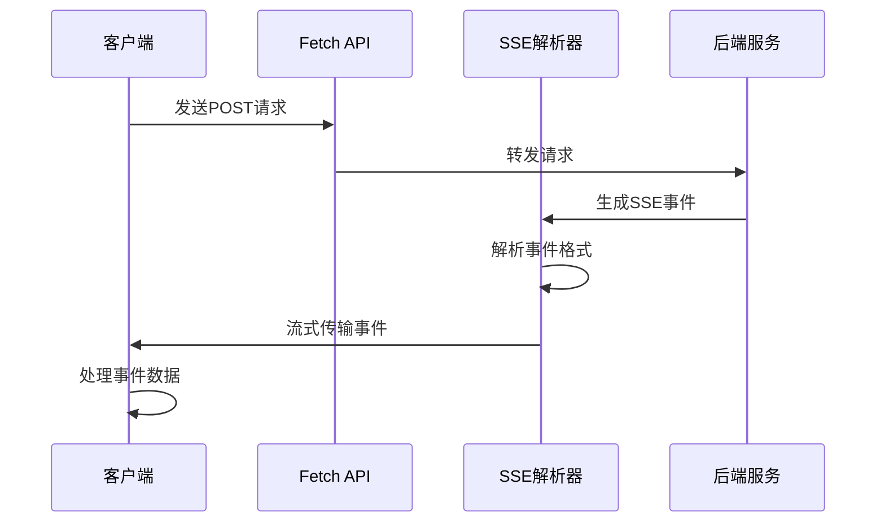

# 聊天API

<cite>
**本文档引用的文件**
- [chat.ts](file://web/src/core/api/chat.ts)
- [fetch-stream.ts](file://web/src/core/sse/fetch-stream.ts)
- [StreamEvent.ts](file://web/src/core/sse/StreamEvent.ts)
- [types.ts](file://web/src/core/api/types.ts)
- [chat_request.py](file://src/server/chat_request.py)
- [app.py](file://src/server/app.py)
- [messages-block.tsx](file://web/src/app/chat/components/messages-block.tsx)
- [input-box.tsx](file://web/src/app/chat/components/input-box.tsx)
- [store.ts](file://web/src/core/store/store.ts)
- [test_chat_request.py](file://tests/unit/server/test_chat_request.py)
- [env.js](file://web/src/env.js)
- [demo_stream_client.py](file://demo_stream_client.py) - *新增于最近提交*
</cite>

## 更新摘要
**已更改内容**
- 更新了核心数据模型部分，添加了`SimpleResearchRequest`和`SimpleResearchResponse`模型
- 新增了简化研究流式接口部分，详细描述了`/api/research/simple/stream`和`/api/research/simple/stream/openai`端点
- 更新了API端点详细分析部分，添加了新的API端点
- 更新了完整使用示例部分，添加了新的curl示例
- 更新了项目架构概览图表，反映了新的API端点

## 目录
1. [简介](#简介)
2. [项目架构概览](#项目架构概览)
3. [核心数据模型](#核心数据模型)
4. [API端点详细分析](#api端点详细分析)
5. [流式响应实现](#流式响应实现)
6. [前端集成](#前端集成)
7. [错误处理机制](#错误处理机制)
8. [完整使用示例](#完整使用示例)
9. [性能优化建议](#性能优化建议)
10. [故障排除指南](#故障排除指南)

## 简介

DeerFlow聊天API是一个基于流式服务器发送事件(SSE)的实时对话系统，支持多轮对话、工具调用和智能研究功能。该API设计用于提供流畅的用户体验，通过实时流式响应技术实现实时消息传递。最近的更新引入了简化研究流式接口，提供了更直接的研究功能访问。

## 项目架构概览



**图表来源**
- [chat.ts](file://web/src/core/api/chat.ts#L1-L198)
- [fetch-stream.ts](file://web/src/core/sse/fetch-stream.ts#L1-L74)
- [app.py](file://src/server/app.py#L1-L1047)

## 核心数据模型

### ChatRequest模型

`ChatRequest`是聊天API的核心数据模型，定义了所有可配置的参数：

```typescript
interface ChatRequest {
  messages: ChatMessage[];
  resources?: Resource[];
  debug?: boolean;
  thread_id?: string;
  max_plan_iterations?: number;
  max_step_num?: number;
  max_search_results?: number;
  search_engine?: string;
  custom_search_repository?: string;
  auto_accepted_plan?: boolean;
  interrupt_feedback?: string;
  mcp_settings?: object;
  enable_background_investigation?: boolean;
  report_style?: ReportStyle;
  enable_deep_thinking?: boolean;
}
```

### 消息模型

```typescript
interface ChatMessage {
  role: "user" | "assistant";
  content: string | ContentItem[];
}

interface ContentItem {
  type: "text" | "image";
  text?: string;
  image_url?: string;
}
```

### 流事件模型

```typescript
interface StreamEvent {
  event: string;
  data: string;
}

type ChatEvent = 
  | MessageChunkEvent
  | ToolCallsEvent
  | ToolCallChunksEvent
  | ToolCallResultEvent
  | InterruptEvent;
```

### SimpleResearchRequest模型

`SimpleResearchRequest`是简化研究API的请求数据模型，与`ChatRequest`具有相同的参数配置：

```python
class SimpleResearchRequest(BaseModel):
    """简化研究请求模型 - 直接使用 LangGraph 工作流，参数可定制"""
    messages: List[Dict[str, str]] = Field(..., description="对话消息列表，OpenAI格式")
    
    # === 与 /api/chat/stream 完全一致的参数配置 ===
    resources: Optional[List[Resource]] = Field([], description="资源列表")
    debug: Optional[bool] = Field(False, description="是否启用调试日志")
    thread_id: Optional[str] = Field("__default__", description="会话标识符")
    max_plan_iterations: Optional[int] = Field(1, description="最大计划迭代次数")
    max_step_num: Optional[int] = Field(3, description="计划中的最大步骤数")
    max_search_results: Optional[int] = Field(3, description="最大搜索结果数")
    search_engine: Optional[str] = Field("custom_search", description="搜索引擎 (tavily, duckduckgo, brave_search, arxiv, wikipedia, custom_search)")
    custom_search_repository: Optional[str] = Field(None, description="自定义搜索仓库ID")
    auto_accepted_plan: Optional[bool] = Field(False, description="是否自动接受计划")
    interrupt_feedback: Optional[str] = Field(None, description="用户对计划的中断反馈")
    mcp_settings: Optional[dict] = Field(None, description="MCP设置")
    enable_background_investigation: Optional[bool] = Field(True, description="是否启用背景调研")
    report_style: Optional[ReportStyle] = Field(ReportStyle.ACADEMIC, description="报告风格")
    enable_deep_thinking: Optional[bool] = Field(False, description="是否启用深度思考")
```

### SimpleResearchResponse模型

`SimpleResearchResponse`是简化研究API的响应数据模型，符合OpenAI标准格式：

```python
class SimpleResearchResponse(BaseModel):
    id: str = Field(..., description="对话的唯一标识符")
    object: str = Field("chat.completion", description="对象类型，固定为 'chat.completion'")
    created: int = Field(..., description="创建时间的 Unix 时间戳（秒）")
    model: str = Field(..., description="生成响应的模型名称")
    choices: List[ChatCompletionChoice] = Field(..., description="模型生成的选择项列表")

    sources: List[str] = Field(default_factory=list, description="参考来源")
    is_complete: bool = Field(True, description="是否完成回答")
    execution_time: float = Field(..., description="执行时间(秒)")
    thinking_steps: Optional[int] = Field(0, description="实际思考步骤数")
    # 新增plan相关字段
    research_plan: Optional[Dict[str, Any]] = Field(None, description="研究计划详情")
    plan_generated: Optional[bool] = Field(False, description="是否生成了计划")
```

**章节来源**
- [chat_request.py](file://src/server/chat_request.py#L29-L72) - *更新于最近提交*
- [types.ts](file://web/src/core/api/types.ts#L1-L85)
- [chat_request.py](file://src/server/chat_request.py#L117-L135) - *新增于最近提交*
- [chat_request.py](file://src/server/chat_request.py#L152-L165) - *新增于最近提交*

## API端点详细分析

### POST /api/chat/stream

这是主要的聊天流式API端点，负责处理用户的聊天请求并返回实时流式响应。

#### 请求体结构

```python
class ChatRequest(BaseModel):
    messages: Optional[List[ChatMessage]] = Field([], description="历史消息记录")
    resources: Optional[List[Resource]] = Field([], description="研究资源")
    debug: Optional[bool] = Field(False, description="是否启用调试日志")
    thread_id: Optional[str] = Field("__default__", description="特定对话标识符")
    max_plan_iterations: Optional[int] = Field(1, description="最大计划迭代次数")
    max_step_num: Optional[int] = Field(3, description="计划中的最大步骤数")
    max_search_results: Optional[int] = Field(3, description="最大搜索结果数")
    search_engine: Optional[str] = Field("custom_search", description="搜索引擎类型")
    custom_search_repository: Optional[str] = Field(None, description="自定义搜索仓库ID")
    auto_accepted_plan: Optional[bool] = Field(False, description="是否自动接受计划")
    interrupt_feedback: Optional[str] = Field(None, description="用户对计划的反馈")
    mcp_settings: Optional[dict] = Field(None, description="MCP设置")
    enable_background_investigation: Optional[bool] = Field(True, description="是否进行背景调查")
    report_style: Optional[ReportStyle] = Field(ReportStyle.ACADEMIC, description="报告风格")
    enable_deep_thinking: Optional[bool] = Field(False, description="是否启用深度思考")
```

#### 响应格式

API使用SSE格式返回流式响应：

```javascript
// 示例SSE响应格式
event: message_chunk
data: {"id":"msg_123","thread_id":"thread_456","agent":"coordinator","role":"assistant","content":"你好"}

event: tool_calls
data: {"id":"msg_123","thread_id":"thread_456","agent":"researcher","role":"assistant","tool_calls":[{"id":"call_789","name":"search","args":{"query":"人工智能"}}],"tool_call_chunks":[]}

event: tool_call_result
data: {"id":"msg_123","thread_id":"thread_456","agent":"researcher","role":"assistant","tool_call_id":"call_789","content":"搜索结果摘要"}
```

### POST /api/research/simple/stream

这是新的简化研究流式API端点，直接使用完整的LangGraph工作流，支持参数定制。

#### 请求体结构

```python
class SimpleResearchRequest(BaseModel):
    messages: List[Dict[str, str]] = Field(..., description="对话消息列表，OpenAI格式")
    resources: Optional[List[Resource]] = Field([], description="资源列表")
    debug: Optional[bool] = Field(False, description="是否启用调试日志")
    thread_id: Optional[str] = Field("__default__", description="会话标识符")
    max_plan_iterations: Optional[int] = Field(1, description="最大计划迭代次数")
    max_step_num: Optional[int] = Field(3, description="计划中的最大步骤数")
    max_search_results: Optional[int] = Field(3, description="最大搜索结果数")
    search_engine: Optional[str] = Field("custom_search", description="搜索引擎 (tavily, duckduckgo, brave_search, arxiv, wikipedia, custom_search)")
    custom_search_repository: Optional[str] = Field(None, description="自定义搜索仓库ID")
    auto_accepted_plan: Optional[bool] = Field(False, description="是否自动接受计划")
    interrupt_feedback: Optional[str] = Field(None, description="用户对计划的中断反馈")
    mcp_settings: Optional[dict] = Field(None, description="MCP设置")
    enable_background_investigation: Optional[bool] = Field(True, description="是否启用背景调研")
    report_style: Optional[ReportStyle] = Field(ReportStyle.ACADEMIC, description="报告风格")
    enable_deep_thinking: Optional[bool] = Field(False, description="是否启用深度思考")
```

#### 响应格式

API使用SSE格式返回流式响应，与`/api/chat/stream`端点保持一致：

```javascript
// 示例SSE响应格式
event: message_chunk
data: {"id":"msg_123","thread_id":"thread_456","agent":"coordinator","role":"assistant","content":"你好"}

event: tool_calls
data: {"id":"msg_123","thread_id":"thread_456","agent":"researcher","role":"assistant","tool_calls":[{"id":"call_789","name":"search","args":{"query":"人工智能"}}],"tool_call_chunks":[]}

event: tool_call_result
data: {"id":"msg_123","thread_id":"thread_456","agent":"researcher","role":"assistant","tool_call_id":"call_789","content":"搜索结果摘要"}
```

### POST /api/research/simple/stream/openai

这是OpenAI格式的简化研究流式API端点，返回符合OpenAI标准的SSE流式响应。

#### 请求体结构

与`/api/research/simple/stream`端点相同，使用`SimpleResearchRequest`模型。

#### 响应格式

API返回符合OpenAI chat.completion.chunk格式的流式响应：

```javascript
// 示例OpenAI格式SSE响应
data: {"id":"chatcmpl-123","object":"chat.completion.chunk","created":1735689600,"model":"deer-flow-research","choices":[{"index":0,"delta":{"role":"assistant"},"finish_reason":null}]}

data: {"id":"chatcmpl-123","object":"chat.completion.chunk","created":1735689600,"model":"deer-flow-research","choices":[{"index":0,"delta":{"content":"你好"},"finish_reason":null}]}

data: {"id":"chatcmpl-123","object":"chat.completion.chunk","created":1735689600,"model":"deer-flow-research","choices":[{"index":0,"delta":{},"finish_reason":"stop"}]}
```

**章节来源**
- [app.py](file://src/server/app.py#L80-L120)
- [chat_request.py](file://src/server/chat_request.py#L25-L70)
- [app.py](file://src/server/app.py#L682-L725) - *新增于最近提交*
- [app.py](file://src/server/app.py#L729-L773) - *新增于最近提交*

## 流式响应实现

### 前端流式处理

前端使用`fetchStream`函数处理SSE响应：

```typescript
export async function* fetchStream(
  url: string,
  init: RequestInit,
): AsyncIterable<StreamEvent> {
  const response = await fetch(url, {
    method: "POST",
    headers: {
      "Content-Type": "application/json",
      "Cache-Control": "no-cache",
    },
    ...init,
  });
  
  if (response.status !== 200) {
    throw new Error(`Failed to fetch from ${url}: ${response.status}`);
  }
  
  const reader = response.body
    ?.pipeThrough(new TextDecoderStream())
    .getReader();
    
  if (!reader) {
    throw new Error("Response body is not readable");
  }
  
  let buffer = "";
  while (true) {
    const { done, value } = await reader.read();
    if (done) break;
    
    buffer += value;
    while (true) {
      const index = buffer.indexOf("\n\n");
      if (index === -1) break;
      
      const chunk = buffer.slice(0, index);
      buffer = buffer.slice(index + 2);
      const event = parseEvent(chunk);
      if (event) yield event;
    }
  }
}
```

### 后端流式生成

后端使用`StreamingResponse`和异步生成器实现流式响应：

```python
@app.post("/api/chat/stream")
async def chat_stream(request: ChatRequest):
    thread_id = request.thread_id
    if thread_id == "__default__":
        thread_id = str(uuid4())
    
    return StreamingResponse(
        _astream_workflow_generator(
            request.model_dump()["messages"],
            thread_id,
            request.resources,
            request.max_plan_iterations,
            request.max_step_num,
            request.max_search_results,
            request.search_engine,
            request.custom_search_repository,
            request.auto_accepted_plan,
            request.interrupt_feedback,
            request.mcp_settings if mcp_enabled else {},
            request.enable_background_investigation,
            request.report_style,
            request.enable_deep_thinking,
        ),
        media_type="text/event-stream",
    )
```

对于新的简化研究接口，后端使用`_direct_langgraph_generator`函数：

```python
@app.post("/api/research/simple/stream")
async def simple_research_stream(request: SimpleResearchRequest):
    """
    简化流式研究接口：直接使用完整的 LangGraph 工作流，支持参数定制
    
    - 移除双模式选择，统一使用 LangGraph 工作流
    - 支持与 /api/chat/stream 一致的完整功能
    - 保持所有参数可定制
    - 提供 SSE 实时事件流
    """
    # 生成唯一的对话 ID
    conversation_id = generate_conversation_id(model_prefix="streamcmpl")
    
    # 确保 thread_id 不为 None
    thread_id = request.thread_id
    if thread_id is None or thread_id == "__default__":
        thread_id = conversation_id
    
    enhanced_logger.set_session_context(
        session_id=conversation_id,
        user_query=request.messages[-1].get("content", "") if request.messages else ""
    )
    
    enhanced_logger.log_node_entry("simple_research_stream", {
        "conversation_id": conversation_id,
        "thread_id": thread_id,
        "messages_count": len(request.messages) if request.messages else 0,
        "max_search_results": request.max_search_results,
        "search_engine": request.search_engine,
        "enable_deep_thinking": request.enable_deep_thinking
    })
    
    # 直接使用 LangGraph 工作流
    return StreamingResponse(
        _direct_langgraph_generator(
            request=request,
            thread_id=thread_id
        ),
        media_type="text/event-stream",
        headers={
            "Cache-Control": "no-cache",
            "Connection": "keep-alive",
            "Access-Control-Allow-Origin": "*",
        }
    )
```

### 事件解析流程



**图表来源**
- [fetch-stream.ts](file://web/src/core/sse/fetch-stream.ts#L6-L47)
- [app.py](file://src/server/app.py#L80-L120)

**章节来源**
- [fetch-stream.ts](file://web/src/core/sse/fetch-stream.ts#L1-L74)
- [app.py](file://src/server/app.py#L80-L120)
- [app.py](file://src/server/app.py#L776-L836) - *新增于最近提交*

## 前端集成

### API调用方法

前端提供了`chatStream`函数来处理聊天请求：

```typescript
export async function* chatStream(
  userMessage: string,
  params: {
    thread_id: string;
    resources?: Array<Resource>;
    auto_accepted_plan: boolean;
    max_plan_iterations: number;
    max_step_num: number;
    max_search_results?: number;
    search_engine?: string;
    custom_search_repository?: string;
    interrupt_feedback?: string;
    enable_deep_thinking?: boolean;
    enable_background_investigation: boolean;
    report_style?: "academic" | "popular_science" | "news" | "social_media";
    mcp_settings?: {
      servers: Record<string, MCPServerMetadata & {
        enabled_tools: string[];
        add_to_agents: string[];
      }>;
    };
  },
  options: { abortSignal?: AbortSignal } = {},
) {
  if (
    env.NEXT_PUBLIC_STATIC_WEBSITE_ONLY ||
    location.search.includes("mock") ||
    location.search.includes("replay=")
  ) 
    return yield* chatReplayStream(userMessage, params, options);
  
  try {
    const stream = fetchStream(resolveServiceURL("chat/stream"), {
      body: JSON.stringify({
        messages: [{ role: "user", content: userMessage }],
        ...params,
      }),
      signal: options.abortSignal,
    });
    
    for await (const event of stream) {
      yield {
        type: event.event,
        data: JSON.parse(event.data),
      } as ChatEvent;
    }
  } catch (e) {
    console.error(e);
  }
}
```

### 状态管理

前端使用Zustand进行状态管理：

```typescript
export const useStore = create<{
  responding: boolean;
  threadId: string | undefined;
  messageIds: string[];
  messages: Map<string, Message>;
  researchIds: string[];
  researchPlanIds: Map<string, string>;
  researchReportIds: Map<string, string>;
  researchActivityIds: Map<string, string[]>;
  ongoingResearchId: string | null;
  openResearchId: string | null;

  appendMessage: (message: Message) => void;
  updateMessage: (message: Message) => void;
  updateMessages: (messages: Message[]) => void;
  openResearch: (researchId: string | null) => void;
  closeResearch: () => void;
  setOngoingResearch: (researchId: string | null) => void;
}>((set) => ({ /* ... */ }));
```

### 组件集成

```typescript
const handleSend = useCallback(
  async (message: string, options?: {
    interruptFeedback?: string;
    resources?: Array<Resource>;
  }) => {
    const abortController = new AbortController();
    abortControllerRef.current = abortController;
    try {
      await sendMessage(
        message,
        {
          interruptFeedback: options?.interruptFeedback ?? feedback?.option.value,
          resources: options?.resources,
        },
        {
          abortSignal: abortController.signal,
        },
      );
    } catch {}
  },
  [feedback],
);
```

**章节来源**
- [chat.ts](file://web/src/core/api/chat.ts#L17-L66)
- [store.ts](file://web/src/core/store/store.ts#L20-L60)
- [messages-block.tsx](file://web/src/app/chat/components/messages-block.tsx#L40-L60)

## 错误处理机制

### HTTP状态码

- **200 OK**: 成功的流式响应
- **400 Bad Request**: 请求参数无效
- **403 Forbidden**: MCP服务器配置被禁用
- **500 Internal Server Error**: 内部服务器错误

### 前端错误处理

```typescript
try {
  const stream = fetchStream(resolveServiceURL("chat/stream"), {
    body: JSON.stringify({
      messages: [{ role: "user", content: userMessage }],
      ...params,
    }),
    signal: options.abortSignal,
  });
  
  for await (const event of stream) {
    yield {
      type: event.event,
      data: JSON.parse(event.data),
    } as ChatEvent;
  }
} catch (e) {
  console.error(e);
}
```

### 后端错误处理

```python
async def _astream_workflow_generator(...):
    try:
        async for agent, _, event_data in graph_instance.astream(
            workflow_input,
            config=workflow_config,
            stream_mode=["messages", "updates"],
            subgraphs=True,
        ):
            if isinstance(event_data, dict):
                if "__interrupt__" in event_data:
                    yield _create_interrupt_event(thread_id, event_data)
                continue
            
            message_chunk, message_metadata = cast(
                tuple[BaseMessage, dict[str, Any]], event_data
            )
            
            async for event in _process_message_chunk(
                message_chunk, message_metadata, thread_id, agent
            ):
                yield event
    except Exception as e:
        logger.exception("Error during graph execution")
        yield _make_event(
            "error",
            {
                "thread_id": thread_id,
                "error": str(e),
            },
        )
```

**章节来源**
- [fetch-stream.ts](file://web/src/core/sse/fetch-stream.ts#L12-L15)
- [app.py](file://src/server/app.py#L350-L370)

## 完整使用示例

### curl示例

```bash
# 发送聊天请求并接收流式响应
curl -X POST "http://localhost:8000/api/chat/stream" \
  -H "Content-Type: application/json" \
  -d '{
    "messages": [
      {
        "role": "user",
        "content": "请帮我写一篇关于人工智能的文章"
      }
    ],
    "thread_id": "session_123",
    "max_plan_iterations": 2,
    "max_step_num": 3,
    "max_search_results": 5,
    "search_engine": "custom_search",
    "auto_accepted_plan": false,
    "enable_background_investigation": true,
    "report_style": "academic"
  }'

# 发送简化研究请求并接收流式响应
curl -X POST "http://localhost:8000/api/research/simple/stream" \
  -H "Content-Type: application/json" \
  -d '{
    "messages": [
      {
        "role": "user",
        "content": "什么是大语言模型？它有哪些应用？"
      }
    ],
    "max_search_results": 2,
    "search_engine": "custom_search",
    "enable_deep_thinking": false
  }'

# 发送简化研究请求并接收OpenAI格式的流式响应
curl -X POST "http://localhost:8000/api/research/simple/stream/openai" \
  -H "Content-Type: application/json" \
  -d '{
    "messages": [
      {
        "role": "user",
        "content": "量子计算的基本原理是什么？"
      }
    ],
    "max_search_results": 3,
    "search_engine": "tavily",
    "enable_deep_thinking": true
  }'
```

### JavaScript客户端示例

```javascript
import { chatStream } from '~/core/api';

async function sendChatMessage() {
  const message = "请帮我写一篇关于量子计算的文章";
  const params = {
    thread_id: "session_" + Date.now(),
    max_plan_iterations: 2,
    max_step_num: 3,
    max_search_results: 5,
    search_engine: "custom_search",
    auto_accepted_plan: false,
    enable_background_investigation: true,
    report_style: "academic"
  };

  try {
    const stream = chatStream(message, params);
    
    for await (const event of stream) {
      switch (event.type) {
        case "message_chunk":
          console.log("消息块:", event.data.content);
          break;
        case "tool_calls":
          console.log("工具调用:", event.data.tool_calls);
          break;
        case "tool_call_result":
          console.log("工具结果:", event.data.content);
          break;
        case "interrupt":
          console.log("需要中断:", event.data.options);
          break;
      }
    }
  } catch (error) {
    console.error("聊天出错:", error);
  }
}
```

### Python客户端示例

```python
import requests
import json

def send_chat_request():
    url = "http://localhost:8000/api/chat/stream"
    headers = {"Content-Type": "application/json"}
    
    data = {
        "messages": [
            {
                "role": "user",
                "content": "请帮我写一篇关于机器学习的文章"
            }
        ],
        "thread_id": "session_456",
        "max_plan_iterations": 1,
        "max_step_num": 3,
        "max_search_results": 3,
        "search_engine": "custom_search",
        "auto_accepted_plan": False,
        "enable_background_investigation": True,
        "report_style": "academic"
    }
    
    response = requests.post(url, headers=headers, json=data, stream=True)
    
    for line in response.iter_lines():
        if line.startswith(b'data: '):
            try:
                json_data = json.loads(line.decode('utf-8')[6:])
                print(json_data)
            except json.JSONDecodeError:
                continue

# 运行示例
send_chat_request()
```

## 性能优化建议

### 连接池配置

```python
# PostgreSQL连接池配置
connection_kwargs = {
    "autocommit": True,
    "row_factory": "dict_row",
    "prepare_threshold": 0,
}

async with AsyncConnectionPool(checkpoint_url, kwargs=connection_kwargs) as conn:
    checkpointer = AsyncPostgresSaver(conn)
    await checkpointer.setup()
```

### 缓存策略

```typescript
const replayCache = new Map<string, string>();

export async function fetchReplay(
  url: string,
  options: { abortSignal?: AbortSignal } = {},
) {
  if (replayCache.has(url)) {
    return replayCache.get(url)!;
  }
  
  const res = await fetch(url, { signal: options.abortSignal });
  if (!res.ok) {
    throw new Error(`Failed to fetch replay: ${res.statusText}`);
  }
  
  const text = await res.text();
  replayCache.set(url, text);
  return text;
}
```

### 并发控制

```typescript
// 使用AbortController控制并发请求
const abortController = new AbortController();
abortControllerRef.current = abortController;

try {
  await sendMessage(message, {}, {
    abortSignal: abortController.signal,
  });
} catch {
  // 处理取消操作
} finally {
  abortControllerRef.current = null;
}
```

## 故障排除指南

### 常见问题及解决方案

#### 1. CORS错误

**问题**: 浏览器阻止跨域请求
**解决方案**: 配置CORS中间件

```python
app.add_middleware(
    CORSMiddleware,
    allow_origins=["http://localhost:3000"],
    allow_credentials=True,
    allow_methods=["GET", "POST", "OPTIONS"],
    allow_headers=["*"],
)
```

#### 2. SSE连接断开

**问题**: 流式连接意外断开
**解决方案**: 实现重连机制

```typescript
async function* chatStreamWithRetry(userMessage: string, params: any) {
  let retryCount = 0;
  const maxRetries = 3;
  
  while (retryCount < maxRetries) {
    try {
      const stream = chatStream(userMessage, params);
      for await (const event of stream) {
        yield event;
      }
      break; // 成功完成，退出循环
    } catch (error) {
      retryCount++;
      if (retryCount >= maxRetries) {
        throw new Error(`Max retries reached: ${error}`);
      }
      await new Promise(resolve => setTimeout(resolve, 1000 * retryCount));
    }
  }
}
```

#### 3. 内存泄漏

**问题**: 长时间运行导致内存占用过高
**解决方案**: 及时清理资源

```typescript
useEffect(() => {
  return () => {
    // 清理AbortController
    if (abortControllerRef.current) {
      abortControllerRef.current.abort();
    }
    
    // 清理缓存
    replayCache.clear();
  };
}, []);
```

#### 4. MCP服务器配置

**问题**: MCP功能不可用
**解决方案**: 检查环境变量配置

```python
# 确保启用了MCP服务器配置
mcp_enabled = get_bool_env("ENABLE_MCP_SERVER_CONFIGURATION", False)

if request.mcp_settings and not mcp_enabled:
    raise HTTPException(
        status_code=403,
        detail="MCP server configuration is disabled. "
               "Set ENABLE_MCP_SERVER_CONFIGURATION=true to enable MCP features.",
    )
```

### 调试技巧

#### 启用调试模式

```python
# 在请求中添加debug参数
data = {
    "messages": [{"role": "user", "content": "测试消息"}],
    "debug": True,  # 启用调试日志
    "thread_id": "debug_session"
}
```

#### 前端调试

```typescript
// 添加调试日志
console.log("Sending chat request:", { message, params });
console.log("Received event:", event);
```

#### 日志配置

```python
import logging

logger = logging.getLogger(__name__)

# 在关键位置添加日志
logger.info(f"Processing message chunk: {message_chunk}")
logger.error(f"Error during graph execution: {e}")
```

**章节来源**
- [app.py](file://src/server/app.py#L50-L80)
- [store.ts](file://web/src/core/store/store.ts#L100-L150)