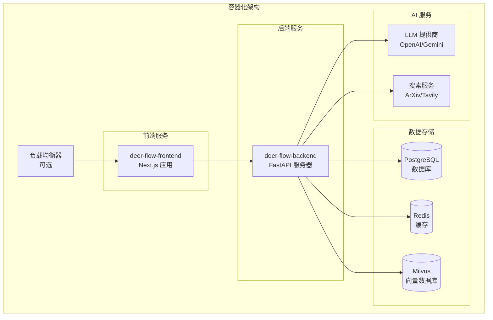
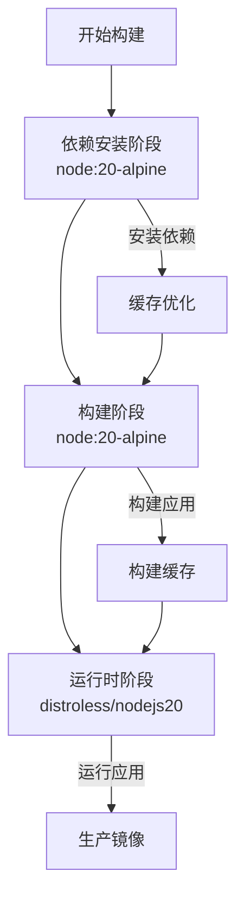
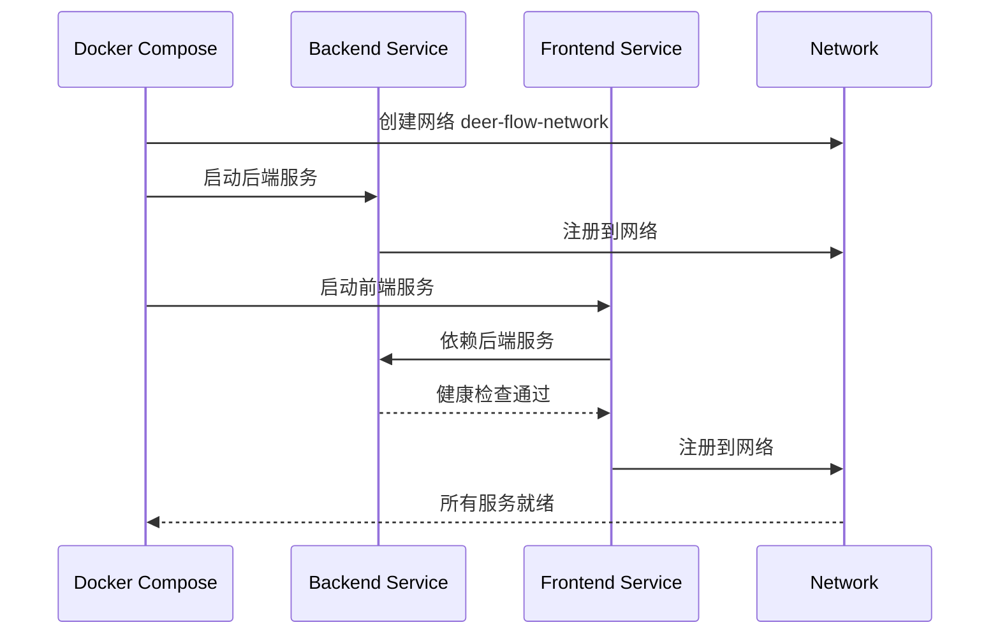
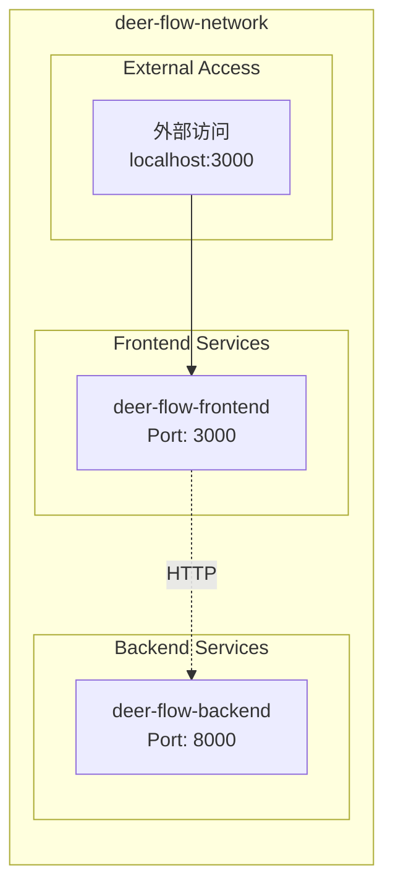

# DeerFlow 容器化部署指南

<cite>
**本文档中引用的文件**
- [Dockerfile](file://Dockerfile)
- [docker-compose.yml](file://docker-compose.yml)
- [web/Dockerfile](file://web/Dockerfile)
- [web/package.json](file://web/package.json)
- [web/next.config.js](file://web/next.config.js)
- [web/src/env.js](file://web/src/env.js)
- [main.py](file://main.py)
- [server.py](file://server.py)
- [pyproject.toml](file://pyproject.toml)
</cite>

## 目录
1. [简介](#简介)
2. [项目架构概览](#项目架构概览)
3. [后端服务容器化](#后端服务容器化)
4. [前端应用容器化](#前端应用容器化)
5. [Docker Compose 服务编排](#docker-compose-服务编排)
6. [网络配置与通信](#网络配置与通信)
7. [环境变量管理](#环境变量管理)
8. [构建与启动流程](#构建与启动流程)
9. [生产环境最佳实践](#生产环境最佳实践)
10. [故障排除指南](#故障排除指南)

## 简介

DeerFlow 是一个基于 Python 和 Next.js 的智能工作流系统，支持 AI 驱动的内容生成、数据分析和自动化任务处理。本指南详细介绍了如何使用 Docker 和 Docker Compose 将 DeerFlow 部署到容器环境中，包括多阶段构建策略、服务编排配置和生产环境优化。

## 项目架构概览

DeerFlow 采用前后端分离的微服务架构，主要包含以下组件：



**图表来源**
- [docker-compose.yml](file://docker-compose.yml#L1-L36)
- [web/Dockerfile](file://web/Dockerfile#L1-L56)

## 后端服务容器化

### 基础镜像选择

后端服务使用 `ghcr.io/astral-sh/uv:python3.12-bookworm` 作为基础镜像，该镜像集成了 UV 包管理器，提供了高效的 Python 依赖管理能力。

```dockerfile
FROM ghcr.io/astral-sh/uv:python3.12-bookworm
```

### 多阶段构建策略

后端 Dockerfile 实现了以下优化策略：

1. **系统依赖安装**：预安装 PostgreSQL 开发库
2. **依赖缓存**：利用 Docker 缓存机制加速构建
3. **应用安装**：分层安装应用依赖和代码

```dockerfile
# 系统依赖安装
RUN apt-get update && apt-get install -y \
    libpq-dev \
    && rm -rf /var/lib/apt/lists/*

# 工作目录设置
WORKDIR /app

# 依赖缓存优化
RUN --mount=type=cache,target=/root/.cache/uv \
    --mount=type=bind,source=uv.lock,target=uv.lock \
    --mount=type=bind,source=pyproject.toml,target=pyproject.toml \
    uv sync --locked --no-install-project

# 应用代码复制
COPY . /app

# 最终依赖安装
RUN --mount=type=cache,target=/root/.cache/uv \
    uv sync --locked
```

### 依赖管理优化

项目使用 UV 包管理器替代传统的 pip，具有以下优势：
- 更快的依赖解析速度
- 更好的缓存机制
- 支持 lock 文件锁定版本

**章节来源**
- [Dockerfile](file://Dockerfile#L1-L30)
- [pyproject.toml](file://pyproject.toml#L1-L91)

## 前端应用容器化

### 多阶段构建架构

前端应用采用三阶段构建策略，确保最终镜像的轻量化和安全性：



**图表来源**
- [web/Dockerfile](file://web/Dockerfile#L1-L56)

### 依赖安装阶段

```dockerfile
FROM node:20-alpine AS deps
RUN apk add --no-cache libc6-compat openssl
WORKDIR /app

# 根据包管理器自动选择安装方式
COPY package.json yarn.lock* package-lock.json* pnpm-lock.yaml\* ./
RUN \
    if [ -f yarn.lock ]; then yarn --frozen-lockfile; \
    elif [ -f package-lock.json ]; then npm ci; \
    elif [ -f pnpm-lock.yaml ]; then npm install -g pnpm && pnpm i; \
    else echo "Lockfile not found." && exit 1; \
    fi
```

### 构建阶段

```dockerfile
FROM node:20-alpine AS builder
WORKDIR /app
ARG NEXT_PUBLIC_API_URL
COPY --from=deps /app/node_modules ./node_modules
COPY . .

ENV NEXT_TELEMETRY_DISABLED=1

# 生产构建优化
RUN \
    if [ -f yarn.lock ]; then SKIP_ENV_VALIDATION=1 yarn build; \
    elif [ -f package-lock.json ]; then SKIP_ENV_VALIDATION=1 npm run build; \
    elif [ -f pnpm-lock.yaml ]; then npm install -g pnpm && SKIP_ENV_VALIDATION=1 pnpm run build; \
    else echo "Lockfile not found." && exit 1; \
    fi
```

### 运行时阶段

```dockerfile
FROM gcr.io/distroless/nodejs20-debian12 AS runner
WORKDIR /app

ENV NODE_ENV=production
ENV NEXT_TELEMETRY_DISABLED=1

# 复制构建产物
COPY --from=builder /app/next.config.js ./
COPY --from=builder /app/public ./public
COPY --from=builder /app/package.json ./package.json

COPY --from=builder /app/.next/standalone ./
COPY --from=builder /app/.next/static ./.next/static

EXPOSE 3000
ENV PORT=3000

CMD ["server.js"]
```

### 性能优化特性

1. **Telemetry 禁用**：减少不必要的网络请求
2. **环境验证跳过**：在 Docker 环境中禁用环境验证
3. **Standalone 模式**：使用独立模式部署，无需 Node.js 运行时
4. **Distroless 基础镜像**：最小化攻击面

**章节来源**
- [web/Dockerfile](file://web/Dockerfile#L1-L56)
- [web/package.json](file://web/package.json#L1-L117)
- [web/next.config.js](file://web/next.config.js#L1-L46)

## Docker Compose 服务编排

### 服务配置详解

Docker Compose 文件定义了两个核心服务：后端 API 服务和前端 Web 应用。

```yaml
services:
  backend:
    build:
      context: .
      dockerfile: Dockerfile
    container_name: deer-flow-backend
    env_file:
      - .env
    volumes:
      - ./conf.yaml:/app/conf.yaml:ro
    restart: unless-stopped
    networks:
      - deer-flow-network

  frontend:
    build:
      context: ./web
      dockerfile: Dockerfile
      args:
        - NEXT_PUBLIC_API_URL=$NEXT_PUBLIC_API_URL
    container_name: deer-flow-frontend
    ports:
      - "3000:3000"
    env_file:
      - .env
    depends_on:
      - backend
    restart: unless-stopped
    networks:
      - deer-flow-network
```

### 服务依赖关系



**图表来源**
- [docker-compose.yml](file://docker-compose.yml#L1-L36)

### 卷挂载策略

1. **配置文件挂载**：只读挂载配置文件
2. **代码热重载**：开发环境下的代码挂载
3. **数据持久化**：数据库和缓存的数据卷

### 重启策略

所有服务都配置了 `unless-stopped` 重启策略，确保容器在异常退出时自动重启，但在手动停止时不自动重启。

**章节来源**
- [docker-compose.yml](file://docker-compose.yml#L1-L36)

## 网络配置与通信

### 自定义网络配置

```yaml
networks:
  deer-flow-network:
    driver: bridge
```

### 容器间通信机制

1. **服务发现**：通过服务名称进行内部通信
2. **端口映射**：前端暴露 3000 端口，后端使用默认 8000 端口
3. **网络隔离**：所有服务都在同一个桥接网络中



**图表来源**
- [docker-compose.yml](file://docker-compose.yml#L28-L36)

### 健康检查配置

虽然当前配置中没有显式的健康检查，但建议在生产环境中添加：

```yaml
healthcheck:
  test: ["CMD", "curl", "-f", "http://localhost:8000/health"]
  interval: 30s
  timeout: 10s
  retries: 3
  start_period: 40s
```

## 环境变量管理

### 前端环境变量

前端应用使用 Zod 进行严格的环境变量验证：

```javascript
export const env = createEnv({
  server: {
    NODE_ENV: z.enum(["development", "test", "production"]),
    AMPLITUDE_API_KEY: z.string().optional(),
    GITHUB_OAUTH_TOKEN: z.string().optional(),
  },
  client: {
    NEXT_PUBLIC_API_URL: z.string().optional(),
    NEXT_PUBLIC_STATIC_WEBSITE_ONLY: z.boolean().optional(),
  },
  runtimeEnv: {
    NODE_ENV: process.env.NODE_ENV,
    NEXT_PUBLIC_API_URL: process.env.NEXT_PUBLIC_API_URL,
    NEXT_PUBLIC_STATIC_WEBSITE_ONLY: process.env.NEXT_PUBLIC_STATIC_WEBSITE_ONLY === "true",
    AMPLITUDE_API_KEY: process.env.AMPLITUDE_API_KEY,
    GITHUB_OAUTH_TOKEN: process.env.GITHUB_OAUTH_TOKEN,
  },
});
```

### 后端环境变量

后端服务通过 `.env` 文件管理环境变量，支持以下配置：

- 数据库连接字符串
- API 密钥和认证信息
- 日志级别配置
- 功能开关和实验性功能

### 环境变量传递

```yaml
frontend:
  build:
    args:
      - NEXT_PUBLIC_API_URL=$NEXT_PUBLIC_API_URL
```

这种配置允许在构建时动态传递环境变量，实现灵活的部署配置。

**章节来源**
- [web/src/env.js](file://web/src/env.js#L1-L51)

## 构建与启动流程

### 构建命令

```bash
# 构建所有服务
docker-compose build

# 只构建特定服务
docker-compose build backend
docker-compose build frontend

# 使用缓存构建
docker-compose build --no-cache
```

### 启动命令

```bash
# 后台启动
docker-compose up -d

# 查看日志
docker-compose logs -f

# 停止服务
docker-compose down

# 清理资源
docker-compose down --volumes --remove-orphans
```

### 开发环境启动

```bash
# 开发模式启动
docker-compose -f docker-compose.yml -f docker-compose.dev.yml up

# 热重载开发
docker-compose up --force-recreate --build
```

### 生产环境启动

```bash
# 生产环境启动
docker-compose -f docker-compose.yml -f docker-compose.prod.yml up -d

# 监控容器状态
docker-compose ps
```

## 生产环境最佳实践

### 镜像安全加固

1. **非特权用户运行**
```dockerfile
# 在 Dockerfile 中添加
USER node
```

2. **最小化权限**
```dockerfile
# 移除不必要的包和文件
RUN apk del --no-cache build-dependencies
```

3. **镜像扫描**
```bash
# 使用 Trivy 进行漏洞扫描
trivy image deer-flow-frontend:latest
trivy image deer-flow-backend:latest
```

### 资源限制配置

```yaml
services:
  backend:
    deploy:
      resources:
        limits:
          memory: 1G
          cpus: '1.0'
        reservations:
          memory: 512M
          cpus: '0.5'
          
  frontend:
    deploy:
      resources:
        limits:
          memory: 512M
          cpus: '0.5'
        reservations:
          memory: 256M
          cpus: '0.25'
```

### 监控和日志管理

```yaml
services:
  backend:
    logging:
      driver: "json-file"
      options:
        max-size: "10m"
        max-file: "3"
        labels: "service=backend"
        
  frontend:
    logging:
      driver: "json-file"
      options:
        max-size: "10m"
        max-file: "3"
        labels: "service=frontend"
```

### 健康检查和监控

```yaml
services:
  backend:
    healthcheck:
      test: ["CMD", "curl", "-f", "http://localhost:8000/health"]
      interval: 30s
      timeout: 10s
      retries: 3
      start_period: 40s
      
  frontend:
    healthcheck:
      test: ["CMD", "curl", "-f", "http://localhost:3000"]
      interval: 30s
      timeout: 10s
      retries: 3
      start_period: 30s
```

### 数据备份和恢复

```yaml
services:
  database:
    volumes:
      - db_data:/var/lib/postgresql/data
      - ./backups:/backups:ro
      
volumes:
  db_data:
```

## 故障排除指南

### 常见问题诊断

1. **容器启动失败**
```bash
# 查看容器日志
docker-compose logs backend
docker-compose logs frontend

# 检查容器状态
docker-compose ps

# 进入容器调试
docker-compose exec backend bash
```

2. **网络连接问题**
```bash
# 测试容器间网络连通性
docker-compose exec frontend ping deer-flow-backend

# 检查端口占用
netstat -tulpn | grep :8000
netstat -tulpn | grep :3000
```

3. **内存不足**
```bash
# 查看系统资源使用
docker stats

# 检查容器资源限制
docker inspect deer-flow-backend | grep Memory
```

### 性能调优

1. **数据库连接池优化**
```yaml
environment:
  DATABASE_POOL_SIZE: 20
  DATABASE_MAX_OVERFLOW: 10
```

2. **缓存配置**
```yaml
services:
  redis:
    image: redis:7-alpine
    command: redis-server --maxmemory 256mb --maxmemory-policy allkeys-lru
```

3. **负载均衡配置**
```yaml
services:
  nginx:
    image: nginx:alpine
    ports:
      - "80:80"
      - "443:443"
    volumes:
      - ./nginx.conf:/etc/nginx/nginx.conf:ro
```

### 监控指标

建议监控以下关键指标：
- CPU 和内存使用率
- 网络 I/O 吞吐量
- 数据库连接数
- 请求响应时间
- 错误率和成功率

**章节来源**
- [server.py](file://server.py#L1-L93)
- [main.py](file://main.py#L1-L157)

## 结论

本指南详细介绍了 DeerFlow 项目的容器化部署方案，涵盖了从单个服务到整体架构的各个方面。通过合理的多阶段构建、服务编排和生产环境优化，可以实现高效、安全、可维护的容器化部署。

关键要点总结：
1. 使用多阶段构建优化镜像大小和安全性
2. 实施严格的环境变量验证和类型检查
3. 配置适当的网络和服务发现机制
4. 建立完善的监控和日志管理体系
5. 制定生产环境的安全加固和性能优化策略

通过遵循这些最佳实践，可以确保 DeerFlow 在容器化环境中稳定、高效地运行。