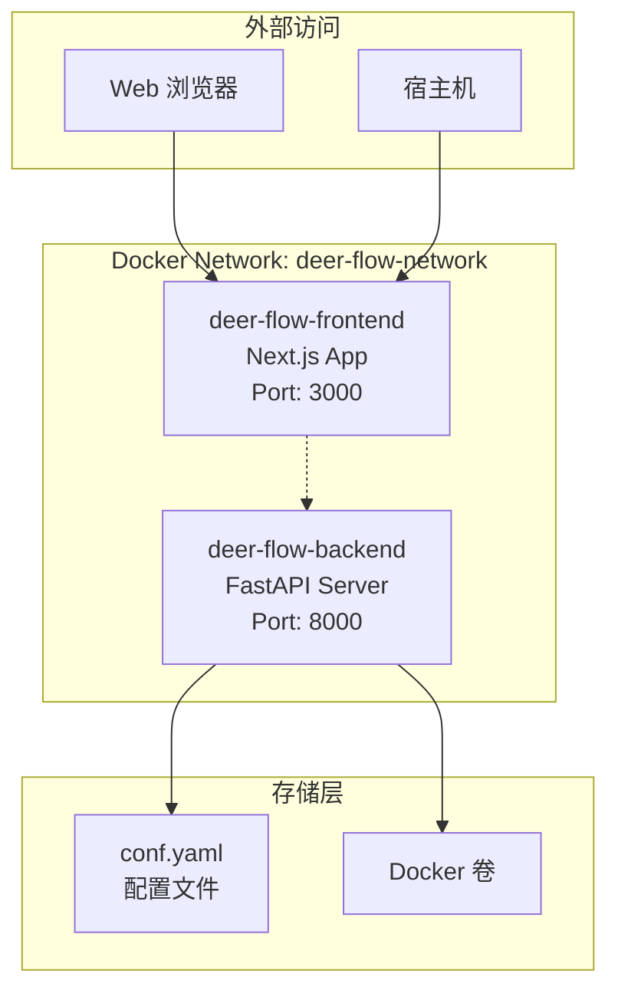
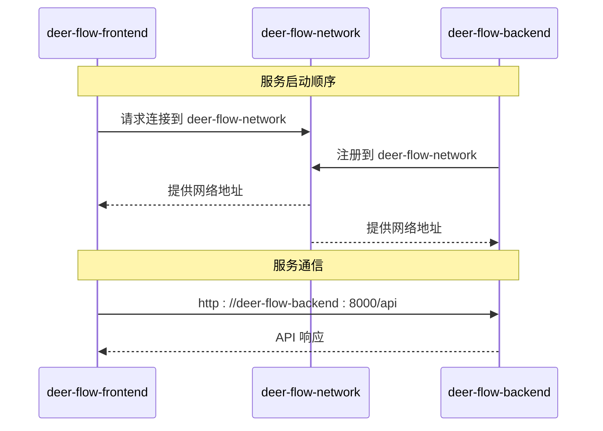
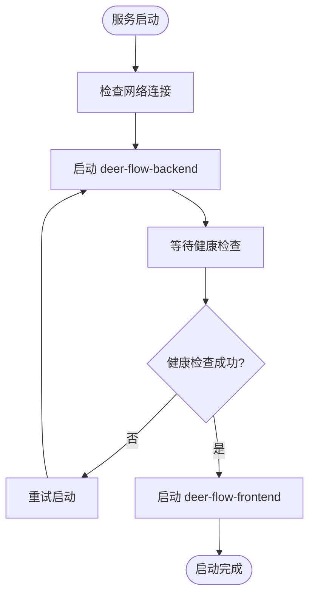
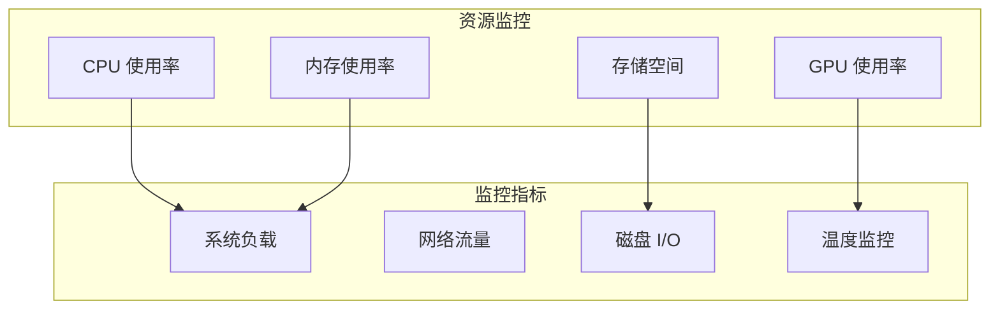
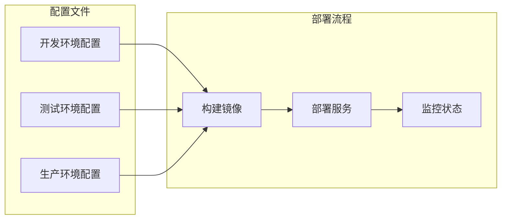
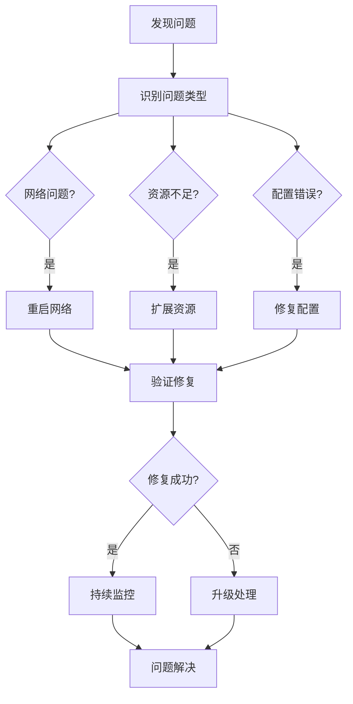

# DeerFlow 容器编排指南

<cite>
**本文档引用的文件**
- [docker-compose.yml](file://docker-compose.yml)
- [web/docker-compose.yml](file://web/docker-compose.yml)
- [Dockerfile](file://Dockerfile)
- [web/Dockerfile](file://web/Dockerfile)
- [.env](file://.env)
- [middlewares/llm/dockercompose.yml](file://middlewares/llm/dockercompose.yml)
- [src/config/loader.py](file://src/config/loader.py)
- [src/config/configuration.py](file://src/config/configuration.py)
</cite>

## 目录
1. [简介](#简介)
2. [项目架构概览](#项目架构概览)
3. [核心服务配置](#核心服务配置)
4. [网络配置与通信](#网络配置与通信)
5. [环境变量管理](#环境变量管理)
6. [卷挂载策略](#卷挂载策略)
7. [健康检查与重启策略](#健康检查与重启策略)
8. [资源限制与性能优化](#资源限制与性能优化)
9. [多环境配置管理](#多环境配置管理)
10. [最佳实践与故障排除](#最佳实践与故障排除)

## 简介

DeerFlow 是一个基于 Next.js 和 FastAPI 构建的智能工作流平台，采用微服务架构设计。本指南详细介绍了如何使用 Docker Compose 进行完整的容器编排，包括后端服务（deer-flow-server）和前端应用（deer-flow-web）的部署配置。

项目采用现代化的容器化部署方案，通过 Docker Compose 实现服务编排，支持开发、测试和生产环境的快速部署。系统包含两个主要服务：后端 API 服务和前端 Web 应用，并通过自定义网络实现服务间通信。

## 项目架构概览



**图表来源**
- [docker-compose.yml](file://docker-compose.yml#L1-L36)

**章节来源**
- [docker-compose.yml](file://docker-compose.yml#L1-L36)

## 核心服务配置

### 后端服务配置

后端服务是 DeerFlow 的核心 API 服务器，基于 FastAPI 构建，负责处理业务逻辑和数据管理。

```yaml
backend:
  build:
    context: .
    dockerfile: Dockerfile
  container_name: deer-flow-backend
  env_file:
    - .env
  volumes:
    - ./conf.yaml:/app/conf.yaml:ro
  restart: unless-stopped
  networks:
    - deer-flow-network
```

**关键配置说明：**

- **构建上下文**：使用项目根目录作为构建上下文，指定 Dockerfile 路径
- **容器名称**：设置明确的容器名称便于管理和识别
- **环境文件**：通过 `.env` 文件管理环境变量
- **只读卷挂载**：将配置文件以只读方式挂载到容器内
- **重启策略**：使用 `unless-stopped` 策略确保服务稳定性

### 前端服务配置

前端服务基于 Next.js 构建，提供用户界面和交互功能。

```yaml
frontend:
  build:
    context: ./web
    dockerfile: Dockerfile
    args:
      - NEXT_PUBLIC_API_URL=$NEXT_PUBLIC_API_URL
  container_name: deer-flow-frontend
  ports:
    - "3000:3000"
  env_file:
    - .env
  depends_on:
    - backend
  restart: unless-stopped
  networks:
    - deer-flow-network
```

**关键配置说明：**

- **构建上下文**：指定 web 目录作为构建上下文
- **构建参数**：通过 `NEXT_PUBLIC_API_URL` 参数传递 API 地址
- **端口映射**：将容器的 3000 端口映射到宿主机的 3000 端口
- **服务依赖**：通过 `depends_on` 确保后端服务优先启动
- **环境变量**：共享主项目的环境变量文件

**章节来源**
- [docker-compose.yml](file://docker-compose.yml#L1-L36)
- [web/docker-compose.yml](file://web/docker-compose.yml#L1-L13)

## 网络配置与通信

### 自定义网络配置

DeerFlow 使用自定义的 Docker 网络 `deer-flow-network` 来实现服务间的通信：

```yaml
networks:
  deer-flow-network:
    driver: bridge
```

**网络特性：**

- **桥接驱动**：使用默认的 bridge 驱动程序
- **服务发现**：容器可以通过服务名称相互访问
- **隔离性**：不同项目使用不同的网络避免冲突

### 服务间通信机制



**图表来源**
- [docker-compose.yml](file://docker-compose.yml#L18-L36)

**通信特点：**

- **内部网络访问**：前端通过 `deer-flow-backend` 主机名访问后端服务
- **端口隔离**：后端服务不直接暴露给宿主机，仅通过前端代理访问
- **网络隔离**：所有服务都在同一个网络中，便于通信但保持安全

**章节来源**
- [docker-compose.yml](file://docker-compose.yml#L29-L36)

## 环境变量管理

### 主项目环境变量

项目根目录的 `.env` 文件包含所有必要的环境配置：

```bash
# 应用基础配置
DEBUG=True
APP_ENV=development
AGENT_RECURSION_LIMIT=30

# CORS 配置
ALLOWED_ORIGINS=http://localhost:3000,http://192.168.0.106:3000,http://127.0.0.1:3000

# MCP 和 Python REPL 配置
ENABLE_MCP_SERVER_CONFIGURATION=false
ENABLE_PYTHON_REPL=false

# 搜索引擎配置
SEARCH_API=custom_search
CUSTOM_SEARCH_API_URL=http://192.168.0.106:8010/ELLM.ELLM-OFFICE.V-1.0/querySources.do
CUSTOM_SEARCH_API_KEY=your_custom_search_api_key
CUSTOM_SEARCH_REPOSITORY=okic-dynamicSearch
CUSTOM_SEARCH_CHANNEL_ID=0
```

### 环境变量处理机制

系统实现了智能的环境变量替换机制：

```python
def replace_env_vars(value: str) -> str:
    """Replace environment variables in string values."""
    if not isinstance(value, str):
        return value
    if value.startswith("$"):
        env_var = value[1:]
        return os.getenv(env_var, env_var)
    return value
```

**处理特性：**

- **递归替换**：支持嵌套的环境变量引用
- **默认值处理**：如果环境变量未设置，保留原始占位符
- **类型保持**：非字符串类型的值保持不变

### 前端环境变量注入

前端服务通过构建参数传递 API 地址：

```dockerfile
ARG NEXT_PUBLIC_API_URL
ENV NEXT_PUBLIC_API_URL=${NEXT_PUBLIC_API_URL}
```

**章节来源**
- [.env](file://.env#L1-L33)
- [src/config/loader.py](file://src/config/loader.py#L32-L41)

## 卷挂载策略

### 配置文件挂载

```yaml
volumes:
  - ./conf.yaml:/app/conf.yaml:ro
```

**挂载策略：**

- **只读模式**：使用 `ro` 标识确保配置文件的安全性
- **路径映射**：将本地配置文件映射到容器内的标准位置
- **版本控制**：配置文件可以纳入版本控制系统

### 存储卷管理

```mermaid
graph LR
subgraph "宿主机"
LocalConfig[./conf.yaml]
LocalModels[本地模型目录]
LocalLogs[日志目录]
end
subgraph "容器"
ContainerConfig[/app/conf.yaml]
ContainerModels[/models/]
ContainerLogs[/var/log/]
end
LocalConfig --> ContainerConfig
LocalModels --> ContainerModels
LocalLogs --> ContainerLogs
```

**图表来源**
- [docker-compose.yml](file://docker-compose.yml#L13-L15)

### 多层卷挂载

对于复杂的中间件服务，如 LLM 中间件：

```yaml
volumes:
  - /home/llm/llz/models/qwen3-0.6:/models/qwen3-0.6
  - ./logs:/var/log/vllm
  - ./app:/app
```

**挂载特点：**

- **本地模型存储**：挂载本地模型目录以提高访问速度
- **日志持久化**：将日志输出到宿主机便于调试
- **代码同步**：挂载应用代码目录实现热重载

**章节来源**
- [docker-compose.yml](file://docker-compose.yml#L13-L15)
- [middlewares/llm/dockercompose.yml](file://middlewares/llm/dockercompose.yml#L32-L35)

## 健康检查与重启策略

### 重启策略配置

所有服务都配置了统一的重启策略：

```yaml
restart: unless-stopped
```

**重启策略说明：**

- **unless-stopped**：除非手动停止，否则始终重启容器
- **自动恢复**：应对意外崩溃或系统重启
- **资源效率**：避免不必要的资源浪费

### 健康检查配置

以 LLM 中间件为例，展示了完整的健康检查配置：

```yaml
healthcheck:
  test: ["CMD", "curl", "-f", "http://localhost:8000/health"]
  interval: 300s
  timeout: 10s
  retries: 3
  start_period: 60s
```

**健康检查特性：**

- **HTTP 探针**：使用 curl 检查健康端点
- **间隔配置**：每 5 分钟检查一次
- **超时设置**：10 秒超时时间
- **重试机制**：最多重试 3 次
- **启动等待**：60 秒启动期，适应模型加载时间

### 服务依赖管理



**图表来源**
- [docker-compose.yml](file://docker-compose.yml#L25-L27)

**章节来源**
- [docker-compose.yml](file://docker-compose.yml#L11-L11)
- [docker-compose.yml](file://docker-compose.yml#L28-L28)
- [middlewares/llm/dockercompose.yml](file://middlewares/llm/dockercompose.yml#L45-L51)

## 资源限制与性能优化

### GPU 资源配置

LLM 中间件展示了完整的 GPU 资源配置：

```yaml
deploy:
  resources:
    reservations:
      devices:
        - driver: nvidia
          count: all
          capabilities: [gpu]
```

**资源配置：**

- **NVIDIA 运行时**：启用 GPU 加速支持
- **设备预留**：为容器预留所有可用 GPU
- **能力声明**：声明需要 GPU 计算能力

### 内存和 CPU 限制

```yaml
command: >
  --max-model-len 8096
  --max-num-batched-tokens 8192
  --max-num-seqs 8
  --gpu-memory-utilization 0.8
```

**性能优化参数：**

- **批处理优化**：设置最大批处理令牌数
- **并发控制**：限制最大并发序列数
- **内存利用**：控制 GPU 内存使用比例
- **模型长度**：限制最大模型长度

### 资源监控



**章节来源**
- [middlewares/llm/dockercompose.yml](file://middlewares/llm/dockercompose.yml#L39-L43)
- [middlewares/llm/dockercompose.yml](file://middlewares/llm/dockercompose.yml#L32-L43)

## 多环境配置管理

### 开发环境配置

开发环境通常使用以下配置：

```yaml
# docker-compose.override.yml 示例
version: '3.8'
services:
  backend:
    ports:
      - "8000:8000"
    volumes:
      - ./src:/app/src:ro
      - ./conf.yaml:/app/conf.yaml:ro
    environment:
      - DEBUG=true
      - APP_ENV=development
  
  frontend:
    ports:
      - "3000:3000"
    volumes:
      - ./web/src:/app/src:ro
      - ./web/.env:/app/.env:ro
    environment:
      - NEXT_TELEMETRY_DISABLED=false
```

### 生产环境配置

生产环境配置强调安全性和性能：

```yaml
# docker-compose.prod.yml 示例
version: '3.8'
services:
  backend:
    restart: unless-stopped
    logging:
      driver: "json-file"
      options:
        max-size: "10m"
        max-file: "3"
  
  frontend:
    restart: unless-stopped
    environment:
      - NODE_ENV=production
      - NEXT_TELEMETRY_DISABLED=true
```

### 环境切换策略



**章节来源**
- [src/config/loader.py](file://src/config/loader.py#L1-L39)

## 最佳实践与故障排除

### 部署最佳实践

1. **服务启动顺序**
   ```bash
   # 先启动后端服务
   docker-compose up -d backend
   
   # 等待后端服务就绪
   sleep 30
   
   # 再启动前端服务
   docker-compose up -d frontend
   ```

2. **资源监控**
   ```bash
   # 监控容器资源使用
   docker stats deer-flow-backend deer-flow-frontend
   
   # 查看容器日志
   docker-compose logs -f backend
   ```

3. **配置验证**
   ```bash
   # 验证配置文件语法
   docker-compose config
   
   # 检查网络连接
   docker-compose exec frontend ping deer-flow-backend
   ```

### 常见问题排查

#### 1. 服务启动失败

**症状**：容器启动后立即退出
**排查步骤**：
```bash
# 查看容器状态
docker-compose ps

# 查看错误日志
docker-compose logs backend

# 检查环境变量
docker-compose exec backend env | grep -E "(API|CONFIG)"
```

#### 2. 网络连接问题

**症状**：前端无法访问后端 API
**排查步骤**：
```bash
# 检查网络连通性
docker-compose exec frontend ping deer-flow-backend

# 测试端口连通性
docker-compose exec frontend telnet deer-flow-backend 8000

# 检查防火墙设置
docker network inspect deer-flow-network
```

#### 3. 性能问题

**症状**：响应缓慢或超时
**排查步骤**：
```bash
# 监控资源使用
docker stats

# 检查容器健康状态
docker-compose ps

# 分析日志错误
docker-compose logs backend | grep -i error
```

### 故障恢复流程



### 性能调优建议

1. **内存优化**
   - 设置合理的 JVM 堆内存大小
   - 配置垃圾回收策略
   - 监控内存泄漏

2. **数据库优化**
   - 配置连接池大小
   - 优化查询语句
   - 定期维护索引

3. **缓存策略**
   - 启用 Redis 缓存
   - 配置缓存过期时间
   - 监控缓存命中率

**章节来源**
- [docker-compose.yml](file://docker-compose.yml#L1-L36)
- [middlewares/llm/dockercompose.yml](file://middlewares/llm/dockercompose.yml#L1-L52)

## 结论

DeerFlow 的容器编排方案提供了完整的微服务部署解决方案。通过 Docker Compose 实现的服务编排，不仅简化了部署流程，还确保了服务间的稳定通信和资源的有效利用。

**主要优势：**

- **模块化设计**：前后端分离，便于独立开发和部署
- **网络隔离**：通过自定义网络确保服务安全通信
- **环境一致性**：统一的配置管理确保开发和生产环境的一致性
- **可扩展性**：支持水平扩展和负载均衡
- **可观测性**：完善的日志记录和健康检查机制

**未来发展方向：**

- **Kubernetes 部署**：考虑迁移到 Kubernetes 以获得更强大的编排能力
- **CI/CD 集成**：完善自动化部署流水线
- **监控告警**：集成 Prometheus 和 Grafana 实现全面监控
- **多云支持**：支持跨云平台部署

通过遵循本指南的最佳实践，可以确保 DeerFlow 系统的稳定运行和高效维护。