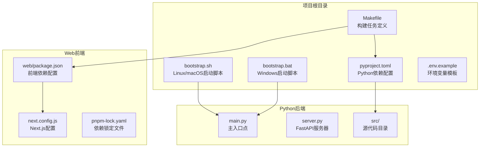
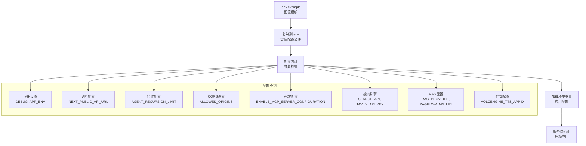
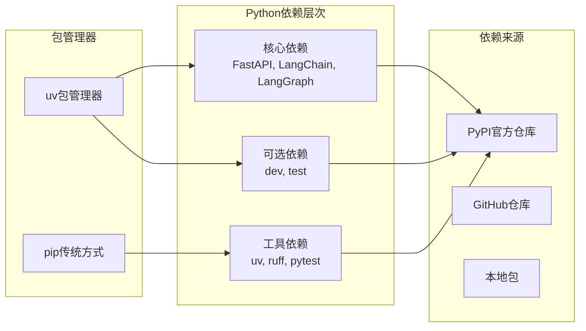
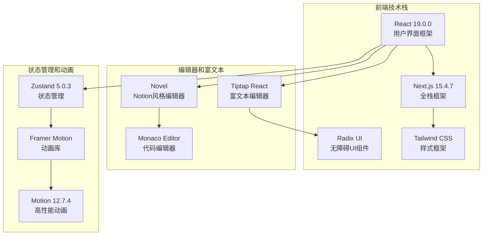
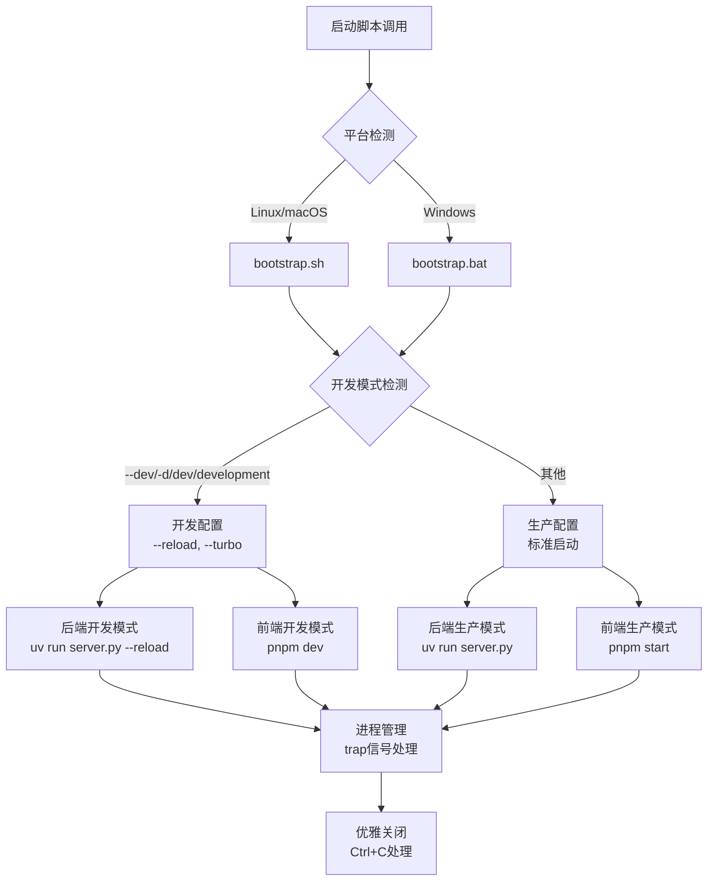
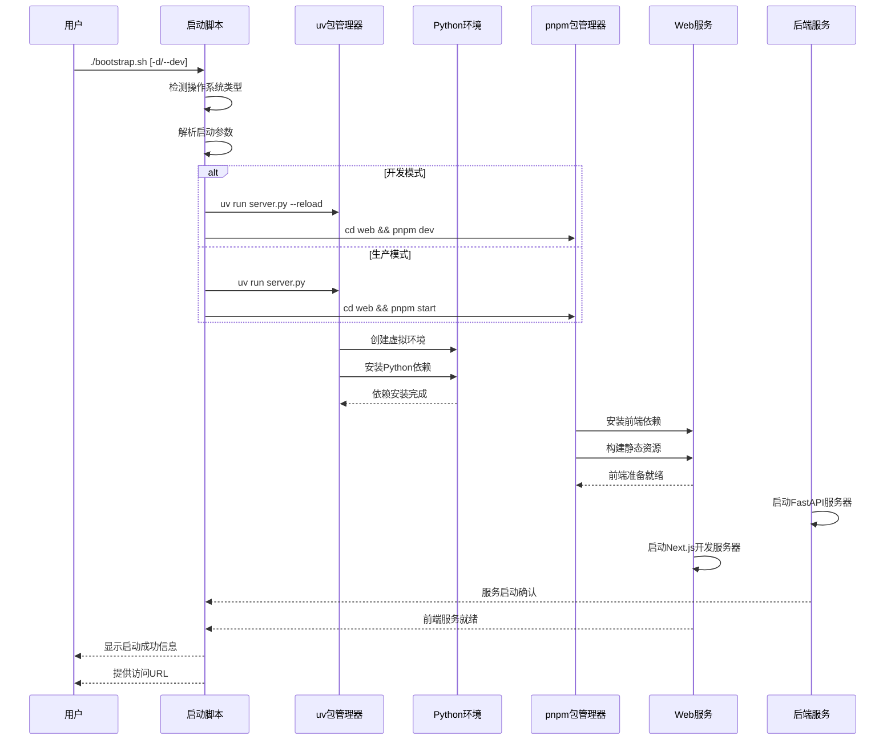
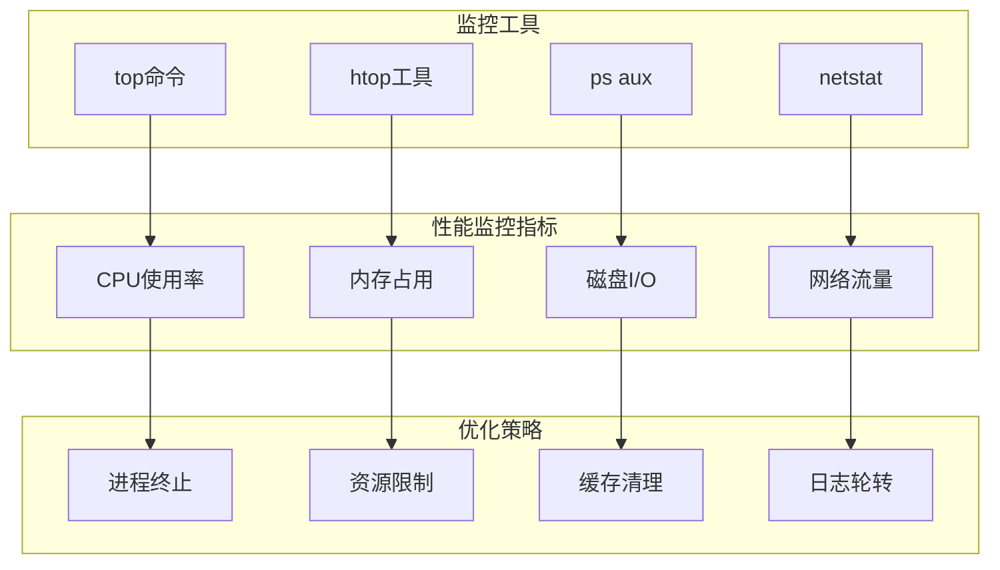

# DeerFlow环境初始化流程详解

<cite>
**本文档引用的文件**
- [bootstrap.sh](file://bootstrap.sh)
- [bootstrap.bat](file://bootstrap.bat)
- [Makefile](file://Makefile)
- [pyproject.toml](file://pyproject.toml)
- [web/package.json](file://web/package.json)
- [.env.example](file://.env.example)
- [README.md](file://README.md)
</cite>

## 目录
1. [概述](#概述)
2. [项目结构分析](#项目结构分析)
3. [核心初始化脚本](#核心初始化脚本)
4. [环境变量配置机制](#环境变量配置机制)
5. [依赖管理策略](#依赖管理策略)
6. [跨平台兼容性](#跨平台兼容性)
7. [初始化流程详解](#初始化流程详解)
8. [常见问题与解决方案](#常见问题与解决方案)
9. [性能优化建议](#性能优化建议)
10. [故障排除指南](#故障排除指南)

## 概述

DeerFlow是一个基于Python和Node.js的深度研究框架，采用现代化的开发工具链进行环境初始化。该项目通过精心设计的启动脚本和构建系统，实现了跨平台的自动化环境配置，支持开发模式和生产模式的无缝切换。

环境初始化是整个项目生命周期的起点，它负责：
- 检测操作系统类型并选择相应的执行路径
- 创建和激活Python虚拟环境
- 安装Python后端依赖（通过uv包管理器）
- 安装前端依赖（通过pnpm包管理器）
- 配置环境变量和配置文件
- 启动前后端服务进程

## 项目结构分析

DeerFlow项目采用模块化的架构设计，主要包含以下关键组件：



**图表来源**
- [bootstrap.sh](file://bootstrap.sh#L1-L19)
- [bootstrap.bat](file://bootstrap.bat#L1-L29)
- [Makefile](file://Makefile#L1-L35)

**章节来源**
- [README.md](file://README.md#L1-L100)

## 核心初始化脚本

### bootstrap.sh（Linux/macOS）

bootstrap.sh是一个简洁而高效的启动脚本，专为Unix-like系统设计：

```bash
#!/bin/bash

# Start both of DeerFlow's backend and web UI server.
# If the user presses Ctrl+C, kill them both.

if [ "$1" = "--dev" -o "$1" = "-d" -o "$1" = "dev" -o "$1" = "development" ]; then
  echo -e "Starting DeerFlow in [DEVELOPMENT] mode...\n"
  uv run  server.py --host 0.0.0.0 --reload & SERVER_PID=$$!
  cd web && pnpm dev & WEB_PID=$$!
  trap "kill $$SERVER_PID $$WEB_PID" SIGINT SIGTERM
  wait
else
  echo -e "Starting DeerFlow in [PRODUCTION] mode...\n"
  uv run server.py & SERVER_PID=$$!
  cd web && pnpm start & WEB_PID=$$!
  trap "kill $$SERVER_PID $$WEB_PID" SIGINT SIGTERM
  wait
fi
```

#### 脚本特性分析

1. **参数检测机制**：
   - 支持多种开发模式标识符：`--dev`、`-d`、`dev`、`development`
   - 自动识别运行模式并设置相应配置

2. **进程管理**：
   - 使用后台进程（`&`）启动前后端服务
   - 通过`trap`信号处理确保优雅关闭
   - 维护进程ID以便统一管理

3. **模式差异化配置**：
   - 开发模式：启用热重载功能
   - 生产模式：标准启动配置

**章节来源**
- [bootstrap.sh](file://bootstrap.sh#L1-L19)

### bootstrap.bat（Windows）

bootstrap.bat提供了Windows平台的等效功能：

```batch
@echo off
SETLOCAL ENABLEEXTENSIONS

REM Check if argument is dev mode
SET MODE=%1
IF "%MODE%"=="--dev" GOTO DEV
IF "%MODE%"=="-d" GOTO DEV
IF "%MODE%"=="dev" GOTO DEV
IF "%MODE%"=="development" GOTO DEV

:PROD
echo Starting DeerFlow in [PRODUCTION] mode...
start uv run server.py
cd web
start pnpm start
REM Wait for user to close
GOTO END

:DEV
echo Starting DeerFlow in [DEVELOPMENT] mode...
start uv run server.py --reload
cd web
start pnpm dev
REM Wait for user to close
pause

:END
ENDLOCAL
```

#### Windows特定功能

1. **条件分支处理**：
   - 使用标签式结构实现多分支逻辑
   - 支持相同的开发模式参数

2. **进程启动方式**：
   - 使用`start`命令在新窗口中启动进程
   - 开发模式下使用`pause`等待用户输入

3. **本地化环境**：
   - `SETLOCAL`和`ENDLOCAL`确保环境变量隔离
   - 支持Windows特有的批处理语法

**章节来源**
- [bootstrap.bat](file://bootstrap.bat#L1-L29)

## 环境变量配置机制

DeerFlow采用.env文件机制进行环境变量管理，提供了灵活的配置选项：

### .env.example配置模板



**图表来源**
- [.env.example](file://.env.example#L1-L93)

### 关键配置项说明

1. **应用基础配置**：
   - `DEBUG`: 控制调试模式开关
   - `APP_ENV`: 应用环境类型（development/production）

2. **API和代理配置**：
   - `NEXT_PUBLIC_API_URL`: 前端API访问地址
   - `AGENT_RECURSION_LIMIT`: 代理递归限制

3. **安全配置**：
   - `ALLOWED_ORIGINS`: CORS允许的来源列表
   - `ENABLE_MCP_SERVER_CONFIGURATION`: MCP服务器配置开关
   - `ENABLE_PYTHON_REPL`: Python REPL功能开关

4. **搜索引擎配置**：
   - `SEARCH_API`: 搜索引擎类型（tavily/duckduckgo/brave_search/arxiv）
   - `TAVILY_API_KEY`: Tavily API密钥

5. **RAG系统配置**：
   - `RAG_PROVIDER`: RAG提供商（ragflow/vikingdb_knowledge_base/milvus）
   - `RAGFLOW_API_URL`: RAGFlow API地址

**章节来源**
- [.env.example](file://.env.example#L1-L93)

## 依赖管理策略

### Python依赖管理（pyproject.toml）

DeerFlow使用现代的Python包管理工具uv，结合pyproject.toml进行依赖管理：



**图表来源**
- [pyproject.toml](file://pyproject.toml#L1-L91)

#### 核心依赖分析

1. **Web框架和API**：
   - `fastapi>=0.110.0`: 现代异步Web框架
   - `uvicorn>=0.27.1`: ASGI服务器
   - `sse-starlette>=1.6.5`: 服务器发送事件支持

2. **AI和语言模型**：
   - `litellm>=1.63.11`: 多模型统一接口
   - `langchain-*`: LangChain生态系统组件
   - `langgraph>=0.3.5`: 多代理工作流框架

3. **数据处理和存储**：
   - `pandas>=2.2.3`: 数据分析库
   - `numpy>=2.2.3`: 数值计算库
   - `pymilvus>=2.3.0`: 向量数据库客户端

**章节来源**
- [pyproject.toml](file://pyproject.toml#L1-L91)

### 前端依赖管理（web/package.json）

前端使用pnpm作为包管理器，提供高效的依赖安装和管理：



**图表来源**
- [web/package.json](file://web/package.json#L1-L117)

#### 前端依赖分类

1. **核心框架**：
   - `next@^15.4.7`: 全栈React框架
   - `react@^19.0.0`: 用户界面库
   - `react-dom@^19.0.0`: DOM渲染层

2. **UI组件库**：
   - `@radix-ui/*`: 可访问性优先的UI组件
   - `@ant-design/icons`: Ant Design图标库
   - `lucide-react`: 现代SVG图标库

3. **编辑器功能**：
   - `@tiptap/*`: 可扩展富文本编辑器
   - `novel`: Notion风格内容编辑器
   - `react-markdown`: Markdown渲染组件

**章节来源**
- [web/package.json](file://web/package.json#L1-L117)

## 跨平台兼容性

### 平台检测与适配

DeerFlow通过启动脚本实现了良好的跨平台兼容性：



### 平台特定优化

1. **Linux/macOS优化**：
   - 使用shell脚本的高级特性
   - 支持进程组管理和信号处理
   - 利用管道和重定向优化I/O

2. **Windows优化**：
   - 批处理脚本的条件分支处理
   - 新窗口启动避免阻塞控制台
   - 本地环境变量隔离

3. **通用特性**：
   - 统一的参数解析机制
   - 相同的错误处理策略
   - 一致的输出格式化

## 初始化流程详解

### 完整初始化序列



**图表来源**
- [bootstrap.sh](file://bootstrap.sh#L1-L19)
- [bootstrap.bat](file://bootstrap.bat#L1-L29)

### 依赖安装流程

1. **Python依赖安装**：
   ```bash
   # 使用uv自动创建虚拟环境
   uv sync
   
   # 安装开发依赖
   uv pip install -e ".[dev]"
   
   # 安装测试依赖
   uv pip install -e ".[test]"
   ```

2. **前端依赖安装**：
   ```bash
   # 进入web目录
   cd web
   
   # 使用pnpm安装依赖
   pnpm install
   
   # 或使用锁定文件确保版本一致性
   pnpm install --frozen-lockfile
   ```

**章节来源**
- [Makefile](file://Makefile#L1-L35)

### 环境验证步骤

1. **Python环境验证**：
   - 检查Python版本（≥3.12）
   - 验证uv包管理器可用性
   - 确认虚拟环境正确创建

2. **Node.js环境验证**：
   - 检查Node.js版本（≥22）
   - 验证pnpm包管理器
   - 确认web目录存在

3. **服务启动验证**：
   - 检查后端API端口（默认8000）
   - 验证前端UI端口（默认3000）
   - 确认数据库连接（如需要）

## 常见问题与解决方案

### 权限相关问题

#### 问题：脚本执行权限不足

**症状**：
```bash
./bootstrap.sh: Permission denied
```

**解决方案**：
```bash
# 添加执行权限
chmod +x bootstrap.sh

# 或者直接使用bash执行
bash bootstrap.sh
```

#### 问题：Python包安装权限问题

**症状**：
```bash
PermissionError: [Errno 13] Permission denied: '/usr/local/lib'
```

**解决方案**：
```bash
# 使用用户目录安装
export PYTHONUSERBASE=~/.local
uv pip install --user package_name

# 或者使用虚拟环境
uv sync --python ~/.local/bin/python3
```

### 网络连接问题

#### 问题：依赖下载超时

**症状**：
```bash
ERROR: Could not install packages due to an EnvironmentError: HTTPSConnectionPool(host='pypi.org', port=443): Max retries exceeded
```

**解决方案**：
```bash
# 设置镜像源
export PIP_INDEX_URL=https://pypi.tuna.tsinghua.edu.cn/simple

# 或使用国内镜像
uv pip install --index-url https://mirrors.aliyun.com/pypi/simple/

# 配置pnpm镜像
pnpm config set registry https://registry.npmmirror.com
```

#### 问题：代理环境下的连接问题

**解决方案**：
```bash
# 设置HTTP代理
export HTTP_PROXY=http://proxy.company.com:8080
export HTTPS_PROXY=http://proxy.company.com:8080

# uv配置代理
uv pip config set global.proxy http://proxy.company.com:8080

# pnpm配置代理
pnpm config set proxy http://proxy.company.com:8080
```

### 依赖冲突问题

#### 问题：版本冲突导致安装失败

**症状**：
```bash
ERROR: Cannot install deer-flow because these package versions have conflicting dependencies.
```

**解决方案**：
```bash
# 清理缓存重新安装
uv pip cache purge
uv sync --reinstall

# 使用约束文件解决冲突
uv pip install -r requirements.txt

# 或者手动指定版本
uv pip install package==version
```

### 系统资源问题

#### 问题：内存不足导致编译失败

**症状**：
```bash
fatal error: cannot allocate memory
```

**解决方案**：
```bash
# 增加交换空间
sudo fallocate -l 2G /swapfile
sudo chmod 600 /swapfile
sudo mkswap /swapfile
sudo swapon /swapfile

# 或者减少并发进程数
export MAKEFLAGS="-j1"
```

## 性能优化建议

### 启动性能优化

1. **并行依赖安装**：
   ```bash
   # 使用Makefile的并行任务
   make install-dev
   
   # 或者手动并行执行
   (cd web && pnpm install) &
   uv sync &
   wait
   ```

2. **缓存利用策略**：
   ```bash
   # 启用uv缓存
   export UV_CACHE_DIR=~/.cache/uv
   
   # 启用pnpm缓存
   pnpm config set store-dir ~/.pnpm-store
   ```

3. **增量更新**：
   ```bash
   # 只更新变更的依赖
   uv pip install --upgrade --outdated
   
   # pnpm增量更新
   pnpm update --latest
   ```

### 运行时性能优化

1. **开发模式优化**：
   ```bash
   # 启用热重载和快速重启
   ./bootstrap.sh --dev
   
   # 使用turbo加速构建
   cd web && pnpm dev --turbo
   ```

2. **生产模式优化**：
   ```bash
   # 预构建静态资源
   cd web && pnpm build
   
   # 启用生产服务器
   ./bootstrap.sh
   ```

### 资源监控



## 故障排除指南

### 环境诊断命令

1. **系统环境检查**：
   ```bash
   # 检查Python版本
   python --version
   
   # 检查uv版本
   uv --version
   
   # 检查Node.js版本
   node --version
   
   # 检查pnpm版本
   pnpm --version
   ```

2. **依赖完整性检查**：
   ```bash
   # 检查Python依赖
   uv pip list
   
   # 检查前端依赖
   cd web && pnpm list
   
   # 验证依赖树
   uv pip check
   cd web && pnpm audit
   ```

3. **服务状态检查**：
   ```bash
   # 检查端口占用
   netstat -tulpn | grep :8000
   lsof -i :3000
   
   # 检查进程状态
   ps aux | grep python
   ps aux | grep node
   ```

### 日志分析技巧

1. **启动日志分析**：
   ```bash
   # 查看启动过程中的错误
   ./bootstrap.sh 2>&1 | tee startup.log
   
   # 实时监控日志
   tail -f startup.log
   ```

2. **服务日志分析**：
   ```bash
   # Python后端日志
   uv run server.py --log-level debug
   
   # 前端开发服务器日志
   cd web && pnpm dev --log-level verbose
   ```

### 回滚和恢复

1. **依赖回滚**：
   ```bash
   # 恢复到已知良好版本
   git checkout commit_hash
   
   # 重新安装依赖
   uv sync
   cd web && pnpm install
   ```

2. **配置恢复**：
   ```bash
   # 备份当前配置
   cp .env .env.backup
   
   # 恢复默认配置
   cp .env.example .env
   
   # 重新配置关键参数
   vim .env
   ```

### 最佳实践总结

1. **定期维护**：
   - 每月检查依赖更新
   - 清理过期缓存
   - 验证许可证合规性

2. **备份策略**：
   - 定期备份.env文件
   - 备份关键配置文件
   - 测试恢复流程

3. **监控告警**：
   - 设置服务健康检查
   - 配置异常告警
   - 建立响应流程

通过遵循这些最佳实践和故障排除指南，可以确保DeerFlow环境的稳定性和可靠性，为用户提供流畅的深度研究体验。