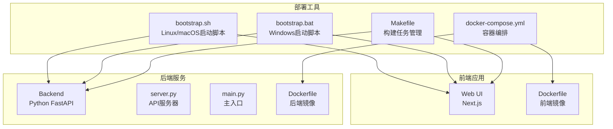
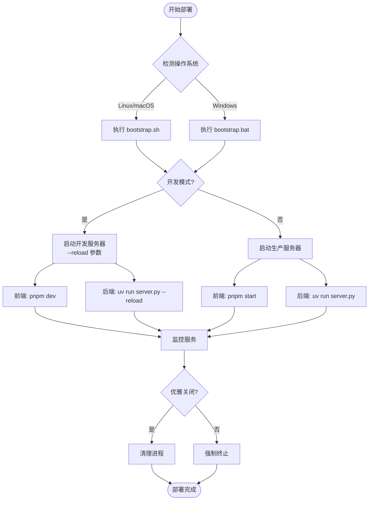

# DeerFlow 脚本化部署指南

<cite>
**本文档引用的文件**
- [bootstrap.sh](file://bootstrap.sh)
- [bootstrap.bat](file://bootstrap.bat)
- [Makefile](file://Makefile)
- [pyproject.toml](file://pyproject.toml)
- [web/package.json](file://web/package.json)
- [main.py](file://main.py)
- [server.py](file://server.py)
- [Dockerfile](file://Dockerfile)
- [web/Dockerfile](file://web/Dockerfile)
- [docker-compose.yml](file://docker-compose.yml)
- [web/docker-compose.yml](file://web/docker-compose.yml)
</cite>

## 目录
1. [简介](#简介)
2. [项目结构概览](#项目结构概览)
3. [核心部署脚本分析](#核心部署脚本分析)
4. [Makefile 部署目标详解](#makefile-部署目标详解)
5. [环境配置与依赖管理](#环境配置与依赖管理)
6. [多平台兼容性处理](#多平台兼容性处理)
7. [Docker 容器化部署](#docker-容器化部署)
8. [CI/CD 集成最佳实践](#cicd-集成最佳实践)
9. [故障排除指南](#故障排除指南)
10. [总结](#总结)

## 简介

DeerFlow 是一个基于 Python 和 Next.js 的智能工作流系统，支持多种部署方式。本指南详细介绍了通过 shell 脚本和 Makefile 进行脚本化部署的完整流程，包括 Python 虚拟环境创建、依赖包安装、环境变量配置和数据库初始化等关键步骤。

## 项目结构概览

DeerFlow 项目采用前后端分离架构，主要包含以下核心组件：



**图表来源**
- [bootstrap.sh](file://bootstrap.sh#L1-L19)
- [bootstrap.bat](file://bootstrap.bat#L1-L29)
- [Makefile](file://Makefile#L1-L35)

## 核心部署脚本分析

### Linux/macOS 启动脚本 (bootstrap.sh)

bootstrap.sh 是 DeerFlow 的核心启动脚本，负责协调前后端服务的启动：

```bash
#!/bin/bash

# Start both of DeerFlow's backend and web UI server.
# If the user presses Ctrl+C, kill them both.

if [ "$1" = "--dev" -o "$1" = "-d" -o "$1" = "dev" -o "$1" = "development" ]; then
  echo -e "Starting DeerFlow in [DEVELOPMENT] mode...\n"
  uv run  server.py --host 0.0.0.0 --reload & SERVER_PID=$$!
  cd web && pnpm dev & WEB_PID=$$!
  trap "kill $$SERVER_PID $$WEB_PID" SIGINT SIGTERM
  wait
else
  echo -e "Starting DeerFlow in [PRODUCTION] mode...\n"
  uv run server.py & SERVER_PID=$$!
  cd web && pnpm start & WEB_PID=$$!
  trap "kill $$SERVER_PID $$WEB_PID" SIGINT SIGTERM
  wait
fi
```

**关键特性：**

1. **多模式支持**：支持开发模式（--dev/-d/dev/development）和生产模式
2. **进程管理**：使用后台进程和 PID 管理确保服务正常关闭
3. **信号处理**：通过 trap 命令优雅处理 Ctrl+C 中断
4. **跨平台兼容**：适用于 Linux 和 macOS 系统

**章节来源**
- [bootstrap.sh](file://bootstrap.sh#L1-L19)

### Windows 启动脚本 (bootstrap.bat)

Windows 版本的启动脚本提供了类似的启动功能，但使用批处理语法：

```batch
@echo off
SETLOCAL ENABLEEXTENSIONS

REM Check if argument is dev mode
SET MODE=%1
IF "%MODE%"=="--dev" GOTO DEV
IF "%MODE%"=="-d" GOTO DEV
IF "%MODE%"=="dev" GOTO DEV
IF "%MODE%"=="development" GOTO DEV

:PROD
echo Starting DeerFlow in [PRODUCTION] mode...
start uv run server.py
cd web
start pnpm start
REM Wait for user to close
GOTO END

:DEV
echo Starting DeerFlow in [DEVELOPMENT] mode...
start uv run server.py --reload
cd web
start pnpm dev
REM Wait for user to close
pause

:END
ENDLOCAL
```

**关键特性：**

1. **条件分支**：根据参数判断启动模式
2. **异步启动**：使用 start 命令并行启动服务
3. **用户交互**：开发模式下暂停等待用户输入
4. **环境隔离**：使用 SETLOCAL/ENDLOCAL 管理环境变量

**章节来源**
- [bootstrap.bat](file://bootstrap.bat#L1-L29)

## Makefile 部署目标详解

Makefile 提供了完整的构建和部署任务管理：

```makefile
.PHONY: help lint format install-dev serve test coverage langgraph-dev lint-frontend

help: ## Show this help message
	@echo "Deer Flow - Available Make Targets:"
	@echo ""
	@grep -E '^[a-zA-Z_-]+:.*?## .*$$' $(MAKEFILE_LIST) | sort | awk 'BEGIN {FS = ":.*?## "}; {printf "  \033[36m%-18s\033[0m %s\n", $$1, $$2}'
	@echo ""
	@echo "Usage: make <target>"

install-dev: ## Install development dependencies
	uv pip install -e ".[dev]" && uv pip install -e ".[test]"

format: ## Format code using ruff
	uv run ruff format --config pyproject.toml .

lint: ## Lint and fix code using ruff
	uv run ruff check --fix --select I --config pyproject.toml .

lint-frontend: ## Lint frontend code and check build
	cd web && pnpm install --frozen-lockfile
	cd web && pnpm lint
	cd web && pnpm typecheck
	cd web && pnpm build

serve: ## Start development server with reload
	uv run server.py --reload

test: ## Run tests with pytest
	uv run pytest tests/

langgraph-dev: ## Start langgraph development server
	uvx --refresh --from "langgraph-cli[inmem]" --with-editable . --python 3.12 langgraph dev --allow-blocking

coverage: ## Run tests with coverage report
	uv run pytest --cov=src tests/ --cov-report=term-missing --cov-report=xml
```

### 主要部署目标

#### 1. 开发环境安装 (install-dev)
```bash
make install-dev
```
- 安装开发依赖：`uv pip install -e ".[dev]"`
- 安装测试依赖：`uv pip install -e ".[test]"`

#### 2. 代码格式化 (format)
```bash
make format
```
- 使用 ruff 格式化 Python 代码
- 遵循 pyproject.toml 配置

#### 3. 代码检查 (lint)
```bash
make lint
```
- 使用 ruff 检查和修复代码风格
- 仅选择导入相关的规则

#### 4. 前端检查 (lint-frontend)
```bash
make lint-frontend
```
- 安装前端依赖（锁定版本）
- 执行 ESLint 检查
- TypeScript 类型检查
- 构建验证

#### 5. 开发服务器启动 (serve)
```bash
make serve
```
- 启动带有自动重载的开发服务器
- `uv run server.py --reload`

#### 6. 测试运行 (test)
```bash
make test
```
- 运行所有单元测试
- 使用 pytest 执行

#### 7. 覆盖率报告 (coverage)
```bash
make coverage
```
- 运行测试并生成覆盖率报告
- 输出文本和 XML 格式的报告

#### 8. LangGraph 开发服务器 (langgraph-dev)
```bash
make langgraph-dev
```
- 启动 LangGraph 开发服务器
- 支持内存检查点

**章节来源**
- [Makefile](file://Makefile#L1-L35)

## 环境配置与依赖管理

### Python 环境配置

DeerFlow 使用 uv 作为包管理器和虚拟环境管理工具：

```toml
[tool.uv]
required-version = ">=0.6.15"

[project]
name = "deer-flow"
version = "0.1.0"
requires-python = ">=3.12"
dependencies = [
    "httpx>=0.28.1",
    "langchain-community>=0.3.19",
    "fastapi>=0.110.0",
    "uvicorn>=0.27.1",
    # ... 更多依赖
]
```

**关键特性：**

1. **Python 版本要求**：最低 Python 3.12
2. **依赖管理**：使用 uv 进行快速包安装
3. **可选依赖**：区分开发和测试依赖
4. **版本约束**：明确的版本范围要求

**章节来源**
- [pyproject.toml](file://pyproject.toml#L1-L91)

### 前端依赖配置

Web 前端使用 Next.js 和 pnpm 包管理器：

```json
{
  "name": "deer-flow-web",
  "version": "0.1.0",
  "private": true,
  "type": "module",
  "scripts": {
    "build": "next build",
    "dev": "dotenv -f ../.env -- next dev --turbo",
    "start": "next start",
    "lint": "next lint",
    "typecheck": "tsc --noEmit"
  },
  "dependencies": {
    "next": "^15.4.7",
    "react": "^19.0.0",
    "react-dom": "^19.0.0",
    # ... 更多依赖
  }
}
```

**关键特性：**

1. **包管理器**：使用 pnpm 管理依赖
2. **脚本命令**：标准化的开发和生产命令
3. **类型检查**：集成 TypeScript 类型检查
4. **环境变量**：使用 dotenv 加载环境配置

**章节来源**
- [web/package.json](file://web/package.json#L1-L117)

## 多平台兼容性处理

### 跨平台脚本设计

DeerFlow 提供了针对不同操作系统的专门脚本：



**图表来源**
- [bootstrap.sh](file://bootstrap.sh#L5-L18)
- [bootstrap.bat](file://bootstrap.bat#L5-L28)

### 平台特定优化

#### Linux/macOS 优化
- 使用 bash shell 特性
- 支持后台进程管理
- 利用现代 shell 的高级功能

#### Windows 优化
- 兼容批处理语法
- 使用 start 命令并行启动
- 支持 Windows 特有的路径格式

#### 通用特性
- 统一的参数接口
- 一致的错误处理
- 标准化的日志输出

## Docker 容器化部署

### 单体 Dockerfile 分析

#### 后端 Dockerfile
```dockerfile
FROM ghcr.io/astral-sh/uv:python3.12-bookworm

# Install uv.
COPY --from=ghcr.io/astral-sh/uv:latest /uv /bin/uv

# Install system dependencies including libpq
RUN apt-get update && apt-get install -y \
    libpq-dev \
    && rm -rf /var/lib/apt/lists/*
    
WORKDIR /app

# Pre-cache the application dependencies.
RUN --mount=type=cache,target=/root/.cache/uv \
    --mount=type=bind,source=uv.lock,target=uv.lock \
    --mount=type=bind,source=pyproject.toml,target=pyproject.toml \
    uv sync --locked --no-install-project

# Copy the application into the container.
COPY . /app

# Install the application dependencies.
RUN --mount=type=cache,target=/root/.cache/uv \
    uv sync --locked

EXPOSE 8000

# Run the application.
CMD ["uv", "run", "python", "server.py", "--host", "0.0.0.0", "--port", "8000"]
```

**关键特性：**

1. **基础镜像**：使用 uv 官方镜像
2. **缓存优化**：利用 Docker 层缓存加速构建
3. **系统依赖**：预安装 PostgreSQL 开发库
4. **安全扫描**：支持 CVE 扫描和漏洞检测

**章节来源**
- [Dockerfile](file://Dockerfile#L1-L30)

#### 前端 Dockerfile
```dockerfile
FROM node:20-alpine AS deps
RUN apk add --no-cache libc6-compat openssl
WORKDIR /app

# Install dependencies based on the preferred package manager
COPY package.json yarn.lock* package-lock.json* pnpm-lock.yaml\* ./
RUN \
    if [ -f yarn.lock ]; then yarn --frozen-lockfile; \
    elif [ -f package-lock.json ]; then npm ci; \
    elif [ -f pnpm-lock.yaml ]; then npm install -g pnpm && pnpm i; \
    else echo "Lockfile not found." && exit 1; \
    fi

FROM node:20-alpine AS builder
WORKDIR /app
ARG NEXT_PUBLIC_API_URL
COPY --from=deps /app/node_modules ./node_modules
COPY . .

ENV NEXT_TELEMETRY_DISABLED=1

RUN \
    if [ -f yarn.lock ]; then SKIP_ENV_VALIDATION=1 yarn build; \
    elif [ -f package-lock.json ]; then SKIP_ENV_VALIDATION=1 npm run build; \
    elif [ -f pnpm-lock.yaml ]; then npm install -g pnpm && SKIP_ENV_VALIDATION=1 pnpm run build; \
    else echo "Lockfile not found." && exit 1; \
    fi

FROM gcr.io/distroless/nodejs20-debian12 AS runner
WORKDIR /app

ENV NODE_ENV=production
ENV NEXT_TELEMETRY_DISABLED=1

COPY --from=builder /app/next.config.js ./
COPY --from=builder /app/public ./public
COPY --from=builder /app/package.json ./package.json

COPY --from=builder /app/.next/standalone ./
COPY --from=builder /app/.next/static ./.next/static

EXPOSE 3000
ENV PORT=3000

CMD ["server.js"]
```

**关键特性：**

1. **多阶段构建**：分离依赖、构建和运行阶段
2. **包管理器适配**：自动检测并使用正确的包管理器
3. **安全优化**：使用 distroless 基础镜像减少攻击面
4. **性能优化**：启用 Next.js Turbo 模式

**章节来源**
- [web/Dockerfile](file://web/Dockerfile#L1-L56)

### Docker Compose 编排

#### 主服务编排
```yaml
services:
  backend:
    build:
      context: .
      dockerfile: Dockerfile
    container_name: deer-flow-backend
    env_file:
      - .env
    volumes:
      - ./conf.yaml:/app/conf.yaml:ro
    restart: unless-stopped
    networks:
      - deer-flow-network

  frontend:
    build:
      context: ./web
      dockerfile: Dockerfile
      args:
        - NEXT_PUBLIC_API_URL=$NEXT_PUBLIC_API_URL
    container_name: deer-flow-frontend
    ports:
      - "3000:3000"
    env_file:
      - .env
    depends_on:
      - backend
    restart: unless-stopped
    networks:
      - deer-flow-network

networks:
  deer-flow-network:
    driver: bridge
```

**关键特性：**

1. **网络隔离**：使用专用网络隔离服务
2. **依赖管理**：前端服务依赖后端服务
3. **持久化存储**：挂载配置文件
4. **健康检查**：自动重启策略

**章节来源**
- [docker-compose.yml](file://docker-compose.yml#L1-L34)

## CI/CD 集成最佳实践

### GitHub Actions 工作流示例

```yaml
name: Deploy to Production

on:
  push:
    branches: [main]
  pull_request:
    branches: [main]

jobs:
  test:
    runs-on: ubuntu-latest
    steps:
      - uses: actions/checkout@v4
      
      - name: Setup Python
        uses: actions/setup-python@v4
        with:
          python-version: '3.12'
          
      - name: Install uv
        run: |
          curl -LsSf https://astral.sh/uv/install.sh | sh
          echo "$HOME/.cargo/bin" >> $GITHUB_PATH
          
      - name: Install dependencies
        run: make install-dev
        
      - name: Run tests
        run: make test
        
      - name: Build frontend
        run: make lint-frontend
        
  deploy:
    needs: test
    runs-on: ubuntu-latest
    if: github.ref == 'refs/heads/main'
    steps:
      - uses: actions/checkout@v4
      
      - name: Login to Docker Registry
        uses: docker/login-action@v3
        with:
          registry: ${{ secrets.DOCKER_REGISTRY }}
          username: ${{ secrets.DOCKER_USERNAME }}
          password: ${{ secrets.DOCKER_PASSWORD }}
          
      - name: Build and push backend
        run: |
          docker build -t deer-flow-backend:${{ github.sha }} .
          docker push deer-flow-backend:${{ github.sha }}
          
      - name: Build and push frontend
        run: |
          docker build -t deer-flow-frontend:${{ github.sha }} ./web
          docker push deer-flow-frontend:${{ github.sha }}
          
      - name: Deploy to production
        run: |
          # 使用 docker-compose 或 kubernetes 部署
          docker-compose up -d
```

### 部署检查清单

#### 预部署检查
- [ ] 所有测试通过
- [ ] 代码质量检查通过
- [ ] Docker 镜像构建成功
- [ ] 环境变量配置正确

#### 部署过程
- [ ] 停止旧服务
- [ ] 拉取新镜像
- [ ] 启动新服务
- [ ] 健康检查确认
- [ ] 清理旧镜像

#### 后部署验证
- [ ] 服务可用性检查
- [ ] 功能完整性测试
- [ ] 性能基准测试
- [ ] 日志监控确认

## 故障排除指南

### 常见部署问题

#### 1. Python 依赖安装失败
**症状**：`uv pip install` 命令失败
**解决方案**：
```bash
# 清理缓存
rm -rf ~/.cache/uv

# 重新安装
make install-dev

# 或手动安装
uv pip install -e ".[dev]" -e ".[test]"
```

#### 2. 前端依赖问题
**症状**：pnpm 安装或构建失败
**解决方案**：
```bash
# 清理 node_modules
rm -rf web/node_modules

# 重新安装
cd web && pnpm install

# 强制重建
cd web && pnpm install --force
```

#### 3. Docker 构建失败
**症状**：Dockerfile 构建过程中断
**解决方案**：
```bash
# 清理构建缓存
docker system prune -a

# 重新构建
docker-compose build --no-cache

# 检查镜像大小
docker images | grep deer-flow
```

#### 4. 端口冲突
**症状**：服务启动时端口被占用
**解决方案**：
```bash
# 查找占用端口的进程
lsof -i :8000
lsof -i :3000

# 杀死进程
kill -9 <PID>

# 或修改配置
export DEER_FLOW_PORT=8001
```

### 调试技巧

#### 1. 启用调试模式
```bash
# 开发模式启动
./bootstrap.sh --dev

# 或使用 Makefile
make serve

# 设置环境变量
export DEBUG=true
export LOG_LEVEL=debug
```

#### 2. 检查服务状态
```bash
# 检查进程
ps aux | grep python
ps aux | grep node

# 检查端口监听
netstat -tulpn | grep :8000
netstat -tulpn | grep :3000

# 检查 Docker 容器
docker ps
docker logs deer-flow-backend
```

#### 3. 日志分析
```bash
# 查看实时日志
tail -f logs/backend.log
tail -f logs/frontend.log

# 检查 Docker 日志
docker logs deer-flow-backend -f
docker logs deer-flow-frontend -f

# 分析错误日志
grep -i error logs/*.log
```

## 总结

DeerFlow 的脚本化部署方案提供了灵活且强大的部署选项，支持从本地开发到生产环境的各种场景。通过合理使用 bootstrap.sh、bootstrap.bat、Makefile 和 Docker 容器化技术，可以实现：

### 核心优势

1. **多平台支持**：统一的接口适配不同操作系统
2. **自动化程度高**：减少手动操作和配置复杂度
3. **可扩展性强**：支持各种 CI/CD 集成场景
4. **维护成本低**：标准化的部署流程和工具链

### 最佳实践建议

1. **开发环境**：使用 bootstrap.sh --dev 快速启动
2. **测试环境**：使用 Makefile 进行标准化测试
3. **生产环境**：优先考虑 Docker 容器化部署
4. **持续集成**：集成 GitHub Actions 或其他 CI/CD 平台

### 未来改进方向

1. **配置管理**：引入更灵活的配置管理系统
2. **监控集成**：添加 Prometheus 和 Grafana 监控
3. **自动化运维**：开发自动化运维脚本
4. **多环境支持**：支持更多环境配置和部署场景

通过遵循本指南的最佳实践，团队可以高效地部署和维护 DeerFlow 应用程序，确保系统的稳定性和可维护性。