现在我已经收集了足够的信息来创建详细的文档。让我基于分析的内容生成自动化命令系统的完整文档。

<docs>
# DeerFlow 自动化命令系统

<cite>
**本文档引用的文件**
- [Makefile](file://Makefile)
- [server.py](file://server.py)
- [main.py](file://main.py)
- [bootstrap.sh](file://bootstrap.sh)
- [bootstrap.bat](file://bootstrap.bat)
- [web/package.json](file://web/package.json)
- [pyproject.toml](file://pyproject.toml)
- [tests/test_state.py](file://tests/test_state.py)
</cite>

## 目录
1. [简介](#简介)
2. [项目结构概览](#项目结构概览)
3. [核心自动化命令](#核心自动化命令)
4. [开发服务器启动机制](#开发服务器启动机制)
5. [生产环境部署](#生产环境部署)
6. [测试框架详解](#测试框架详解)
7. [代码质量工具](#代码质量工具)
8. [前端构建流程](#前端构建流程)
9. [进程管理和错误处理](#进程管理和错误处理)
10. [CI/CD 集成指南](#ci/cd-集成指南)
11. [故障排除指南](#故障排除指南)
12. [总结](#总结)

## 简介

DeerFlow 是一个基于 Python 和 Next.js 的深度研究框架，提供了完整的自动化命令系统来简化开发、测试和部署流程。该系统通过 Makefile 定义了一系列标准化的任务，支持前后端服务的并行启动、代码质量检查、测试执行和生产环境部署。

本文档将深入分析 DeerFlow 的自动化命令系统，重点介绍 Makefile 中定义的各项任务及其执行逻辑，包括开发服务器启动机制、生产环境部署流程、测试框架设计以及 CI/CD 集成方法。

## 项目结构概览

DeerFlow 采用模块化的项目结构，包含以下核心组件：

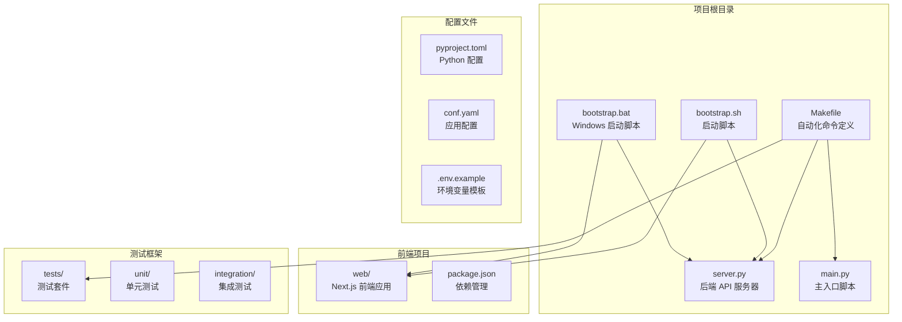

**图表来源**
- [Makefile](file://Makefile#L1-L35)
- [server.py](file://server.py#L1-L93)
- [main.py](file://main.py#L1-L157)

## 核心自动化命令

DeerFlow 的 Makefile 定义了六个核心自动化命令，每个命令都有明确的功能定位和执行逻辑：

### 帮助命令 (help)

```bash
make help
```

帮助命令显示所有可用的 Make 目标及其功能描述。它使用 grep 命令从 Makefile 中提取带有 `##` 注释的目标，提供清晰的命令列表。

### 开发环境安装 (install-dev)

```bash
make install-dev
```

该命令安装开发和测试所需的依赖包：
- 使用 `uv pip install -e ".[dev]"` 安装开发依赖
- 使用 `uv pip install -e ".[test]"` 安装测试依赖

### 代码格式化 (format)

```bash
make format
```

使用 ruff 工具对代码进行格式化：
- 执行 `uv run ruff format --config pyproject.toml .`
- 按照 pyproject.toml 中的配置规则格式化代码

### 代码检查 (lint)

```bash
make lint
```

执行代码检查和自动修复：
- 运行 `uv run ruff check --fix --select I --config pyproject.toml .`
- 仅检查导入顺序问题 (I 规则)
- 自动修复可修复的问题

### 前端代码检查 (lint-frontend)

```bash
make lint-frontend
```

前端代码质量检查流程：
1. 切换到 web 目录并安装依赖
2. 运行 `pnpm lint` 进行 ESLint 检查
3. 执行 `pnpm typecheck` 类型检查
4. 最后运行 `pnpm build` 构建检查

### 开发服务器启动 (serve)

```bash
make serve
```

启动开发服务器，启用自动重载功能：
- 执行 `uv run server.py --reload`
- 后端服务器在检测到文件变化时自动重启

### 测试执行 (test)

```bash
make test
```

运行完整的测试套件：
- 执行 `uv run pytest tests/`
- 收集覆盖率报告
- 生成详细的测试结果

### 覆盖率报告 (coverage)

```bash
make coverage
```

生成详细的代码覆盖率报告：
- 运行 `uv run pytest --cov=src tests/`
- 生成终端覆盖率摘要
- 导出 XML 格式的覆盖率报告

### LangGraph 开发模式 (langgraph-dev)

```bash
make langgraph-dev
```

启动 LangGraph 开发服务器：
- 使用 `uvx` 创建隔离环境
- 安装 `langgraph-cli[inmem]` 包
- 启动本地开发服务器

**章节来源**
- [Makefile](file://Makefile#L1-L35)

## 开发服务器启动机制

DeerFlow 提供了两种启动方式：通过 Makefile 的 `serve` 命令和通过 bootstrap 脚本。这两种方式都实现了前后端服务的并行启动机制。

### Makefile 启动方式

```bash
make serve
```

这种方式直接启动后端服务器，适用于简单的开发场景：

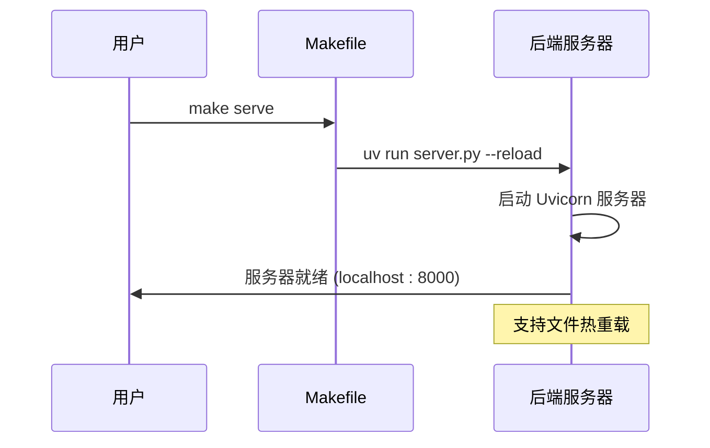

**图表来源**
- [Makefile](file://Makefile#L33-L33)
- [server.py](file://server.py#L60-L85)

### Bootstrap 脚本启动方式

Bootstrap 脚本提供了更完整的开发环境启动流程，支持跨平台操作：

#### Linux/macOS 版本 (bootstrap.sh)

```bash
./bootstrap.sh -d
```

该脚本实现以下功能：

```mermaid
flowchart TD
Start([启动脚本]) --> CheckMode{检查模式参数}
CheckMode --> |--dev/-d/dev/development| DevMode[开发模式]
CheckMode --> |其他| ProdMode[生产模式]
DevMode --> StartBackend[启动后端服务器<br/>uv run server.py --host 0.0.0.0 --reload]
DevMode --> StartFrontend[启动前端开发服务器<br/>cd web && pnpm dev]
DevMode --> SetupTrap[设置信号捕获<br/>trap "kill $SERVER_PID $WEB_PID"]
DevMode --> Wait[等待进程结束]
ProdMode --> StartProdBackend[启动生产后端<br/>uv run server.py]
ProdMode --> StartProdFrontend[启动生产前端<br/>cd web && pnpm start]
ProdMode --> SetupProdTrap[设置生产信号捕获]
ProdMode --> WaitProd[等待进程结束]
StartBackend --> Wait
StartFrontend --> Wait
StartProdBackend --> WaitProd
StartProdFrontend --> WaitProd
```

**图表来源**
- [bootstrap.sh](file://bootstrap.sh#L1-L19)

#### Windows 版本 (bootstrap.bat)

```bash
bootstrap.bat -d
```

Windows 版本的启动脚本使用批处理命令实现类似功能：

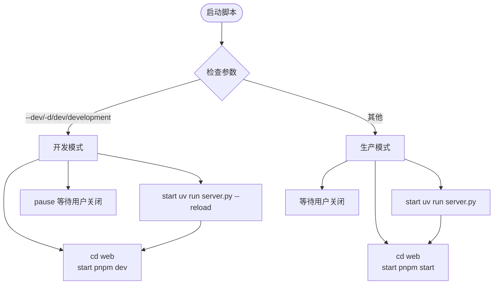

**图表来源**
- [bootstrap.bat](file://bootstrap.bat#L1-L29)

### 服务器配置参数

无论是通过 Makefile 还是 bootstrap 脚本启动，服务器都支持以下配置参数：

```python
# 主要配置参数
parser.add_argument(
    "--reload", action="store_true", 
    help="启用自动重载（默认：除 Windows 外都启用）"
)
parser.add_argument(
    "--host", type=str, default="localhost", 
    help="绑定主机地址（默认：localhost）"
)
parser.add_argument(
    "--port", type=int, default=8000, 
    help="绑定端口（默认：8000）"
)
parser.add_argument(
    "--log-level", type=str, default="info", 
    choices=["debug", "info", "warning", "error", "critical"],
    help="日志级别（默认：info）"
)
```

**章节来源**
- [server.py](file://server.py#L40-L70)
- [bootstrap.sh](file://bootstrap.sh#L1-L19)
- [bootstrap.bat](file://bootstrap.bat#L1-L29)

## 生产环境部署

生产环境部署通过 bootstrap 脚本的默认模式实现，与开发模式相比有以下关键差异：

### 生产模式特性

1. **主机绑定**：默认绑定到 `localhost`，提高安全性
2. **禁用自动重载**：不启用文件监控和自动重启
3. **优化性能**：使用生产优化的启动参数

### 生产启动流程

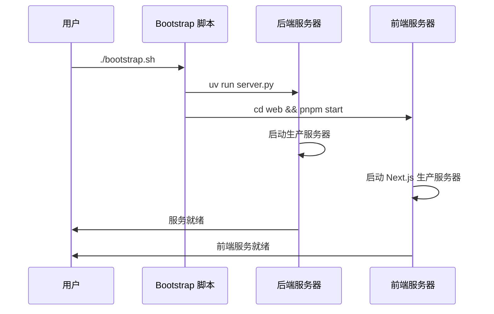

**图表来源**
- [bootstrap.sh](file://bootstrap.sh#L10-L12)

### 生产环境配置建议

对于生产环境部署，建议修改以下配置：

1. **主机配置**：在 bootstrap 脚本中将 `--host 0.0.0.0` 添加到服务器启动参数
2. **环境变量**：确保正确配置 `.env` 文件中的所有必需变量
3. **防火墙设置**：开放必要的端口（8000 用于后端，3000 用于前端）
4. **SSL/TLS**：考虑使用反向代理配置 HTTPS

**章节来源**
- [bootstrap.sh](file://bootstrap.sh#L10-L12)

## 测试框架详解

DeerFlow 的测试框架采用分层架构，包含单元测试和集成测试两个层次。

### 测试目录结构

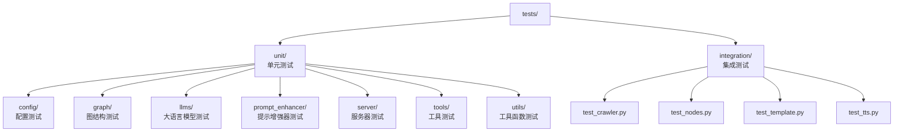

**图表来源**
- [tests/test_state.py](file://tests/test_state.py#L1-L134)

### 测试执行流程

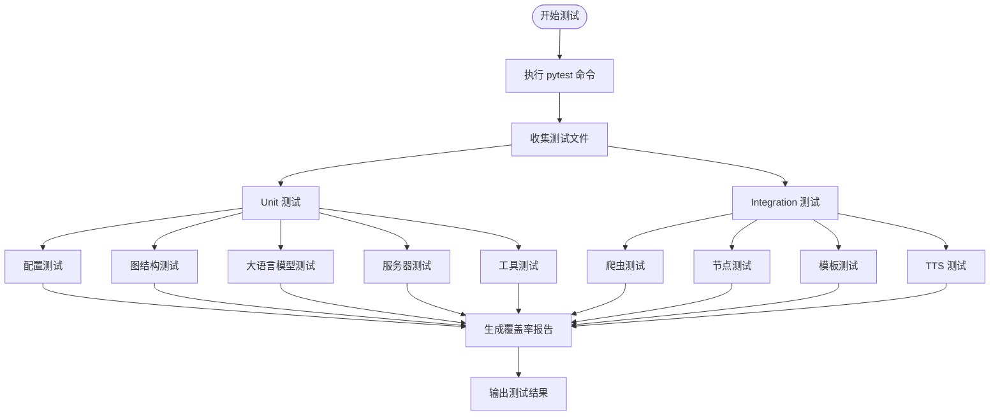

**图表来源**
- [Makefile](file://Makefile#L34-L35)
- [pyproject.toml](file://pyproject.toml#L45-L50)

### 测试配置

测试框架使用 pytest 和 pytest-cov 进行测试执行和覆盖率分析：

```toml
[tool.pytest.ini_options]
testpaths = ["tests"]
python_files = ["test_*.py"]
addopts = "-v --cov=src --cov-report=term-missing"
filterwarnings = [
    "ignore::DeprecationWarning",
    "ignore::UserWarning",
]

[tool.coverage.report]
fail_under = 25
```

### 测试覆盖率要求

- **最小覆盖率**：25%
- **报告格式**：终端摘要 + XML 报告
- **覆盖范围**：仅覆盖 `src` 目录

**章节来源**
- [pyproject.toml](file://pyproject.toml#L45-L55)
- [tests/test_state.py](file://tests/test_state.py#L1-L134)

## 代码质量工具

DeerFlow 集成了多个代码质量工具，确保代码的一致性和可维护性。

### Ruff 工具链

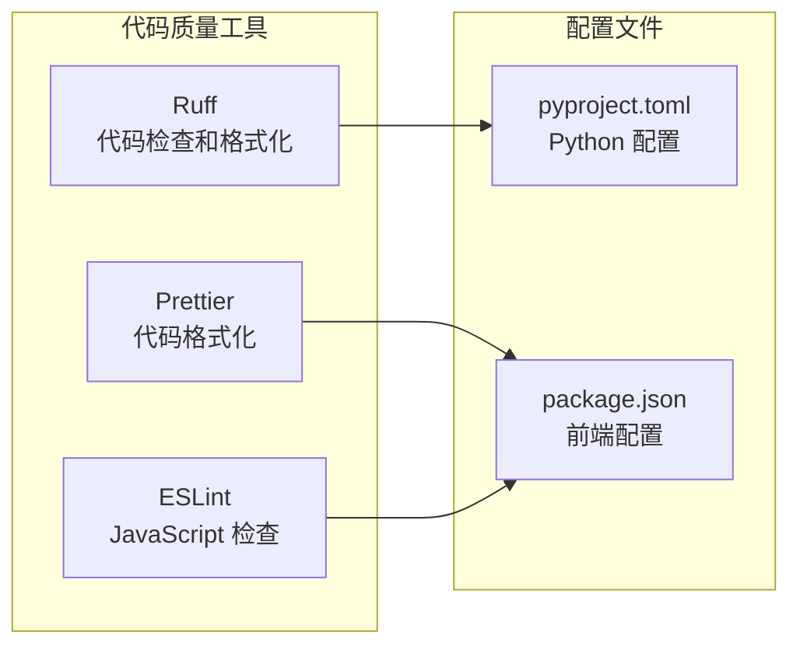

**图表来源**
- [pyproject.toml](file://pyproject.toml#L70-L85)
- [web/package.json](file://web/package.json#L1-L50)

### Python 代码质量

#### Ruff 配置

```toml
[tool.ruff]
line-length = 88
indent-width = 4
target-version = "py312"
extend-include = ["*.pyi"]

[tool.ruff.format]
indent-style = "space"
line-ending = "auto"
exclude = ['^/build/']
```

#### Ruff 命令

1. **格式化**：`uv run ruff format --config pyproject.toml .`
2. **检查修复**：`uv run ruff check --fix --select I --config pyproject.toml .`

### 前端代码质量

#### ESLint 配置

前端使用 Next.js 内置的 ESLint 配置，支持：
- TypeScript 类型检查
- React 组件最佳实践
- 代码风格一致性

#### Prettier 配置

- **缩进**：4 个空格
- **行尾**：自动检测
- **文件类型**：支持 `.ts`, `.tsx`, `.js`, `.jsx`, `.mdx`

### 代码质量检查流程

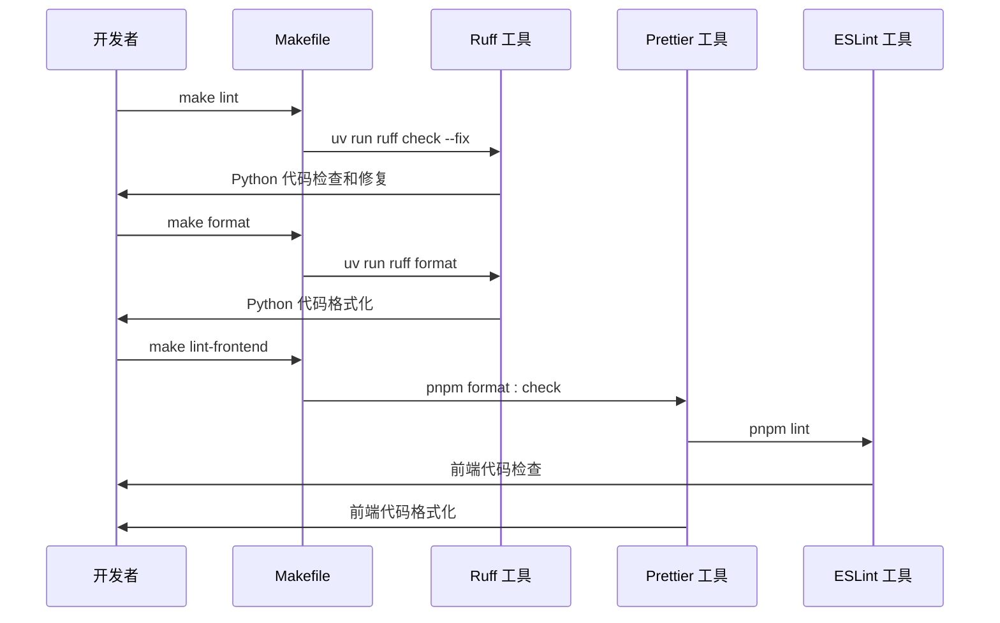

**图表来源**
- [Makefile](file://Makefile#L10-L15)
- [web/package.json](file://web/package.json#L6-L15)

**章节来源**
- [pyproject.toml](file://pyproject.toml#L70-L85)
- [web/package.json](file://web/package.json#L6-L15)

## 前端构建流程

前端构建流程通过 npm scripts 实现，支持开发和生产两种模式。

### 前端项目结构

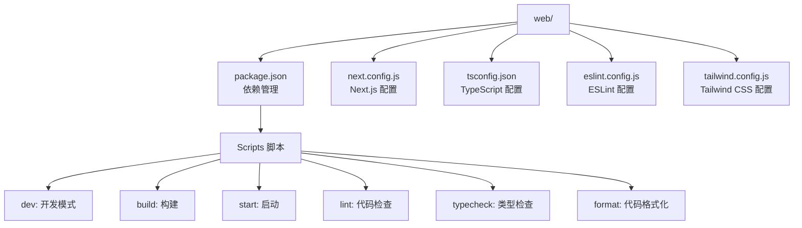

**图表来源**
- [web/package.json](file://web/package.json#L1-L117)

### 前端脚本功能

#### 开发模式

```bash
pnpm dev
```

- 启动 Next.js 开发服务器
- 启用热重载功能
- 使用 `--turbo` 参数加速构建
- 通过 dotenv 加载环境变量

#### 构建模式

```bash
pnpm build
```

- 生成生产就绪的静态文件
- 优化 JavaScript 和 CSS
- 生成 HTML 页面

#### 启动模式

```bash
pnpm start
```

- 启动生产服务器
- 无需构建步骤
- 更快的启动速度

#### 代码质量检查

```bash
pnpm lint
pnpm typecheck
pnpm build
```

- **ESLint 检查**：`pnpm lint`
- **TypeScript 类型检查**：`pnpm typecheck`
- **构建检查**：`pnpm build`

### 前端依赖管理

前端项目使用 pnpm 作为包管理器，具有以下优势：

1. **磁盘空间效率**：共享依赖缓存
2. **安装速度**：更快的依赖安装
3. **版本锁定**：精确的版本控制

### 前端构建流程

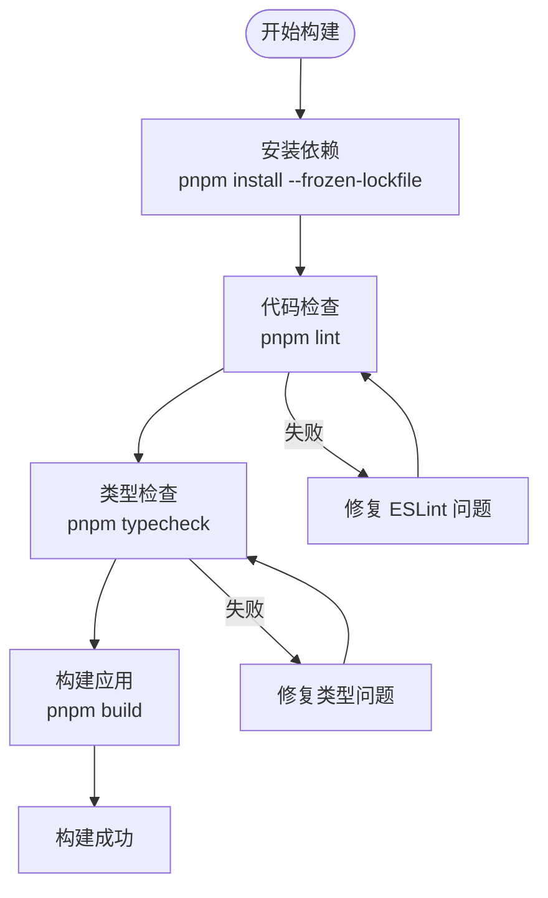

**图表来源**
- [Makefile](file://Makefile#L12-L15)

**章节来源**
- [web/package.json](file://web/package.json#L1-L117)

## 进程管理和错误处理

DeerFlow 的启动脚本实现了完善的进程管理和错误处理机制。

### 进程管理策略

#### Linux/macOS 平台

```bash
# 设置信号捕获
trap "kill $$SERVER_PID $$WEB_PID" SIGINT SIGTERM

# 等待进程结束
wait
```

这种策略确保：
1. **优雅关闭**：接收到中断信号时优雅地终止所有子进程
2. **资源清理**：避免僵尸进程和资源泄漏
3. **状态同步**：主进程等待所有子进程完成

#### Windows 平台

```batch
REM Windows 版本使用 pause 等待用户手动关闭
pause
```

### 错误处理机制

#### 服务器错误处理

```python
# server.py 中的错误处理
try:
    logger.info(f"Starting DeerFlow API server on {args.host}:{args.port}")
    uvicorn.run(
        "src.server:app",
        host=args.host,
        port=args.port,
        reload=reload,
        log_level=args.log_level,
    )
except Exception as e:
    logger.error(f"Failed to start server: {str(e)}")
    sys.exit(1)
```

#### 信号处理

```python
def handle_shutdown(signum, frame):
    """处理优雅关闭信号"""
    logger.info("Received shutdown signal. Starting graceful shutdown...")
    sys.exit(0)

# 注册信号处理器
signal.signal(signal.SIGTERM, handle_shutdown)
signal.signal(signal.SIGINT, handle_shutdown)
```

### 日志输出规范

#### 日志格式

```python
logging.basicConfig(
    level=logging.INFO,
    format="%(asctime)s - %(name)s - %(levelname)s - %(message)s",
)
```

#### 日志级别

- **DEBUG**：详细调试信息
- **INFO**：一般信息记录
- **WARNING**：警告信息
- **ERROR**：错误信息
- **CRITICAL**：严重错误

### 进程监控流程

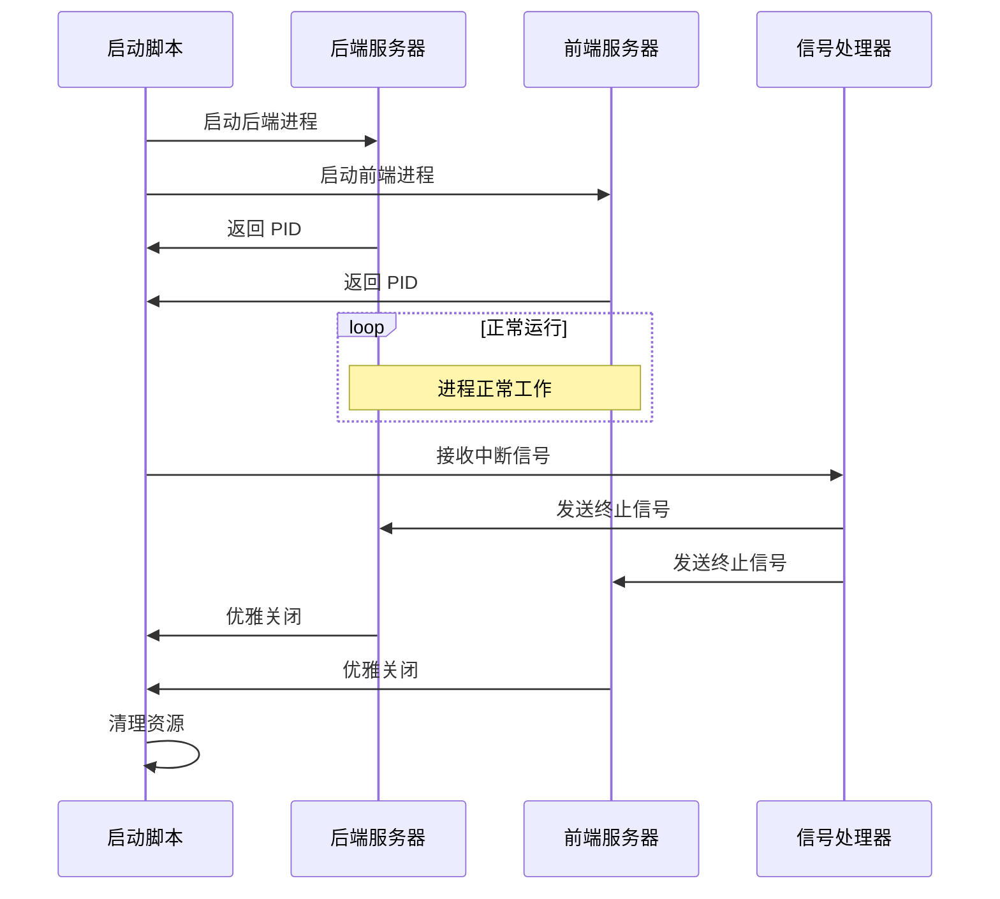

**图表来源**
- [server.py](file://server.py#L25-L35)
- [bootstrap.sh](file://bootstrap.sh#L10-L12)

**章节来源**
- [server.py](file://server.py#L25-L93)
- [bootstrap.sh](file://bootstrap.sh#L10-L12)
- [bootstrap.bat](file://bootstrap.bat#L15-L18)

## CI/CD 集成指南

DeerFlow 的自动化命令系统可以轻松集成到 CI/CD 流水线中，实现持续集成和持续部署。

### CI/CD 流水线设计

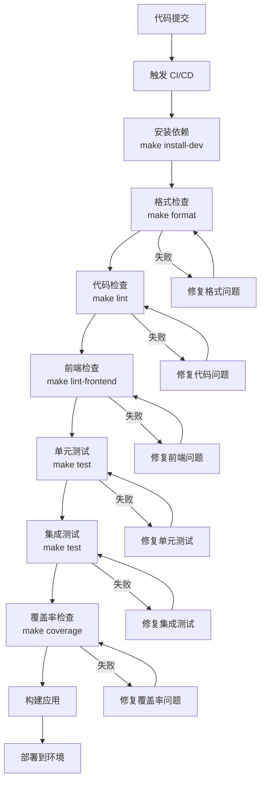

### GitHub Actions 示例

```yaml
name: DeerFlow CI/CD Pipeline

on:
  push:
    branches: [main, develop]
  pull_request:
    branches: [main]

jobs:
  test:
    runs-on: ubuntu-latest
    
    steps:
    - uses: actions/checkout@v4
    
    - name: Set up Python
      uses: actions/setup-python@v4
      with:
        python-version: '3.12'
        
    - name: Install uv
      run: |
        curl -LsSf https://astral.sh/uv/install.sh | sh
        
    - name: Install dependencies
      run: make install-dev
      
    - name: Format check
      run: make format
      
    - name: Lint check
      run: make lint
      
    - name: Frontend lint check
      run: make lint-frontend
      
    - name: Run tests
      run: make test
      
    - name: Upload coverage
      uses: codecov/codecov-action@v3
      with:
        file: ./coverage.xml
        flags: unittests
        name: codecov-umbrella
```

### Docker 集成

```dockerfile
FROM python:3.12-slim

WORKDIR /app

# 安装系统依赖
RUN apt-get update && apt-get install -y \
    curl \
    git \
    && rm -rf /var/lib/apt/lists/*

# 安装 uv
COPY --from=ghcr.io/astral-sh/uv:latest /uv /usr/local/bin/

# 复制项目文件
COPY . .

# 安装 Python 依赖
RUN uv sync --frozen

# 设置环境变量
ENV PYTHONPATH=/app/src

# 暴露端口
EXPOSE 8000

# 启动命令
CMD ["make", "serve"]
```

### 部署脚本

```bash
#!/bin/bash
# deploy.sh - 生产环境部署脚本

set -e

echo "Starting production deployment..."

# 拉取最新代码
git pull origin main

# 安装生产依赖
make install-dev

# 运行测试
make test

# 构建前端
cd web
pnpm install --frozen-lockfile
pnpm build
cd ..

# 启动生产服务
./bootstrap.sh

echo "Deployment completed successfully!"
```

### 监控和告警

```yaml
# monitoring.yml
monitors:
  - name: "DeerFlow Backend Health"
    endpoint: "http://localhost:8000/health"
    interval: 30s
    timeout: 10s
    
  - name: "DeerFlow Frontend Availability"
    endpoint: "http://localhost:3000"
    interval: 30s
    timeout: 10s
    
alerts:
  - name: "Service Down Alert"
    condition: "response_time > 60s OR status_code != 200"
    recipients: ["admin@example.com"]
    severity: "high"
```

## 故障排除指南

### 常见问题及解决方案

#### 1. 端口冲突

**问题**：端口 8000 或 3000 被占用

**解决方案**：
```bash
# 查找占用端口的进程
lsof -i :8000
lsof -i :3000

# 杀死占用进程
kill -9 <PID>

# 或者更改端口配置
uv run server.py --port 8080
```

#### 2. 依赖安装失败

**问题**：uv 安装依赖时出错

**解决方案**：
```bash
# 清理 uv 缓存
uv cache clean

# 强制重新安装
uv sync --force

# 检查 Python 版本
python --version
```

#### 3. 前端构建失败

**问题**：pnpm 构建失败

**解决方案**：
```bash
# 清理 node_modules
rm -rf web/node_modules

# 重新安装依赖
cd web && pnpm install

# 检查 Node.js 版本
node --version
```

#### 4. 服务器启动失败

**问题**：Uvicorn 启动失败

**解决方案**：
```bash
# 检查配置文件
cat conf.yaml

# 检查环境变量
cat .env

# 单独测试服务器
uv run server.py --host 0.0.0.0 --port 8000
```

### 调试技巧

#### 启用调试模式

```bash
# 启用详细日志
uv run server.py --log-level debug

# 在 main.py 中启用调试
uv run main.py --debug
```

#### 网络连接测试

```bash
# 测试后端 API
curl http://localhost:8000/health

# 测试前端页面
curl http://localhost:3000

# 测试端口连通性
telnet localhost 8000
telnet localhost 3000
```

#### 性能监控

```bash
# 监控内存使用
top -p $(pgrep -f server.py)

# 监控网络连接
netstat -tulpn | grep :8000

# 监控磁盘空间
df