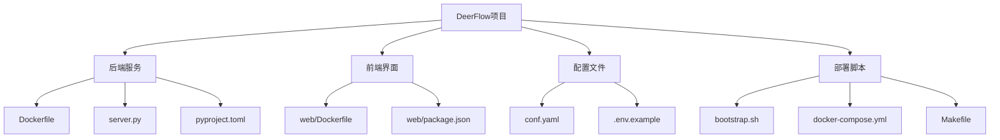
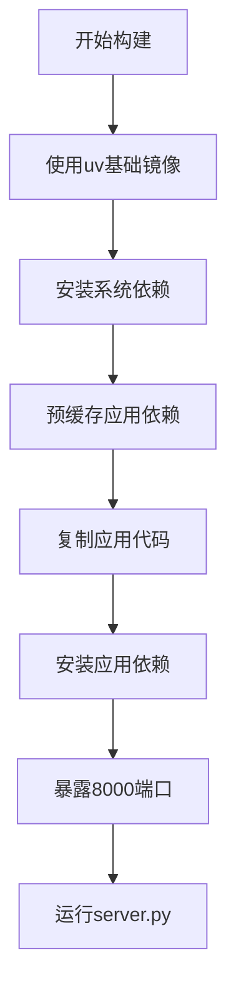
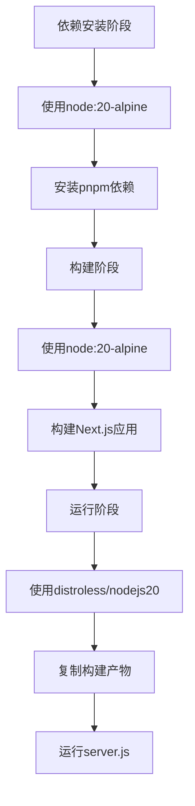
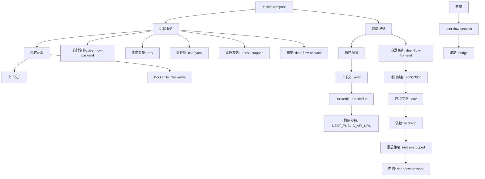
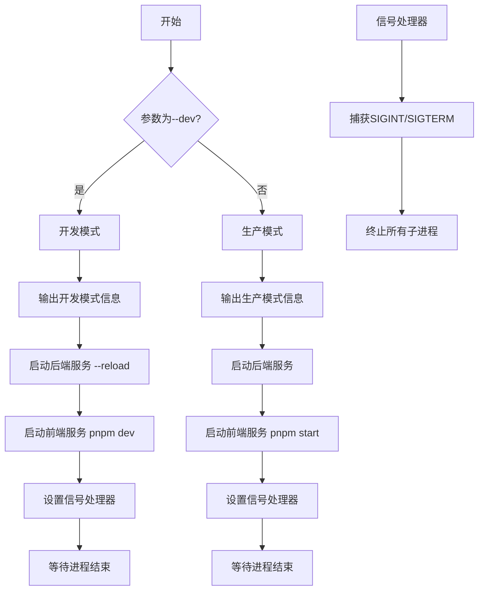
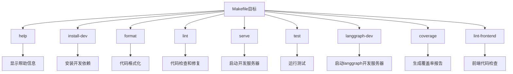
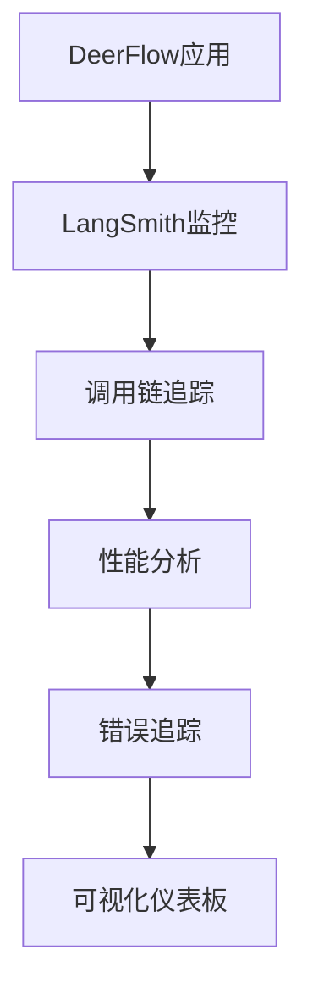

# 部署流程

<cite>
**本文档中引用的文件**  
- [Dockerfile](file://Dockerfile)
- [docker-compose.yml](file://docker-compose.yml)
- [bootstrap.sh](file://bootstrap.sh)
- [Makefile](file://Makefile)
- [web/Dockerfile](file://web/Dockerfile)
- [pyproject.toml](file://pyproject.toml)
- [conf.yaml](file://conf.yaml)
- [server.py](file://server.py)
- [.env.example](file://.env.example)
- [src/config/loader.py](file://src/config/loader.py)
</cite>

## 目录
1. [简介](#简介)
2. [项目结构](#项目结构)
3. [Docker镜像构建](#docker镜像构建)
4. [Docker Compose服务编排](#docker-compose服务编排)
5. [bootstrap.sh初始化流程](#bootstrapsh初始化流程)
6. [Makefile便捷命令](#makefile便捷命令)
7. [部署场景指导](#部署场景指导)
8. [性能调优与监控](#性能调优与监控)
9. [结论](#结论)

## 简介
DeerFlow是一个基于LangGraph的智能代理工作流系统，支持深度研究、播客生成和PPT生成等多种AI应用。本部署指南提供了从零开始的完整部署说明，涵盖Docker镜像构建、服务编排、初始化流程和多种部署场景。

## 项目结构
DeerFlow项目采用模块化设计，主要包含后端服务、前端界面和配置文件。项目根目录包含核心的Dockerfile、docker-compose.yml、bootstrap.sh和Makefile等部署相关文件。



**Diagram sources**
- [Dockerfile](file://Dockerfile)
- [web/Dockerfile](file://web/Dockerfile)
- [conf.yaml](file://conf.yaml)
- [bootstrap.sh](file://bootstrap.sh)
- [docker-compose.yml](file://docker-compose.yml)
- [Makefile](file://Makefile)

**Section sources**
- [Dockerfile](file://Dockerfile)
- [docker-compose.yml](file://docker-compose.yml)
- [bootstrap.sh](file://bootstrap.sh)
- [Makefile](file://Makefile)
- [web/Dockerfile](file://web/Dockerfile)

## Docker镜像构建

### 后端Docker镜像构建
DeerFlow后端使用uv作为Python包管理器，基于ghcr.io/astral-sh/uv:python3.12-bookworm基础镜像构建。Dockerfile首先安装系统依赖，然后预缓存应用依赖，最后复制应用代码并安装依赖。



**Diagram sources**
- [Dockerfile](file://Dockerfile)

**Section sources**
- [Dockerfile](file://Dockerfile)
- [pyproject.toml](file://pyproject.toml)

### 前端Docker镜像构建
前端使用多阶段构建策略，分为依赖安装、构建和运行三个阶段。第一阶段安装Node.js依赖，第二阶段构建应用，第三阶段使用轻量级distroless镜像运行应用。



**Diagram sources**
- [web/Dockerfile](file://web/Dockerfile)

**Section sources**
- [web/Dockerfile](file://web/Dockerfile)
- [web/package.json](file://web/package.json)

## Docker Compose服务编排

### 服务配置
docker-compose.yml文件定义了后端和前端两个服务，通过自定义网络进行通信。后端服务不直接暴露端口，通过前端服务反向代理访问。



**Diagram sources**
- [docker-compose.yml](file://docker-compose.yml)

**Section sources**
- [docker-compose.yml](file://docker-compose.yml)
- [web/docker-compose.yml](file://web/docker-compose.yml)

## bootstrap.sh初始化流程

### 脚本功能
bootstrap.sh脚本用于启动DeerFlow的后端和前端服务。根据启动参数判断运行模式（开发或生产），并启动相应的服务进程。



**Diagram sources**
- [bootstrap.sh](file://bootstrap.sh)

**Section sources**
- [bootstrap.sh](file://bootstrap.sh)
- [server.py](file://server.py)

## Makefile便捷命令

### 可用目标
Makefile提供了多个便捷命令，用于开发、测试和部署DeerFlow应用。



**Diagram sources**
- [Makefile](file://Makefile)

**Section sources**
- [Makefile](file://Makefile)
- [pyproject.toml](file://pyproject.toml)

## 部署场景指导

### 本地开发部署
本地开发部署使用bootstrap.sh脚本的开发模式，启用自动重载功能，便于开发调试。

```bash
./bootstrap.sh --dev
```

### 测试环境部署
测试环境部署使用Docker Compose，确保环境一致性。

```bash
docker-compose up --build
```

### 生产环境部署
生产环境部署建议使用Docker Compose，并配置适当的资源限制和监控。

```bash
docker-compose -f docker-compose.yml up -d
```

**Section sources**
- [bootstrap.sh](file://bootstrap.sh)
- [docker-compose.yml](file://docker-compose.yml)
- [Makefile](file://Makefile)

## 性能调优与监控

### 资源分配策略
根据DeerFlow的应用特性，建议的资源分配策略如下：

| 服务 | CPU核心 | 内存 | 存储 |
|------|--------|------|------|
| 后端 | 2-4 | 4-8GB | 50GB |
| 前端 | 1-2 | 2-4GB | 10GB |

### 监控集成方法
DeerFlow可以通过环境变量集成LangSmith等监控工具，实现调用链追踪和性能监控。



**Section sources**
- [.env.example](file://.env.example)
- [src/config/loader.py](file://src/config/loader.py)

## 结论
DeerFlow提供了完整的部署解决方案，通过Docker镜像构建、Docker Compose服务编排、bootstrap.sh初始化脚本和Makefile便捷命令，实现了从开发到生产的全流程部署。建议根据具体场景选择合适的部署方式，并配置适当的性能调优和监控策略。