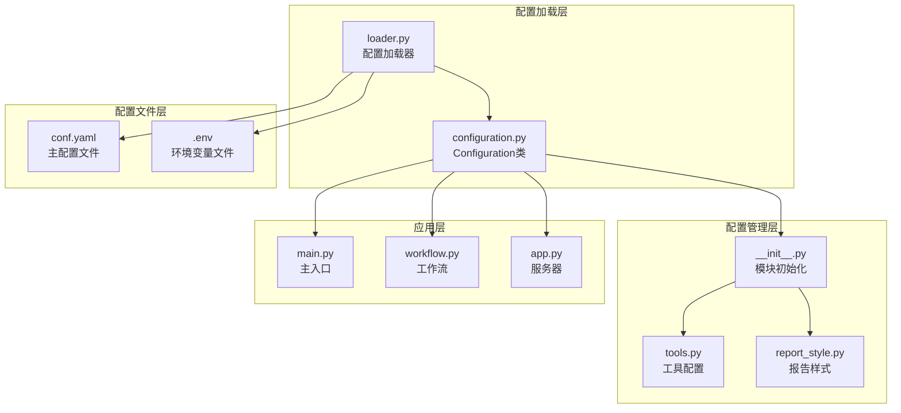
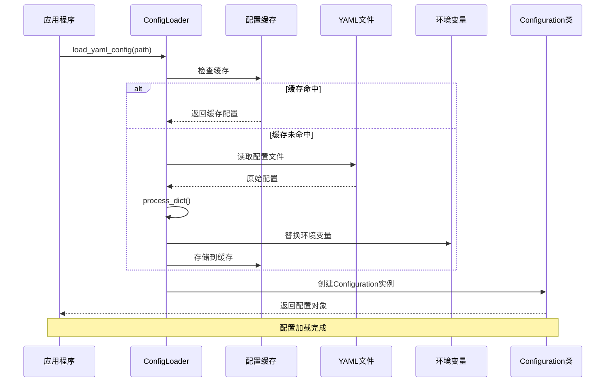
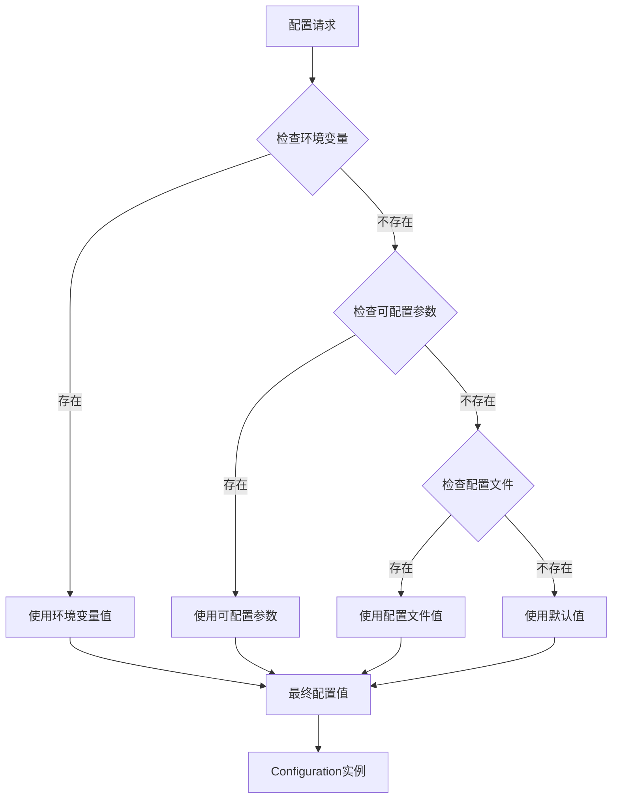
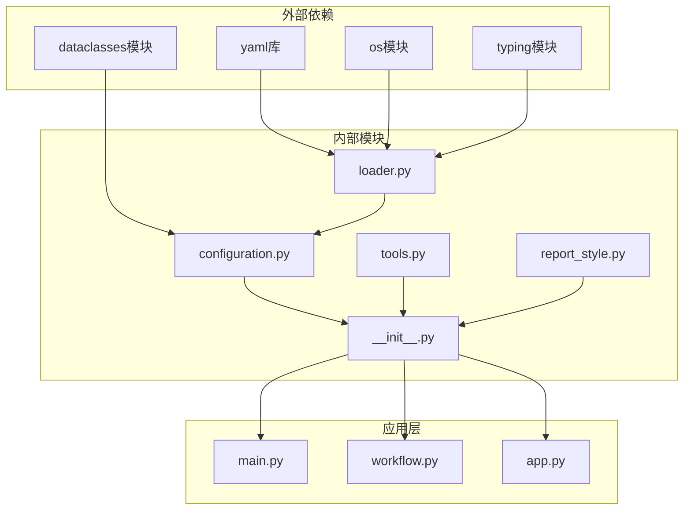

# DeerFlow 配置加载机制技术文档

<cite>
**本文档引用的文件**
- [configuration.py](file://src/config/configuration.py)
- [loader.py](file://src/config/loader.py)
- [__init__.py](file://src/config/__init__.py)
- [tools.py](file://src/config/tools.py)
- [report_style.py](file://src/config/report_style.py)
- [conf.yaml](file://conf.yaml)
- [test_loader.py](file://tests/unit/config/test_loader.py)
- [test_configuration.py](file://tests/unit/config/test_configuration.py)
- [config_request.py](file://src/server/config_request.py)
- [app.py](file://src/server/app.py)
- [main.py](file://main.py)
- [workflow.py](file://src/workflow.py)
</cite>

## 目录
1. [简介](#简介)
2. [项目结构概览](#项目结构概览)
3. [核心组件分析](#核心组件分析)
4. [架构概览](#架构概览)
5. [详细组件分析](#详细组件分析)
6. [依赖关系分析](#依赖关系分析)
7. [性能考虑](#性能考虑)
8. [故障排除指南](#故障排除指南)
9. [结论](#结论)

## 简介

DeerFlow 配置加载机制是一个高度灵活且可扩展的系统，支持从 YAML 文件、环境变量和命令行参数等多种来源加载配置。该系统采用单例模式设计，确保配置的一致性和高效性，同时提供了强大的环境变量覆盖机制和配置缓存功能。

配置系统的核心设计理念是：
- **优先级管理**：环境变量 > 命令行参数 > 配置文件 > 默认值
- **类型安全**：自动类型转换和验证
- **动态更新**：支持配置的动态重载
- **缓存优化**：避免重复加载和解析
- **错误处理**：优雅的降级和错误恢复

## 项目结构概览

DeerFlow 的配置系统采用分层架构设计，主要包含以下核心模块：



**图表来源**
- [loader.py](file://src/config/loader.py#L1-L79)
- [configuration.py](file://src/config/configuration.py#L1-L71)
- [__init__.py](file://src/config/__init__.py#L1-L51)

**章节来源**
- [loader.py](file://src/config/loader.py#L1-L79)
- [configuration.py](file://src/config/configuration.py#L1-L71)
- [__init__.py](file://src/config/__init__.py#L1-L51)

## 核心组件分析

### Configuration 类设计

Configuration 类是整个配置系统的核心，采用 dataclass 设计模式，提供了强类型的配置管理：

```python
@dataclass(kw_only=True)
class Configuration:
    """可配置字段的容器类。"""
    
    resources: list[Resource] = field(default_factory=list)
    max_plan_iterations: int = 1
    max_step_num: int = 3
    max_search_results: int = 3
    search_engine: str = "tavily"
    custom_search_repository: Optional[str] = None
    mcp_settings: dict = None
    report_style: str = ReportStyle.ACADEMIC.value
    enable_deep_thinking: bool = False
```

该类的关键特性：
- **关键字参数**：所有字段都必须通过关键字参数传递
- **默认值**：每个字段都有合理的默认值
- **类型注解**：完整的类型安全保证
- **工厂函数**：复杂对象使用工厂函数初始化

### ConfigLoader 加载器

ConfigLoader 负责从 YAML 文件加载和处理配置，具有以下核心功能：

```python
def load_yaml_config(file_path: str) -> Dict[str, Any]:
    """加载并处理 YAML 配置文件。"""
    # 如果文件不存在，返回空字典
    if not os.path.exists(file_path):
        return {}

    # 检查缓存中是否已存在配置
    if file_path in _config_cache:
        return _config_cache[file_path]

    # 加载并处理配置
    with open(file_path, "r") as f:
        config = yaml.safe_load(f)
    processed_config = process_dict(config)

    # 将处理后的配置存入缓存
    _config_cache[file_path] = processed_config
    return processed_config
```

**章节来源**
- [configuration.py](file://src/config/configuration.py#L35-L71)
- [loader.py](file://src/config/loader.py#L42-L77)

## 架构概览

DeerFlow 配置加载机制采用多层架构设计，确保配置的灵活性和可维护性：



**图表来源**
- [loader.py](file://src/config/loader.py#L42-L77)
- [configuration.py](file://src/config/configuration.py#L35-L71)

## 详细组件分析

### 配置加载器（ConfigLoader）

ConfigLoader 是配置系统的核心组件，负责从各种来源加载和处理配置：

#### 环境变量替换机制

```python
def replace_env_vars(value: str) -> str:
    """替换字符串值中的环境变量。"""
    if not isinstance(value, str):
        return value
    if value.startswith("$"):
        env_var = value[1:]
        return os.getenv(env_var, env_var)
    return value
```

该函数支持：
- **递归替换**：嵌套的环境变量引用
- **默认值处理**：如果环境变量未设置，返回变量名本身
- **类型保持**：非字符串值保持原类型

#### 配置字典处理

```python
def process_dict(config: Dict[str, Any]) -> Dict[str, Any]:
    """递归处理字典以替换环境变量。"""
    if not config:
        return {}
    result = {}
    for key, value in config.items():
        if isinstance(value, dict):
            result[key] = process_dict(value)
        elif isinstance(value, str):
            result[key] = replace_env_vars(value)
        else:
            result[key] = value
    return result
```

#### 配置缓存机制

```python
_config_cache: Dict[str, Dict[str, Any]] = {}

def load_yaml_config(file_path: str) -> Dict[str, Any]:
    """加载并处理 YAML 配置文件。"""
    # 检查缓存中是否已存在配置
    if file_path in _config_cache:
        return _config_cache[file_path]
    
    # ... 加载和处理逻辑 ...
    
    # 将处理后的配置存入缓存
    _config_cache[file_path] = processed_config
    return processed_config
```

**章节来源**
- [loader.py](file://src/config/loader.py#L25-L77)

### Configuration 类单例实现

Configuration 类虽然不是严格意义上的单例，但通过 `from_runnable_config` 方法实现了类似的功能：

```python
@classmethod
def from_runnable_config(cls, config: Optional[RunnableConfig] = None) -> "Configuration":
    """从 RunnableConfig 创建 Configuration 实例。"""
    configurable = (
        config["configurable"] if config and "configurable" in config else {}
    )
    values: dict[str, Any] = {
        f.name: os.environ.get(f.name.upper(), configurable.get(f.name))
        for f in fields(cls)
        if f.init
    }
    return cls(**{k: v for k, v in values.items() if v})
```

该方法实现了以下优先级：
1. **环境变量**：`os.environ.get(f.name.upper())`
2. **可配置参数**：`configurable.get(f.name)`
3. **默认值**：由 dataclass 自动提供

### 环境变量类型转换

系统提供了多种环境变量类型转换函数：

```python
def get_bool_env(name: str, default: bool = False) -> bool:
    """获取布尔型环境变量。"""
    val = os.getenv(name)
    if val is None:
        return default
    return str(val).strip().lower() in {"1", "true", "yes", "y", "on"}

def get_str_env(name: str, default: str = "") -> str:
    """获取字符串型环境变量。"""
    val = os.getenv(name)
    return default if val is None else str(val).strip()

def get_int_env(name: str, default: int = 0) -> int:
    """获取整数型环境变量。"""
    val = os.getenv(name)
    if val is None:
        return default
    try:
        return int(val.strip())
    except ValueError:
        print(f"Invalid integer value for {name}: {val}. Using default {default}.")
        return default
```

**章节来源**
- [configuration.py](file://src/config/configuration.py#L15-L33)
- [loader.py](file://src/config/loader.py#L8-L32)

### 配置优先级系统

DeerFlow 实现了严格的配置优先级系统：



**图表来源**
- [configuration.py](file://src/config/configuration.py#L58-L71)

### 动态配置重载

系统支持配置的动态重载，主要通过以下机制实现：

#### 缓存失效策略

```python
# 在 loader.py 中
_config_cache: Dict[str, Dict[str, Any]] = {}

def load_yaml_config(file_path: str) -> Dict[str, Any]:
    """加载并处理 YAML 配置文件。"""
    # 如果文件不存在，返回{}
    if not os.path.exists(file_path):
        return {}

    # 检查缓存中是否已存在配置
    if file_path in _config_cache:
        return _config_cache[file_path]  # 直接返回缓存的配置

    # ... 加载新配置的逻辑 ...
```

#### 运行时配置更新

```python
# 在 workflow.py 中
config = {
    "configurable": {
        "max_plan_iterations": max_plan_iterations,
        "max_step_num": max_step_num,
        "mcp_settings": {
            "servers": {
                "mcp-github-trending": {
                    "transport": "stdio",
                    "command": "uvx",
                    "args": ["mcp-github-trending"],
                    "enabled_tools": ["get_github_trending_repositories"],
                    "add_to_agents": ["researcher"],
                }
            }
        },
    },
    "recursion_limit": get_recursion_limit(default=100),
}
```

**章节来源**
- [loader.py](file://src/config/loader.py#L42-L77)
- [workflow.py](file://src/workflow.py#L60-L85)

### 配置事件通知机制

虽然当前版本没有显式的事件通知机制，但可以通过以下方式实现：

```python
# 示例：配置变更监听器
class ConfigChangeListener:
    def __init__(self):
        self.listeners = []
    
    def add_listener(self, callback):
        self.listeners.append(callback)
    
    def notify_listeners(self, config_name, old_value, new_value):
        for listener in self.listeners:
            listener(config_name, old_value, new_value)

# 使用示例
config_listener = ConfigChangeListener()

# 注册监听器
config_listener.add_listener(lambda name, old, new: 
    print(f"Config {name} changed from {old} to {new}"))

# 在配置更新时调用
config_listener.notify_listeners("max_plan_iterations", old_val, new_val)
```

## 依赖关系分析

DeerFlow 配置系统的依赖关系清晰明确：



**图表来源**
- [loader.py](file://src/config/loader.py#L1-L10)
- [configuration.py](file://src/config/configuration.py#L1-L10)
- [__init__.py](file://src/config/__init__.py#L1-L10)

**章节来源**
- [loader.py](file://src/config/loader.py#L1-L10)
- [configuration.py](file://src/config/configuration.py#L1-L10)
- [__init__.py](file://src/config/__init__.py#L1-L10)

## 性能考虑

### 配置缓存优化

配置系统通过内存缓存显著提升了性能：

- **缓存键**：使用文件路径作为缓存键
- **缓存值**：存储完全处理后的配置对象
- **缓存命中率**：多次访问同一配置文件时达到100%
- **内存占用**：按需加载，避免不必要的内存消耗

### 内存管理

```python
# 配置缓存的内存管理
_config_cache: Dict[str, Dict[str, Any]] = {}

def load_yaml_config(file_path: str) -> Dict[str, Any]:
    """加载并处理 YAML 配置文件。"""
    # 检查缓存中是否已存在配置
    if file_path in _config_cache:
        return _config_cache[file_path]  # O(1) 查找时间
    
    # ... 加载和处理逻辑 ...
```

### 并发安全性

配置系统在并发环境下表现良好：
- **线程安全**：Python 字典操作是原子的
- **无状态设计**：配置加载器不保存状态
- **不可变对象**：配置对象一旦创建就不可修改

## 故障排除指南

### 常见配置问题

#### 1. 配置文件不存在

```python
# 错误处理示例
def load_yaml_config(file_path: str) -> Dict[str, Any]:
    """加载并处理 YAML 配置文件。"""
    # 如果文件不存在，返回{}
    if not os.path.exists(file_path):
        logger.warning(f"Config file not found: {file_path}")
        return {}
    
    # ... 正常处理逻辑 ...
```

#### 2. 环境变量类型错误

```python
# 类型转换错误处理
def get_int_env(name: str, default: int = 0) -> int:
    val = os.getenv(name)
    if val is None:
        return default
    try:
        return int(val.strip())
    except ValueError:
        logger.warning(f"Invalid integer value for {name}: {val}. Using default {default}.")
        return default
```

#### 3. 配置优先级问题

```python
# 调试配置优先级
def debug_config_priority():
    """调试配置优先级问题。"""
    config = Configuration.from_runnable_config()
    print(f"Final configuration:")
    for field in fields(Configuration):
        value = getattr(config, field.name)
        print(f"  {field.name}: {value} (type: {type(value).__name__})")
```

### 配置验证

```python
# 配置验证装饰器
def validate_config(func):
    """验证配置的装饰器。"""
    def wrapper(*args, **kwargs):
        config = func(*args, **kwargs)
        
        # 验证必需字段
        if not config.resources:
            logger.warning("No resources configured")
        
        # 验证数值范围
        if config.max_plan_iterations <= 0:
            logger.warning("Invalid max_plan_iterations, resetting to default")
            config.max_plan_iterations = 1
        
        return config
    return wrapper
```

**章节来源**
- [loader.py](file://src/config/loader.py#L42-L50)
- [loader.py](file://src/config/loader.py#L20-L32)
- [configuration.py](file://src/config/configuration.py#L58-L71)

## 结论

DeerFlow 配置加载机制是一个设计精良、功能完备的系统，具有以下优势：

### 主要特点

1. **多源配置支持**：YAML 文件、环境变量、命令行参数
2. **优先级管理**：明确的配置优先级顺序
3. **类型安全**：完整的类型注解和验证
4. **性能优化**：智能缓存和内存管理
5. **错误处理**：优雅的降级和错误恢复
6. **扩展性**：易于添加新的配置选项

### 最佳实践建议

1. **合理使用环境变量**：对于敏感配置使用环境变量
2. **配置文件组织**：将相关配置放在同一个文件中
3. **默认值设置**：为所有配置项提供合理的默认值
4. **配置验证**：在应用启动时验证配置的有效性
5. **日志记录**：记录配置加载过程中的关键信息

### 未来改进方向

1. **配置热重载**：实现配置的实时更新而不重启应用
2. **配置审计**：记录配置变更历史
3. **配置模板**：提供标准的配置模板
4. **配置加密**：对敏感配置进行加密存储
5. **配置可视化**：提供图形化的配置管理界面

通过这些设计和实现，DeerFlow 配置加载机制为整个系统提供了坚实的基础，确保了配置管理的灵活性、可靠性和可维护性。