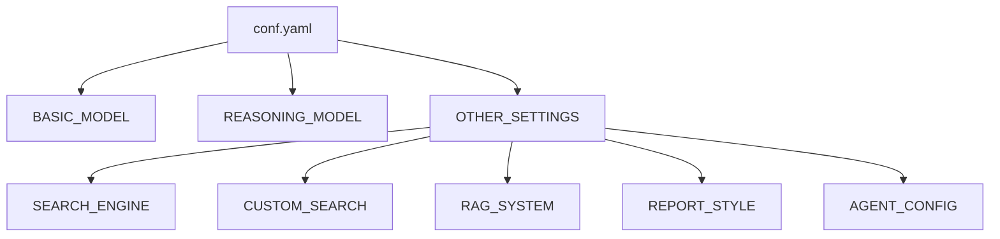

# DeerFlow 配置文件结构详细文档

<cite>
**本文档引用的文件**
- [conf.yaml](file://conf.yaml)
- [configuration.py](file://src/config/configuration.py)
- [loader.py](file://src/config/loader.py)
- [dashscope.py](file://src/llms/providers/dashscope.py)
- [tools.py](file://src/config/tools.py)
- [agents.py](file://src/config/agents.py)
- [custom_search.py](file://src/config/custom_search.py)
- [report_style.py](file://src/config/report_style.py)
- [questions.py](file://src/config/questions.py)
- [coordinator.md](file://src/prompts/coordinator.md)
- [planner.md](file://src/prompts/planner.md)
- [tavily_search_api_wrapper.py](file://src/tools/tavily_search/tavily_search_api_wrapper.py)
</cite>

## 目录
1. [简介](#简介)
2. [配置文件概述](#配置文件概述)
3. [基本模型配置](#基本模型配置)
4. [智能体配置](#智能体配置)
5. [工具集成配置](#工具集成配置)
6. [RAG系统配置](#rag系统配置)
7. [搜索引擎配置](#搜索引擎配置)
8. [自定义搜索配置](#自定义搜索配置)
9. [完整配置示例](#完整配置示例)
10. [配置最佳实践](#配置最佳实践)

## 简介

DeerFlow 是一个基于 LangGraph 的智能研究助手框架，支持多智能体协作进行深度信息收集和分析。配置文件 `conf.yaml` 是 DeerFlow 的核心配置中心，定义了 LLM 提供商、智能体行为、工具集成和 RAG 系统等各个方面。

## 配置文件概述

DeerFlow 使用 YAML 格式的配置文件，支持环境变量替换和配置缓存机制。配置文件采用分层结构，包含以下主要配置节：



**图表来源**
- [conf.yaml](file://conf.yaml#L1-L69)
- [configuration.py](file://src/config/configuration.py#L1-L71)

## 基本模型配置

### BASIC_MODEL 节点

这是 DeerFlow 的核心配置节点，定义了主要使用的 LLM 提供商设置。

```yaml
BASIC_MODEL:
  base_url: http://192.168.0.106:8088/v1
  model: qwen3-0.6
  api_key: xxxx
  # max_retries: 3 # 最大重试次数
  verify_ssl: false  # 注释此行以禁用SSL证书验证
```

#### 配置参数详解

| 参数名 | 类型 | 必需 | 默认值 | 描述 |
|--------|------|------|--------|------|
| `base_url` | 字符串 | 是 | - | LLM 服务的基础 URL |
| `model` | 字符串 | 是 | - | 使用的模型名称 |
| `api_key` | 字符串 | 是 | - | API 密钥 |
| `max_retries` | 整数 | 否 | 3 | LLM 调用的最大重试次数 |
| `verify_ssl` | 布尔值 | 否 | true | 是否验证 SSL 证书 |

#### 支持的 LLM 平台

DeerFlow 支持多种 LLM 平台，可以通过 `platform` 参数指定：

```yaml
# Google AI Studio 配置示例
BASIC_MODEL:
  platform: "google_aistudio"
  model: "gemini-2.5-flash"
  api_key: your_gemini_api_key
  max_retries: 3
```

**章节来源**
- [conf.yaml](file://conf.yaml#L1-L18)
- [dashscope.py](file://src/llms/providers/dashscope.py#L1-L50)

## 智能体配置

### 协调器（Coordinator）

协调器负责处理用户问候和简单对话，将复杂的研究请求转交给规划者。

**提示模板特点：**
- 支持多语言响应
- 区分直接处理、拒绝和转交三种请求类型
- 维护友好的专业对话风格

### 规划者（Planner）

规划者是研究流程的核心，负责分解研究任务并制定详细的信息收集计划。

**关键特性：**
- 严格的上下文评估标准
- 多维度信息收集框架
- 最大步骤限制控制
- 研究与处理步骤分离

**信息质量标准：**
1. **全面覆盖**：涵盖主题的所有方面
2. **充分深度**：提供详细的数据点和事实
3. **充足数量**：收集大量高质量信息

**章节来源**
- [coordinator.md](file://src/prompts/coordinator.md#L1-L56)
- [planner.md](file://src/prompts/planner.md#L1-L188)

## 工具集成配置

### 搜索引擎工具

DeerFlow 支持多种搜索引擎工具，通过 `SEARCH_ENGINE` 配置节点管理。

```yaml
SEARCH_ENGINE:
  engine: tavily
  include_domains:
    - example.com
    - trusted-news.com
    - reliable-source.org
    - gov.cn
    - edu.cn
  exclude_domains:
    - example.com
```

#### 可用搜索引擎

| 引擎名称 | 描述 | 特性 |
|----------|------|------|
| `tavily` | 高级搜索引擎 | 支持域名过滤、图像搜索 |
| `duckduckgo` | 隐私保护搜索 | 开源搜索引擎 |
| `brave_search` | Brave 浏览器搜索 | 隐私优先 |
| `arxiv` | 学术论文搜索 | 科研文献 |
| `wikipedia` | 维基百科搜索 | 通用知识 |
| `custom_search` | 自定义搜索引擎 | 企业内部搜索 |

### Python REPL 工具

允许在安全环境中执行 Python 代码，支持数学计算、数据分析等操作。

### TTS 工具

文本转语音功能，支持多种语音合成选项。

**章节来源**
- [tools.py](file://src/config/tools.py#L1-L32)
- [tavily_search_api_wrapper.py](file://src/tools/tavily_search/tavily_search_api_wrapper.py#L1-L114)

## RAG系统配置

### 向量数据库配置

DeerFlow 支持多种 RAG 提供商，通过 `RAG_PROVIDER` 环境变量或配置指定。

```python
class RAGProvider(enum.Enum):
    RAGFLOW = "ragflow"
    VIKINGDB_KNOWLEDGE_BASE = "vikingdb_knowledge_base"
    MILVUS = "milvus"
```

#### Milvus 配置

```yaml
RAG_SYSTEM:
  provider: milvus
  connection:
    host: localhost
    port: 19530
    database: default
  collection: deerflow_docs
  embedding_model: sentence-transformers/all-MiniLM-L6-v2
```

#### VikingDB 配置

```yaml
RAG_SYSTEM:
  provider: vikingdb_knowledge_base
  connection:
    url: http://localhost:8080
    api_key: your_api_key
  knowledge_base: deerflow_kb
```

#### RAGFlow 配置

```yaml
RAG_SYSTEM:
  provider: ragflow
  connection:
    base_url: http://localhost:9380
    api_key: your_api_key
  document_store: deerflow_store
```

**章节来源**
- [tools.py](file://src/config/tools.py#L20-L25)

## 搜索引擎配置

### Tavily 搜索引擎

Tavily 是 DeerFlow 的默认搜索引擎，提供高级搜索功能。

```yaml
SEARCH_ENGINE:
  engine: tavily
  include_domains:
    - example.com
    - trusted-news.com
    - reliable-source.org
    - gov.cn
    - edu.cn
  exclude_domains:
    - example.com
```

#### Tavily 配置参数

| 参数名 | 类型 | 描述 |
|--------|------|------|
| `engine` | 字符串 | 搜索引擎类型 |
| `include_domains` | 列表 | 包含的域名过滤 |
| `exclude_domains` | 列表 | 排除的域名过滤 |

### 自定义搜索配置

```yaml
CUSTOM_SEARCH:
  repositories:
    aggregation_search:
      name: "聚合搜索"
      description: "聚合多个数据源的搜索服务"
      repository: "aggregation-search"
      channel_id: "0"
    vector_search:
      name: "向量库"
      description: "基于向量相似度的搜索服务"
      repository: "euvd-searchByChannelId"
      channel_id: "0"
    dynamic_search:
      name: "交行知道"
      description: "交通银行内部知识库搜索"
      repository: "okic-dynamicSearch"
      channel_id: "0"
  default_repository: "dynamic_search"
```

**章节来源**
- [conf.yaml](file://conf.yaml#L20-L69)
- [custom_search.py](file://src/config/custom_search.py#L1-L120)

## 自定义搜索配置

### Repository 配置结构

每个自定义搜索仓库都有以下配置项：

```python
@dataclass
class CustomSearchRepository:
    name: str              # 显示名称
    description: str       # 功能描述
    repository: str        # 实际仓库标识
    channel_id: str = "0"  # 通道ID
```

### 可用仓库类型

| 仓库ID | 名称 | 描述 | 适用场景 |
|--------|------|------|----------|
| `aggregation_search` | 聚合搜索 | 多数据源聚合 | 通用信息检索 |
| `vector_search` | 向量库 | 基于向量相似度 | 精确内容匹配 |
| `dynamic_search` | 交行知道 | 内部知识库 | 企业内部搜索 |

**章节来源**
- [custom_search.py](file://src/config/custom_search.py#L10-L25)

## 完整配置示例

以下是 DeerFlow 的完整配置示例：

```yaml
# 基础模型配置
BASIC_MODEL:
  base_url: http://192.168.0.106:8088/v1
  model: qwen3-0.6
  api_key: ${DASHSCOPE_API_KEY}
  max_retries: 3
  verify_ssl: false

# 推理模型配置（可选）
REASONING_MODEL:
  base_url: https://ark.cn-beijing.volces.com/api/v3
  model: "doubao-1-5-thinking-pro-m-250428"
  api_key: ${DASHSCOPE_REASONING_API_KEY}
  max_retries: 3

# 搜索引擎配置
SEARCH_ENGINE:
  engine: tavily
  include_domains:
    - example.com
    - trusted-news.com
    - reliable-source.org
    - gov.cn
    - edu.cn
  exclude_domains:
    - example.com

# 自定义搜索配置
CUSTOM_SEARCH:
  repositories:
    aggregation_search:
      name: "聚合搜索"
      description: "聚合多个数据源的搜索服务"
      repository: "aggregation-search"
      channel_id: "0"
    vector_search:
      name: "向量库"
      description: "基于向量相似度的搜索服务"
      repository: "euvd-searchByChannelId"
      channel_id: "0"
    dynamic_search:
      name: "交行知道"
      description: "交通银行内部知识库搜索"
      repository: "okic-dynamicSearch"
      channel_id: "0"
  default_repository: "dynamic_search"

# RAG系统配置
RAG_SYSTEM:
  provider: milvus
  connection:
    host: localhost
    port: 19530
    database: default
  collection: deerflow_docs
  embedding_model: sentence-transformers/all-MiniLM-L6-v2

# 报告样式配置
REPORT_STYLE: academic

# 代理配置
AGENT_CONFIG:
  max_plan_iterations: 1
  max_step_num: 3
  max_search_results: 3
  enable_deep_thinking: false
```

## 配置最佳实践

### 环境变量使用

推荐使用环境变量来管理敏感信息：

```bash
export DASHSCOPE_API_KEY="your_api_key_here"
export DASHSCOPE_REASONING_API_KEY="your_reasoning_api_key_here"
export AGENT_RECURSION_LIMIT=25
```

### 性能优化建议

1. **合理设置重试次数**：避免过多重试导致性能下降
2. **选择合适的模型**：根据任务复杂度选择基础模型或推理模型
3. **域名过滤**：使用 `include_domains` 和 `exclude_domains` 提高搜索质量
4. **RAG配置优化**：根据数据规模选择合适的向量数据库

### 安全考虑

1. **SSL验证**：生产环境建议启用 SSL 验证
2. **API密钥管理**：使用环境变量存储 API 密钥
3. **访问控制**：限制配置文件的访问权限

### 监控和调试

1. **日志记录**：启用详细的日志记录
2. **性能监控**：监控 LLM 调用延迟和成功率
3. **错误处理**：实现适当的错误处理和重试机制

**章节来源**
- [loader.py](file://src/config/loader.py#L1-L79)
- [configuration.py](file://src/config/configuration.py#L1-L71)