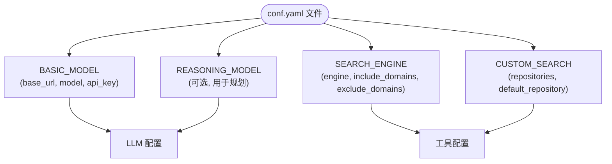
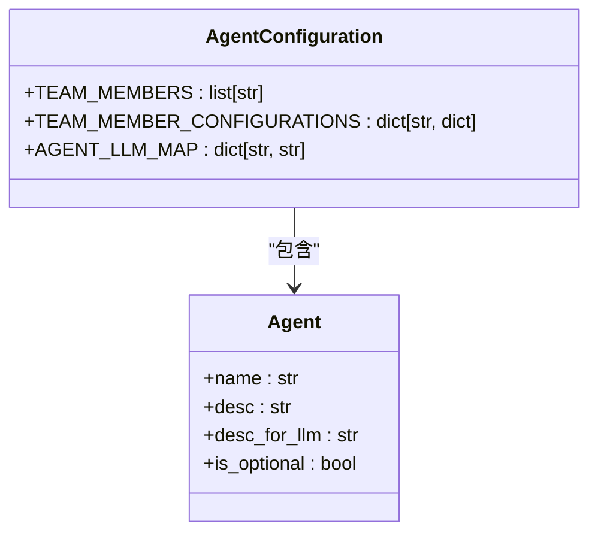
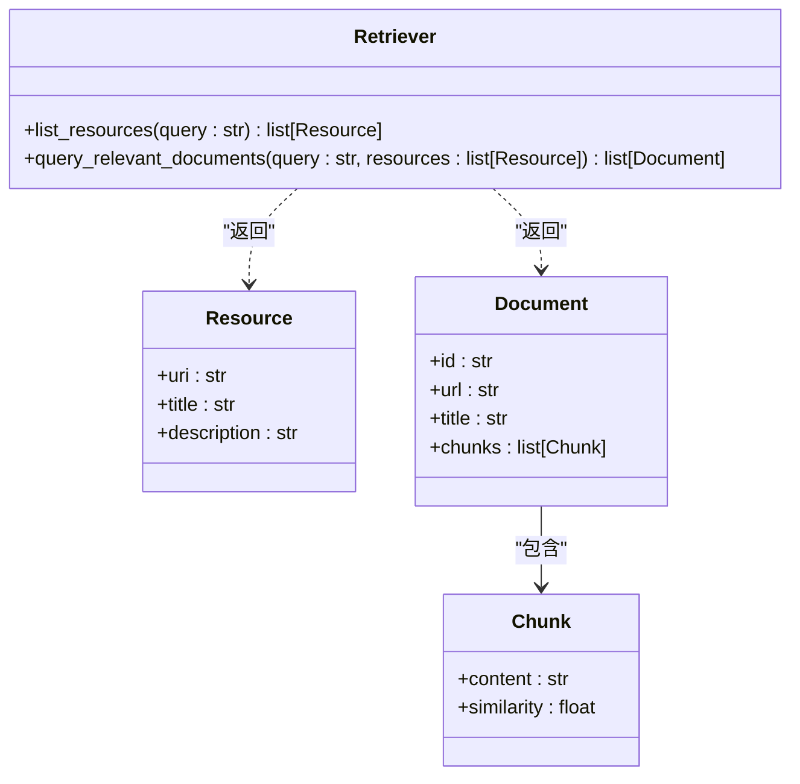

# 配置管理

<cite>
**本文档中引用的文件**  
- [conf.yaml](file://conf.yaml)
- [src/config/loader.py](file://src/config/loader.py)
- [src/config/configuration.py](file://src/config/configuration.py)
- [src/config/tools.py](file://src/config/tools.py)
- [src/config/agents.py](file://src/config/agents.py)
- [src/config/custom_search.py](file://src/config/custom_search.py)
- [src/config/report_style.py](file://src/config/report_style.py)
- [src/server/config_request.py](file://src/server/config_request.py)
- [src/server/rag_request.py](file://src/server/rag_request.py)
- [src/tools/search.py](file://src/tools/search.py)
- [src/llms/providers/dashscope.py](file://src/llms/providers/dashscope.py)
- [src/rag/retriever.py](file://src/rag/retriever.py)
- [tests/unit/config/test_loader.py](file://tests/unit/config/test_loader.py)
- [tests/unit/config/test_configuration.py](file://tests/unit/config/test_configuration.py)
</cite>

## 目录
1. [简介](#简介)
2. [配置文件结构](#配置文件结构)
3. [LLM提供商配置](#llm提供商配置)
4. [智能体参数配置](#智能体参数配置)
5. [工具集成选项](#工具集成选项)
6. [RAG系统设置](#rag系统设置)
7. [配置加载机制](#配置加载机制)
8. [配置验证与常见错误](#配置验证与常见错误)
9. [自定义配置项](#自定义配置项)
10. [附录](#附录)

## 简介
DeerFlow 是一个基于智能体的工作流系统，其行为和功能高度依赖于 `conf.yaml` 配置文件。本配置管理文档深入解析了 DeerFlow 的配置体系，涵盖 LLM 提供商、智能体角色、工具集成、RAG 系统等核心组件的配置方法。文档详细说明了配置的加载机制、优先级规则和动态重载功能，并提供了不同场景下的最佳实践示例。通过本指南，开发者可以全面掌握 DeerFlow 的配置管理，确保系统在不同环境下的稳定运行和高效开发。

## 配置文件结构
`conf.yaml` 是 DeerFlow 的核心配置文件，采用 YAML 格式定义了系统的各项参数。该文件位于项目根目录下，其结构清晰，主要分为以下几个部分：基础模型配置（BASIC_MODEL）、推理模型配置（REASONING_MODEL，可选）、搜索引擎配置（SEARCH_ENGINE）以及自定义搜索引擎配置（CUSTOM_SEARCH）。

配置文件支持通过环境变量进行动态覆盖，所有字符串类型的值若以 `$` 开头，将被解析为环境变量名并替换为其实际值。例如，`api_key: $DASHSCOPE_API_KEY` 会使用名为 `DASHSCOPE_API_KEY` 的环境变量值。配置文件在首次加载后会被缓存，以提高性能，但可以通过特定方法重新加载以应用更改。



**图示来源**
- [conf.yaml](file://conf.yaml)
- [src/config/loader.py](file://src/config/loader.py)

**本节来源**
- [conf.yaml](file://conf.yaml#L1-L68)
- [src/config/loader.py](file://src/config/loader.py#L50-L78)

## LLM提供商配置
LLM（大语言模型）提供商配置定义了系统与不同 LLM 服务交互的连接参数。DeerFlow 支持多种 LLM 平台，包括自托管模型、DashScope、Google AI Studio 等。配置的核心是 `BASIC_MODEL` 字段，它指定了基础模型的访问信息。

### 基础模型配置
`BASIC_MODEL` 配置块包含以下关键字段：
- **base_url**: LLM 服务的 API 端点地址。例如，`http://192.168.0.106:8088/v1` 指向一个本地部署的模型服务。
- **model**: 要使用的具体模型名称，如 `qwen3-0.6`。
- **api_key**: 访问 LLM 服务的认证密钥。出于安全考虑，建议使用环境变量（如 `$DASHSCOPE_API_KEY`）来引用密钥。
- **verify_ssl**: 布尔值，用于控制是否验证 SSL 证书。当使用自签名证书的本地服务器时，应将其设置为 `false`。

```yaml
BASIC_MODEL:
  base_url: http://192.168.0.106:8088/v1
  model: qwen3-0.6
  api_key: xxxx
  verify_ssl: false
```

### 使用 Google AI Studio
要使用 Google AI Studio 作为 LLM 提供商，需将 `BASIC_MODEL` 配置为以下格式：
```yaml
BASIC_MODEL:
  platform: "google_aistudio"
  model: "gemini-2.5-flash"
  api_key: your_gemini_api_key
```

### 推理模型配置
系统还支持可选的 `REASONING_MODEL` 配置，专门用于需要深度思考和规划的智能体（如规划者）。其配置结构与 `BASIC_MODEL` 类似，但通常指向具有更强推理能力的模型。启用此配置后，相关智能体会优先使用此模型进行复杂任务的处理。

**本节来源**
- [conf.yaml](file://conf.yaml#L1-L68)
- [src/llms/providers/dashscope.py](file://src/llms/providers/dashscope.py)

## 智能体参数配置
智能体参数配置定义了系统中各个智能体（Agent）的行为模式和角色分工。这些配置主要通过代码中的常量和数据类实现，而非直接在 `conf.yaml` 中定义。

### 智能体角色与职责
系统预定义了多个智能体角色，每个角色都有明确的职责描述：
- **协调者 (coordinator)**: 负责整体流程的协调和调度。
- **规划者 (planner)**: 负责制定任务执行计划。
- **研究员 (researcher)**: 负责通过搜索和爬虫收集信息，不能执行数学或编程任务。
- **编码者 (coder)**: 负责执行 Python 或 Bash 命令、进行数学计算，是处理技术任务的可选角色。

### 智能体-LLM 映射
`AGENT_LLM_MAP` 字典定义了每个智能体默认使用的 LLM 类型。目前所有智能体都映射到 `"basic"` 类型，意味着它们使用 `BASIC_MODEL` 中配置的基础模型。这种设计允许未来扩展，例如为特定智能体（如编码者）配置专用的代码模型。



**图示来源**
- [src/config/agents.py](file://src/config/agents.py#L1-L20)
- [src/config/__init__.py](file://src/config/__init__.py#L1-L50)

**本节来源**
- [src/config/agents.py](file://src/config/agents.py#L1-L20)
- [src/config/__init__.py](file://src/config/__init__.py#L1-L50)

## 工具集成选项
DeerFlow 集成了多种外部工具，以增强智能体的能力。工具的配置主要通过 `conf.yaml` 和环境变量共同完成。

### 搜索引擎配置
`SEARCH_ENGINE` 配置块定义了默认的搜索引擎及其行为：
- **engine**: 指定使用的搜索引擎，如 `tavily`、`duckduckgo` 等。
- **include_domains**: 一个域名列表，搜索结果将仅限于这些域名内。
- **exclude_domains**: 一个域名列表，搜索结果将排除这些域名。

```yaml
SEARCH_ENGINE:
  engine: tavily
  include_domains:
    - gov.cn
    - edu.cn
  exclude_domains:
    - example.com
```

### 自定义搜索引擎
`CUSTOM_SEARCH` 配置支持更复杂的搜索场景，允许定义多个数据源（repositories）：
- **repositories**: 一个字典，每个条目代表一个数据源，包含名称、描述、内部仓库名和频道ID。
- **default_repository**: 指定默认使用的数据源ID。

```yaml
CUSTOM_SEARCH:
  repositories:
    dynamic_search:
      name: "交行知道"
      description: "交通银行内部知识库搜索"
      repository: "okic-dynamicSearch"
      channel_id: "0"
  default_repository: "dynamic_search"
```

### Python REPL
系统通过 `src/tools/python_repl.py` 集成了 Python REPL（读取-求值-打印循环）工具。当 `coder` 智能体被激活时，它可以使用此工具执行 Python 代码片段，进行数学计算或数据处理。

**本节来源**
- [conf.yaml](file://conf.yaml#L50-L68)
- [src/config/tools.py](file://src/config/tools.py#L1-L31)
- [src/tools/search.py](file://src/tools/search.py#L1-L113)
- [src/config/custom_search.py](file://src/config/custom_search.py#L1-L119)

## RAG系统设置
RAG（检索增强生成）系统通过从外部知识库检索相关信息来增强 LLM 的回答能力。DeerFlow 的 RAG 配置主要通过环境变量和代码实现。

### RAG提供者
`SELECTED_RAG_PROVIDER` 环境变量用于指定当前使用的 RAG 提供商，可选值包括：
- `ragflow`
- `vikingdb_knowledge_base`
- `milvus`

### 资源检索
`Resource` 类定义了 RAG 系统中资源的基本结构，包含 URI、标题和描述。`Retriever` 是一个抽象基类，定义了 `list_resources` 和 `query_relevant_documents` 两个抽象方法，具体的 RAG 提供商需要实现这些方法来提供资源列表和查询相关文档的功能。



**图示来源**
- [src/rag/retriever.py](file://src/rag/retriever.py#L1-L81)
- [src/config/tools.py](file://src/config/tools.py#L1-L31)

**本节来源**
- [src/rag/retriever.py](file://src/rag/retriever.py#L1-L81)
- [src/config/tools.py](file://src