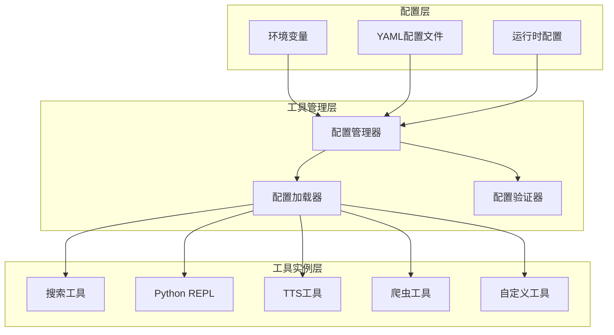
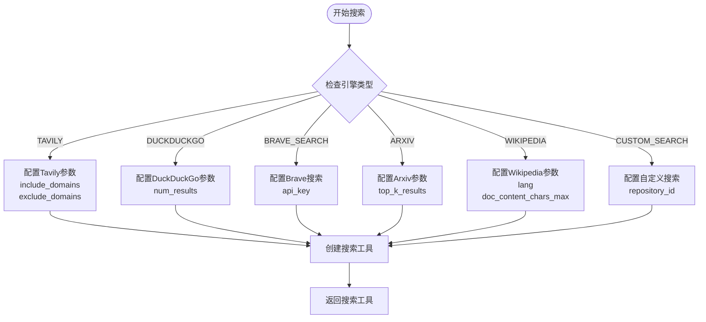
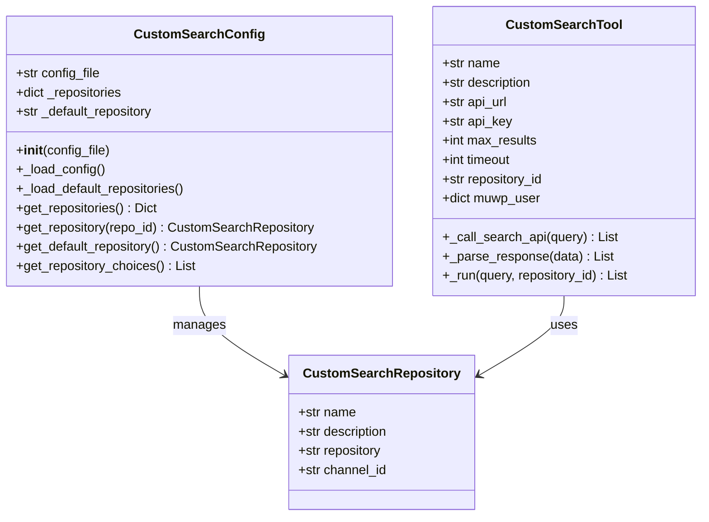

# 工具配置指南

<cite>
**本文档引用的文件**
- [src/config/tools.py](file://src/config/tools.py)
- [src/config/custom_search.py](file://src/config/custom_search.py)
- [src/tools/search.py](file://src/tools/search.py)
- [src/tools/crawl.py](file://src/tools/crawl.py)
- [src/tools/python_repl.py](file://src/tools/python_repl.py)
- [src/tools/tts.py](file://src/tools/tts.py)
- [src/tools/custom_search.py](file://src/tools/custom_search.py)
- [src/config/configuration.py](file://src/config/configuration.py)
- [src/config/loader.py](file://src/config/loader.py)
- [conf.yaml](file://conf.yaml)
</cite>

## 目录
1. [简介](#简介)
2. [工具配置架构](#工具配置架构)
3. [核心工具配置](#核心工具配置)
4. [搜索工具配置](#搜索工具配置)
5. [自定义搜索引擎配置](#自定义搜索引擎配置)
6. [Python REPL工具配置](#python-repl工具配置)
7. [TTS语音合成工具配置](#tts语音合成工具配置)
8. [爬虫工具配置](#爬虫工具配置)
9. [环境变量配置](#环境变量配置)
10. [配置最佳实践](#配置最佳实践)
11. [故障排除](#故障排除)

## 简介

deer-flow 是一个强大的AI智能体框架，提供了丰富的工具集来支持各种任务场景。本指南详细介绍了如何配置和管理这些工具，包括搜索引擎、Python REPL、TTS语音合成、爬虫等功能模块的启用、禁用和参数调整。

工具配置系统采用分层设计，通过环境变量、配置文件和运行时参数相结合的方式，提供了灵活且可扩展的配置机制。用户可以根据具体需求选择合适的工具组合，并通过统一的配置接口进行管理。

## 工具配置架构

deer-flow 的工具配置系统采用模块化设计，主要包含以下几个层次：



**图表来源**
- [src/config/loader.py](file://src/config/loader.py#L1-L79)
- [src/config/configuration.py](file://src/config/configuration.py#L1-L71)

**章节来源**
- [src/config/loader.py](file://src/config/loader.py#L1-L79)
- [src/config/configuration.py](file://src/config/configuration.py#L1-L71)

## 核心工具配置

### 搜索引擎配置

deer-flow 支持多种搜索引擎，通过 `SearchEngine` 枚举类进行管理：

```python
class SearchEngine(enum.Enum):
    TAVILY = "tavily"
    DUCKDUCKGO = "duckduckgo"
    BRAVE_SEARCH = "brave_search"
    ARXIV = "arxiv"
    WIKIPEDIA = "wikipedia"
    CUSTOM_SEARCH = "custom_search"
```

默认搜索引擎通过环境变量 `SEARCH_API` 进行配置，默认值为 `tavily`。

### RAG提供商配置

支持多种RAG（检索增强生成）提供商：

```python
class RAGProvider(enum.Enum):
    RAGFLOW = "ragflow"
    VIKINGDB_KNOWLEDGE_BASE = "vikingdb_knowledge_base"
    MILVUS = "milvus"
```

RAG提供商通过环境变量 `RAG_PROVIDER` 进行配置。

**章节来源**
- [src/config/tools.py](file://src/config/tools.py#L1-L32)

## 搜索工具配置

### 搜索引擎选择

`search.py` 文件实现了多种搜索引擎的统一接口：



**图表来源**
- [src/tools/search.py](file://src/tools/search.py#L40-L113)

### 搜索配置参数

每个搜索引擎都有其特定的配置参数：

#### Tavily搜索引擎配置
```yaml
SEARCH_ENGINE:
  engine: tavily
  include_domains:
    - example.com
    - trusted-news.com
  exclude_domains:
    - example.com
```

#### Wikipedia搜索引擎配置
```yaml
SEARCH_ENGINE:
  engine: wikipedia
  wikipedia_lang: en
  wikipedia_doc_content_chars_max: 4000
```

**章节来源**
- [src/tools/search.py](file://src/tools/search.py#L1-L114)
- [conf.yaml](file://conf.yaml#L25-L40)

## 自定义搜索引擎配置

### 配置结构

自定义搜索引擎通过 `CustomSearchConfig` 类进行管理：



**图表来源**
- [src/config/custom_search.py](file://src/config/custom_search.py#L10-L120)
- [src/tools/custom_search.py](file://src/tools/custom_search.py#L25-L100)

### 默认仓库配置

系统预设了三个默认仓库：

1. **聚合搜索** (`aggregation_search`)
   - 名称：聚合搜索
   - 描述：聚合多个数据源的搜索服务
   - 仓库标识：`aggregation-search`

2. **向量库** (`vector_search`)
   - 名称：向量库
   - 描述：基于向量相似度的搜索服务
   - 仓库标识：`euvd-searchByChannelId`

3. **交行知道** (`dynamic_search`)
   - 名称：交行知道
   - 描述：交通银行内部知识库搜索
   - 仓库标识：`okic-dynamicSearch`

### 自定义仓库配置

用户可以通过 `conf.yaml` 文件添加自定义仓库：

```yaml
CUSTOM_SEARCH:
  repositories:
    my_custom_repo:
      name: "我的自定义仓库"
      description: "自定义搜索仓库描述"
      repository: "my-custom-repository"
      channel_id: "1"
  default_repository: "my_custom_repo"
```

**章节来源**
- [src/config/custom_search.py](file://src/config/custom_search.py#L1-L120)
- [src/tools/custom_search.py](file://src/tools/custom_search.py#L1-L309)
- [conf.yaml](file://conf.yaml#L42-L68)

## Python REPL工具配置

### 启用条件

Python REPL工具通过环境变量 `ENABLE_PYTHON_REPL` 控制：

```python
def _is_python_repl_enabled() -> bool:
    """Check if Python REPL tool is enabled from configuration."""
    env_enabled = os.getenv("ENABLE_PYTHON_REPL", "false").lower()
    if env_enabled in ("true", "1", "yes", "on"):
        return True
    return False
```

### 支持的环境变量值

- `"true"`, `"1"`, `"yes"`, `"on"` - 启用Python REPL
- `"false"`, `"0"`, `"no"`, `"off"` - 禁用Python REPL
- 默认值：`"false"`

### 安全考虑

Python REPL工具具有执行任意代码的能力，因此需要谨慎启用。建议仅在受信任的环境中使用。

**章节来源**
- [src/tools/python_repl.py](file://src/tools/python_repl.py#L1-L64)

## TTS语音合成工具配置

### 配置类

`VolcengineTTS` 类提供了完整的TTS配置选项：

```python
class VolcengineTTS:
    def __init__(
        self,
        appid: str,
        access_token: str,
        cluster: str = "volcano_tts",
        voice_type: str = "BV700_V2_streaming",
        host: str = "openspeech.bytedance.com",
    ):
```

### 必需的认证信息

1. **appid**: 平台应用ID
2. **access_token**: 访问令牌
3. **cluster**: TTS集群名称（默认："volcano_tts"）
4. **host**: API主机地址（默认："openspeech.bytedance.com"）

### 音频参数

- **encoding**: 音频编码格式（默认："mp3"）
- **speed_ratio**: 语速比例（默认：1.0）
- **volume_ratio**: 音量比例（默认：1.0）
- **pitch_ratio**: 音调比例（默认：1.0）
- **text_type**: 文本类型（默认："plain"）

### 使用示例

```python
tts_client = VolcengineTTS(
    appid="your-app-id",
    access_token="your-access-token"
)

result = tts_client.text_to_speech(
    text="你好，世界！",
    speed_ratio=1.2,
    volume_ratio=1.1
)
```

**章节来源**
- [src/tools/tts.py](file://src/tools/tts.py#L1-L134)

## 爬虫工具配置

### 基本配置

爬虫工具通过 `Crawler` 类实现网页内容抓取：

```python
@tool
@log_io
def crawl_tool(
    url: Annotated[str, "The url to crawl."],
) -> str:
    """Use this to crawl a url and get a readable content in markdown format."""
    try:
        crawler = Crawler()
        article = crawler.crawl(url)
        return {"url": url, "crawled_content": article.to_markdown()[:1000]}
    except BaseException as e:
        error_msg = f"Failed to crawl. Error: {repr(e)}"
        logger.error(error_msg)
        return error_msg
```

### 功能特性

1. **自动内容提取**: 使用 `readability_extractor.py` 提取网页主要内容
2. **Markdown格式输出**: 将提取的内容转换为Markdown格式
3. **长度限制**: 截取前1000个字符以控制输出大小
4. **错误处理**: 完善的异常捕获和错误日志记录

**章节来源**
- [src/tools/crawl.py](file://src/tools/crawl.py#L1-L30)

## 环境变量配置

### 核心环境变量

| 变量名 | 类型 | 默认值 | 描述 |
|--------|------|--------|------|
| `SEARCH_API` | String | "tavily" | 搜索引擎选择 |
| `RAG_PROVIDER` | String | None | RAG提供商选择 |
| `ENABLE_PYTHON_REPL` | Boolean | "false" | Python REPL工具启用状态 |
| `CUSTOM_SEARCH_API_URL` | String | "" | 自定义搜索API地址 |
| `CUSTOM_SEARCH_API_KEY` | String | "" | 自定义搜索API密钥 |
| `MUWP_BRANCH_ID` | String | "1000027159" | 用户分支ID |
| `MUWP_LOGIN_NAME` | String | "xuew_4" | 用户登录名 |
| `MUWP_USER_CODE` | String | "9743616" | 用户代码 |
| `MUWP_USER_NAME` | String | "薛巍" | 用户姓名 |
| `MUWP_USER_ID` | String | "132298" | 用户ID |

### 高级配置变量

| 变量名 | 类型 | 默认值 | 描述 |
|--------|------|--------|------|
| `AGENT_RECURSION_LIMIT` | Integer | 25 | 智能体递归限制 |
| `BRAVE_SEARCH_API_KEY` | String | "" | Brave搜索API密钥 |

**章节来源**
- [src/tools/python_repl.py](file://src/tools/python_repl.py#L15-L25)
- [src/config/loader.py](file://src/config/loader.py#L10-L30)

## 配置最佳实践

### 1. 环境隔离

建议为不同环境（开发、测试、生产）使用不同的配置文件：

```bash
# 开发环境
export SEARCH_API=tavily
export ENABLE_PYTHON_REPL=true

# 生产环境
export SEARCH_API=custom_search
export ENABLE_PYTHON_REPL=false
```

### 2. 安全配置

- 不要将敏感信息硬编码在代码中
- 使用环境变量存储API密钥
- 在生产环境中禁用Python REPL工具

### 3. 性能优化

- 根据实际需求调整 `max_results` 参数
- 设置合理的超时时间（默认30秒）
- 选择最适合业务场景的搜索引擎

### 4. 监控和日志

- 启用详细的日志记录
- 监控工具使用频率和性能指标
- 设置告警规则处理异常情况

## 故障排除

### 常见问题及解决方案

#### 1. 搜索引擎无法连接

**症状**: 搜索工具返回空结果或连接超时

**解决方案**:
```bash
# 检查API密钥
echo $SEARCH_API_KEY

# 测试网络连接
curl -I https://api.tavily.com

# 验证配置文件
cat conf.yaml | grep -i search
```

#### 2. Python REPL工具不可用

**症状**: 执行Python代码时返回"Tool disabled"消息

**解决方案**:
```bash
# 启用Python REPL
export ENABLE_PYTHON_REPL=true

# 验证环境变量
echo $ENABLE_PYTHON_REPL

# 重启应用程序
```

#### 3. TTS服务失败

**症状**: 语音合成请求返回错误

**解决方案**:
```python
# 检查认证信息
tts_client = VolcengineTTS(appid="your-app-id", access_token="your-token")
result = tts_client.text_to_speech("测试文本")
print(result)  # 检查是否有错误信息
```

#### 4. 自定义搜索配置错误

**症状**: 自定义搜索工具无法正常工作

**解决方案**:
```python
# 验证配置文件
from src.config.custom_search import get_custom_search_config
config = get_custom_search_config()
print(config.get_repository_choices())

# 检查环境变量
import os
print(os.getenv("CUSTOM_SEARCH_API_URL"))
print(os.getenv("CUSTOM_SEARCH_API_KEY"))
```

### 调试技巧

1. **启用调试日志**:
```python
import logging
logging.basicConfig(level=logging.DEBUG)
```

2. **检查工具状态**:
```python
from src.tools.search import get_web_search_tool
tool = get_web_search_tool(max_search_results=3)
print(f"Active tool: {tool.name}")
```

3. **验证配置加载**:
```python
from src.config.loader import load_yaml_config
config = load_yaml_config("conf.yaml")
print(config.get("SEARCH_ENGINE", {}))
```

**章节来源**
- [src/tools/search.py](file://src/tools/search.py#L40-L113)
- [src/tools/python_repl.py](file://src/tools/python_repl.py#L30-L50)
- [src/tools/custom_search.py](file://src/tools/custom_search.py#L100-L150)