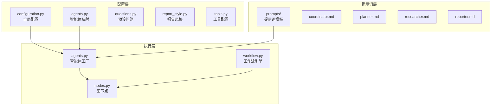
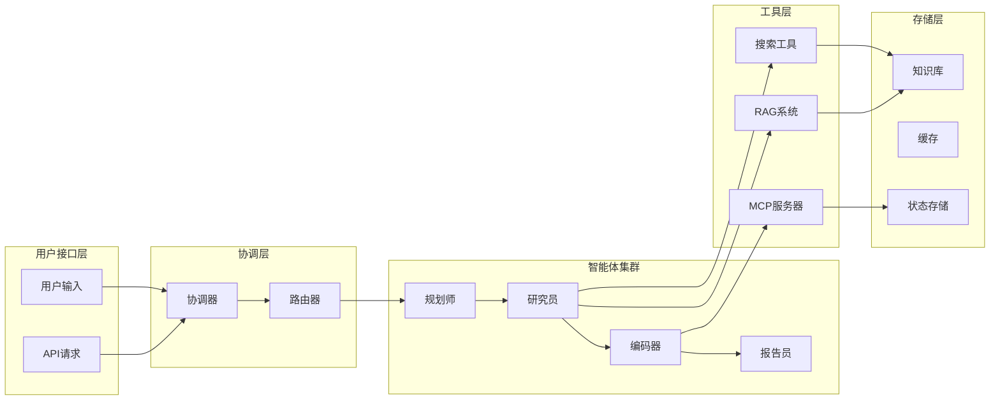
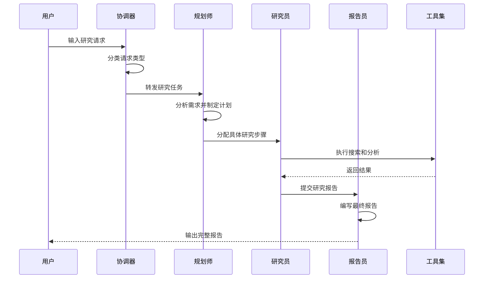
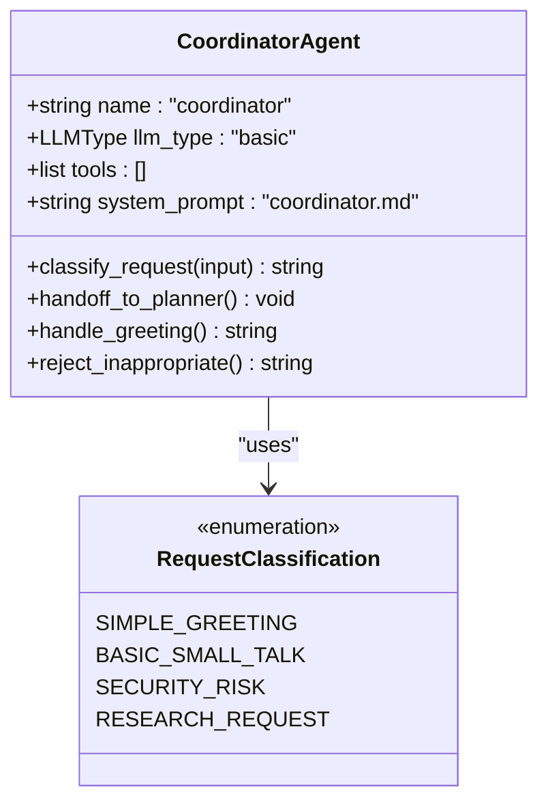
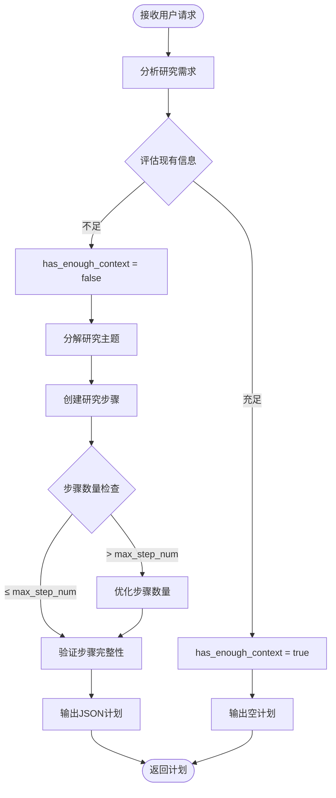
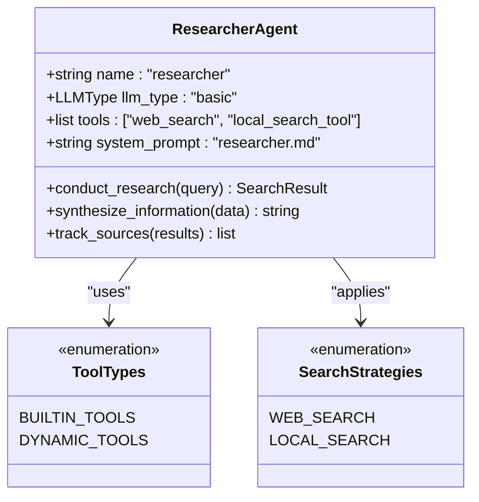
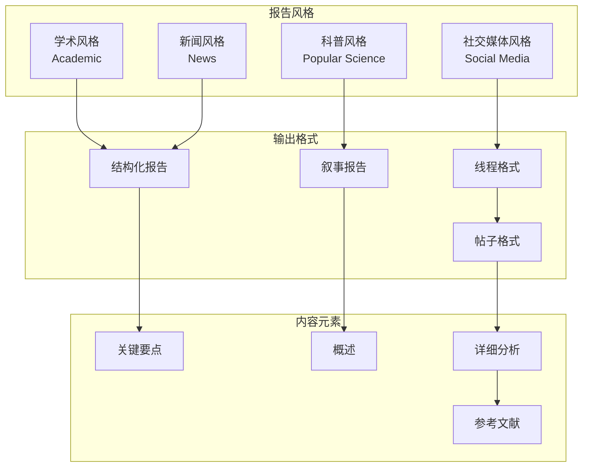
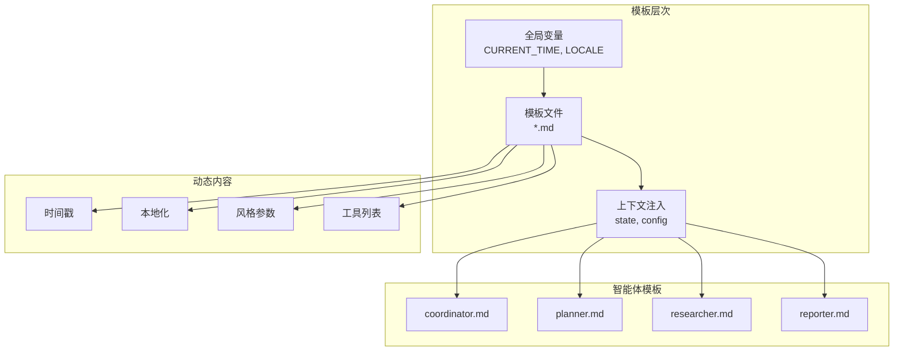
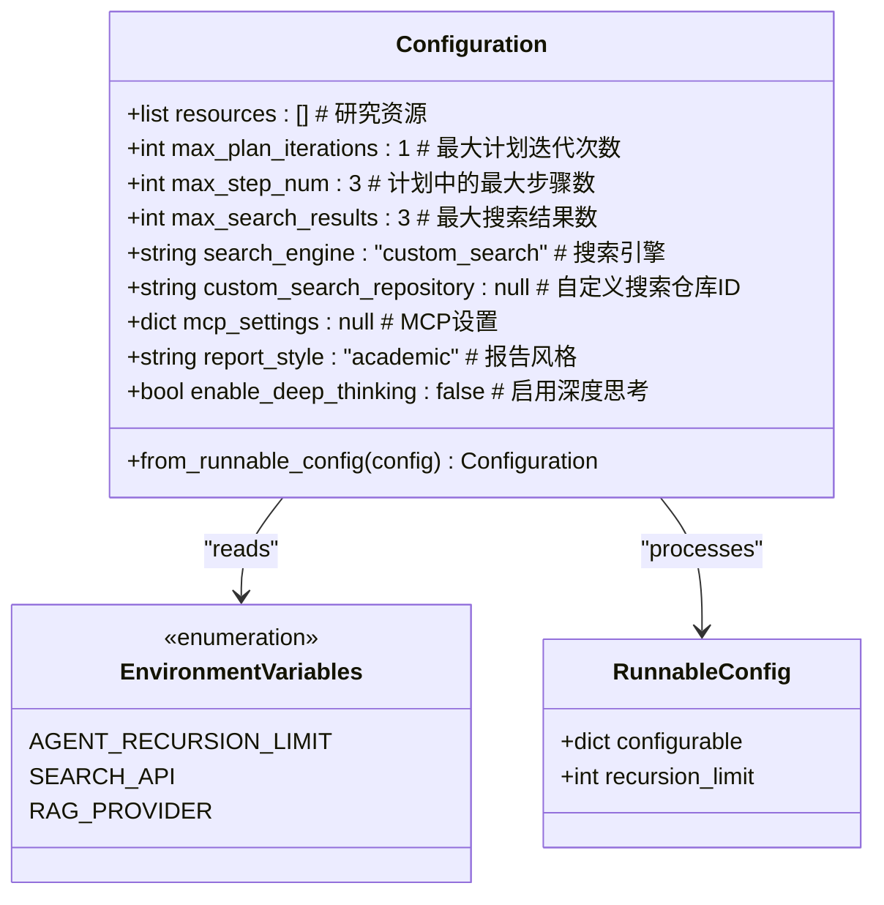
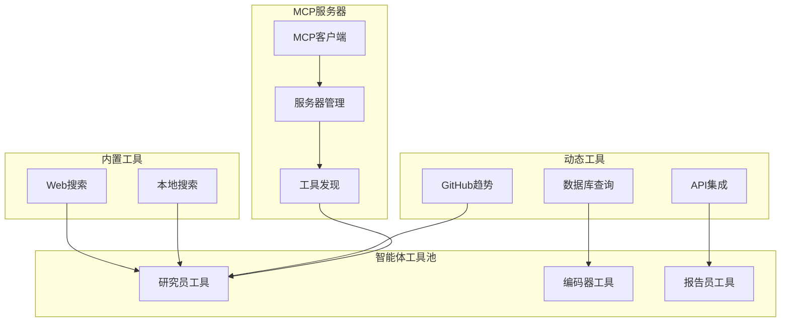

# 智能体配置

<cite>
**本文档引用的文件**
- [agents.py](file://src/config/agents.py)
- [questions.py](file://src/config/questions.py)
- [report_style.py](file://src/config/report_style.py)
- [configuration.py](file://src/config/configuration.py)
- [tools.py](file://src/config/tools.py)
- [coordinator.md](file://src/prompts/coordinator.md)
- [planner.md](file://src/prompts/planner.md)
- [researcher.md](file://src/prompts/researcher.md)
- [reporter.md](file://src/prompts/reporter.md)
- [agents.py](file://src/agents/agents.py)
- [workflow.py](file://src/workflow.py)
- [builder.py](file://src/graph/builder.py) - *近期提交中已更新*
</cite>

## 更新摘要
**已做更改**
- 更新了研究员智能体配置部分，反映`crawl_tool`已被移除
- 修正了报告员智能体的LLM类型为`reasoning`
- 更新了智能体协作流程图以反映最新逻辑
- 添加了对`builder.py`文件的引用以支持更新的流程逻辑

## 目录
1. [简介](#简介)
2. [项目结构概览](#项目结构概览)
3. [核心智能体配置](#核心智能体配置)
4. [智能体系统架构](#智能体系统架构)
5. [详细组件分析](#详细组件分析)
6. [提示词模板系统](#提示词模板系统)
7. [配置管理机制](#配置管理机制)
8. [工具集成与扩展](#工具集成与扩展)
9. [性能优化与调优](#性能优化与调优)
10. [故障排除指南](#故障排除指南)
11. [最佳实践](#最佳实践)
12. [结论](#结论)

## 简介

DeerFlow是一个基于多智能体协作的深度研究平台，通过精心设计的智能体配置系统实现复杂的任务分解和执行。该系统包含协调器、规划师、研究员、报告员等多个专业智能体，每个智能体都有独特的职责和行为模式。

本文档深入解析智能体配置的核心要素，包括智能体类型映射、提示词模板、配置参数、工具集成等方面，为开发者提供全面的配置指导和扩展方案。

## 项目结构概览

智能体配置系统的核心文件组织如下：



**图表来源**
- [configuration.py](file://src/config/configuration.py#L1-L71)
- [agents.py](file://src/config/agents.py#L1-L21)
- [prompts/coordinator.md](file://src/prompts/coordinator.md#L1-L56)

## 核心智能体配置

### 智能体类型映射

智能体配置系统通过`AGENT_LLM_MAP`字典定义不同智能体与LLM类型的映射关系：

```python
# 定义可用的LLM类型
LLMType = Literal["basic", "reasoning", "vision", "code"]

# 定义智能体-LLM映射
AGENT_LLM_MAP: dict[str, LLMType] = {
    "coordinator": "basic",
    "planner": "basic", 
    "researcher": "basic",
    "coder": "basic",
    "reporter": "reasoning",  # 已更新为reasoning类型
    "podcast_script_writer": "basic",
    "ppt_composer": "basic",
    "prose_writer": "basic",
    "prompt_enhancer": "basic",
}
```

### 支持的智能体类型

系统支持以下智能体类型：

1. **协调器 (Coordinator)**: 负责用户交互和任务分配
2. **规划师 (Planner)**: 制定研究计划和步骤
3. **研究员 (Researcher)**: 执行信息检索和分析
4. **编码器 (Coder)**: 代码生成和编程任务
5. **报告员 (Reporter)**: 文档撰写和报告生成
6. **播客脚本编写器 (Podcast Script Writer)**: 音频内容创作
7. **PPT组合器 (PPT Composer)**: 幻灯片制作
8. **散文作家 (Prose Writer)**: 文学创作
9. **提示增强器 (Prompt Enhancer)**: 提示词优化

**章节来源**
- [agents.py](file://src/config/agents.py#L1-L21)

## 智能体系统架构

### 整体架构设计



**图表来源**
- [workflow.py](file://src/workflow.py#L1-L104)
- [agents.py](file://src/agents/agents.py#L1-L20)

### 智能体协作流程



**图表来源**
- [coordinator.md](file://src/prompts/coordinator.md#L1-L56)
- [planner.md](file://src/prompts/planner.md#L1-L188)
- [researcher.md](file://src/prompts/researcher.md#L1-L87)

## 详细组件分析

### 协调器智能体配置

协调器是系统的入口点，负责用户交互和任务分类：



**图表来源**
- [coordinator.md](file://src/prompts/coordinator.md#L1-L56)

协调器的主要职责：
- **问候处理**: 响应简单的问候语和闲聊
- **安全过滤**: 拒绝不当请求和有害内容
- **任务转接**: 将研究请求转交给规划师
- **上下文维护**: 保持与用户的对话连贯性

### 规划师智能体配置

规划师负责制定详细的研究计划：



**图表来源**
- [planner.md](file://src/prompts/planner.md#L1-L188)

规划师的关键特性：
- **全面覆盖**: 确保涵盖所有必要方面
- **深度优先**: 重视信息的深度而非广度
- **步骤约束**: 限制最大步骤数以避免过度复杂化
- **动态调整**: 根据需求动态调整研究策略

### 研究员智能体配置

研究员专注于信息检索和数据分析：



**图表来源**
- [researcher.md](file://src/prompts/researcher.md#L1-L87)
- [builder.py](file://src/graph/builder.py#L1-L137) - *更新了流程逻辑*

研究员的工作流程：
1. **问题理解**: 忘却先前知识，仔细阅读问题陈述
2. **工具评估**: 识别可用工具列表
3. **解决方案规划**: 确定最佳解决方法
4. **执行方案**: 使用适当工具检索信息
5. **信息合成**: 组合来自所有工具的信息

**更新** 研究员智能体已移除`crawl_tool`，现在主要依赖`web_search`和`local_search_tool`进行信息检索。

### 报告员智能体配置

报告员根据不同的报告风格生成专业的文档：



**图表来源**
- [reporter.md](file://src/prompts/reporter.md#L1-L280)
- [report_style.py](file://src/config/report_style.py#L1-L9)

**章节来源**
- [coordinator.md](file://src/prompts/coordinator.md#L1-L56)
- [planner.md](file://src/prompts/planner.md#L1-L188)
- [researcher.md](file://src/prompts/researcher.md#L1-L87)
- [reporter.md](file://src/prompts/reporter.md#L1-L280)

## 提示词模板系统

### 提示词架构设计

提示词模板系统采用模块化设计，每个智能体都有对应的提示词文件：



**图表来源**
- [coordinator.md](file://src/prompts/coordinator.md#L1-L56)
- [planner.md](file://src/prompts/planner.md#L1-L188)
- [researcher.md](file://src/prompts/researcher.md#L1-L87)
- [reporter.md](file://src/prompts/reporter.md#L1-L280)

### 提示词定制化机制

每个智能体的提示词都支持高度定制化：

1. **变量替换**: 支持`{{ variable_name }}`语法进行动态替换
2. **条件渲染**: 根据配置条件选择性渲染内容
3. **本地化支持**: 自动适配不同语言环境
4. **功能开关**: 可以启用或禁用特定功能块

### 预设问题系统

系统提供了丰富的预设问题库：

```python
# 英文预设问题
BUILT_IN_QUESTIONS = [
    "What factors are influencing AI adoption in healthcare?",
    "How does quantum computing impact cryptography?",
    "What are the latest developments in renewable energy technology?",
    # ... 更多问题
]

# 中文预设问题  
BUILT_IN_QUESTIONS_ZH_CN = [
    "人工智能在医疗保健领域的应用有哪些因素影响?",
    "量子计算如何影响密码学?",
    "可再生能源技术的最新发展是什么?",
    # ... 更多问题
]
```

这些预设问题可以直接用于测试和演示，也可以作为用户输入的参考。

**章节来源**
- [questions.py](file://src/config/questions.py#L1-L35)

## 配置管理机制

### 全局配置系统

配置系统通过`Configuration`类管理所有可配置参数：



**图表来源**
- [configuration.py](file://src/config/configuration.py#L1-L71)

### 配置参数详解

1. **资源配置** (`resources`)
   - 定义可用于研究的知识库资源
   - 支持多种数据源格式
   - 可动态加载和卸载

2. **计划控制** (`max_plan_iterations`, `max_step_num`)
   - 控制规划过程的深度和广度
   - 防止无限循环和过度计算

3. **搜索配置** (`search_engine`, `max_search_results`)
   - 支持多种搜索引擎
   - 控制搜索结果的数量和质量

4. **报告风格** (`report_style`)
   - 支持四种不同的报告风格
   - 动态调整输出格式和语气

### 环境变量管理

系统支持通过环境变量进行配置：

```python
# 递归限制配置
def get_recursion_limit(default: int = 25) -> int:
    """从环境变量获取递归限制或使用默认值"""
    env_value_str = get_str_env("AGENT_RECURSION_LIMIT", str(default))
    parsed_limit = get_int_env("AGENT_RECURSION_LIMIT", default)
    
    if parsed_limit > 0:
        logger.info(f"Recursion limit set to: {parsed_limit}")
        return parsed_limit
    else:
        logger.warning(f"Invalid recursion limit value: {env_value_str}")
        return default
```

**章节来源**
- [configuration.py](file://src/config/configuration.py#L1-L71)

## 工具集成与扩展

### 工具生态系统

系统支持多种类型的工具集成：



**图表来源**
- [tools.py](file://src/config/tools.py#L1-L32)

### 搜索引擎配置

系统支持多种搜索引擎：

```python
class SearchEngine(enum.Enum):
    TAVILY = "tavily"
    DUCKDUCKGO = "duckduckgo"
    BRAVE_SEARCH = "brave_search"
    ARXIV = "arxiv"
    WIKIPEDIA = "wikipedia"
    CUSTOM_SEARCH = "custom_search"
```

### MCP (Model Context Protocol) 集成

MCP允许动态加载外部工具和服务：

```python
# MCP服务器配置示例
mcp_settings = {
    "servers": {
        "mcp-github-trending": {
            "transport": "stdio",
            "command": "uvx",
            "args": ["mcp-github-trending"],
            "enabled_tools": ["get_github_trending_repositories"],
            "add_to_agents": ["researcher"],
        }
    }
}
```

这种设计使得系统能够：
- **按需加载**: 只加载需要的工具
- **版本控制**: 管理工具版本兼容性
- **权限控制**: 限制工具访问范围
- **性能优化**: 减少不必要的依赖

**章节来源**
- [tools.py](file://src/config/tools.py#L1-L32)

## 性能优化与调优

### 递归限制管理

为了避免无限递归和性能问题，系统实现了递归限制机制：

```python
def get_recursion_limit(default: int = 25) -> int:
    """获取递归限制，支持环境变量配置"""
    env_value_str = get_str_env("AGENT_RECURSION_LIMIT", str(default))
    parsed_limit = get_int_env("AGENT_RECURSION_LIMIT", default)

    if parsed_limit > 0:
        logger.info(f"Recursion limit set to: {parsed_limit}")
        return parsed_limit
    else:
        logger.warning(
            f"AGENT_RECURSION_LIMIT value '{env_value_str}' (parsed as {parsed_limit}) is not positive. "
            f"Using default value {default}."
        )
        return default
```

### 并发处理优化

工作流引擎支持异步处理：

```python
async def run_agent_workflow_async(
    user_input: str,
    debug: bool = False,
    max_plan_iterations: int = 1,
    max_step_num: int = 3,
    enable_background_investigation: bool = True,
):
    """异步运行智能体工作流"""
    # 异步流式处理
    async for s in graph.astream(
        input=initial_state, config=config, stream_mode="values"
    ):
        # 实时处理输出
        if isinstance(s, dict) and "messages" in s:
            message = s["messages"][-1]
            message.pretty_print()
```

### 内存管理

系统实现了智能的状态管理和内存清理：

- **状态压缩**: 定期清理历史消息
- **缓存策略**: 智能缓存常用数据
- **资源释放**: 及时释放不再使用的资源

## 故障排除指南

### 常见配置问题

1. **智能体类型映射错误**
   ```python
   # 错误示例
   AGENT_LLM_MAP = {
       "unknown_agent": "nonexistent_type"  # 类型不存在
   }
   
   # 解决方案
   AGENT_LLM_MAP = {
       "unknown_agent": "basic"  # 使用存在的类型
   }
   ```

2. **提示词模板缺失**
   - 确保每个智能体都有对应的提示词文件
   - 检查文件路径和命名是否正确
   - 验证模板语法是否符合要求

3. **工具配置错误**
   - 检查工具是否正确注册
   - 验证工具权限设置
   - 确认MCP服务器连接状态

### 调试技巧

1. **启用调试日志**
   ```python
   def enable_debug_logging():
       """启用调试级别日志记录"""
       logging.getLogger("src").setLevel(logging.DEBUG)
   ```

2. **监控工作流状态**
   ```python
   # 在工作流中添加状态跟踪
   logger.info(f"Starting async workflow with user input: {user_input}")
   ```

3. **验证配置参数**
   ```python
   # 检查配置是否正确加载
   config = Configuration.from_runnable_config(runnable_config)
   logger.info(f"Loaded configuration: {config}")
   ```

### 性能监控

- **递归深度监控**: 跟踪智能体调用深度
- **内存使用监控**: 监控系统资源消耗
- **响应时间统计**: 测量各阶段处理时间

## 最佳实践

### 智能体配置最佳实践

1. **合理分配LLM类型**
   - 基础任务使用`basic`类型
   - 复杂推理使用`reasoning`类型
   - 图像处理使用`vision`类型
   - 代码生成使用`code`类型

2. **提示词设计原则**
   - 保持提示词简洁明了
   - 使用清晰的指令结构
   - 包含适当的示例
   - 考虑多语言支持

3. **工具选择策略**
   - 优先使用内置工具
   - 按需加载外部工具
   - 实现工具降级机制
   - 确保工具安全性

### 扩展开发指南

1. **添加新智能体类型**
   ```python
   # 1. 更新智能体映射
   AGENT_LLM_MAP = {
       "new_agent": "basic",
       # ...
   }
   
   # 2. 创建提示词模板
   # src/prompts/new_agent.md
   
   # 3. 实现智能体工厂函数
   def create_new_agent(tools: list, prompt_template: str):
       return create_react_agent(
           name="new_agent",
           model=get_llm_by_type(AGENT_LLM_MAP["new_agent"]),
           tools=tools,
           prompt=lambda state: apply_prompt_template(prompt_template, state),
       )
   ```

2. **自定义报告风格**
   ```python
   # 扩展报告风格枚举
   class ReportStyle(enum.Enum):
       ACADEMIC = "academic"
       POPULAR_SCIENCE = "popular_science"
       NEWS = "news"
       SOCIAL_MEDIA = "social_media"
       BUSINESS_ANALYSIS = "business_analysis"  # 新增风格
   ```

3. **集成第三方工具**
   ```python
   # MCP服务器配置示例
   mcp_settings = {
       "servers": {
           "third-party-tool": {
               "transport": "http",
               "url": "https://api.example.com",
               "enabled_tools": ["tool1", "tool2"],
               "add_to_agents": ["researcher", "coder"],
           }
       }
   }
   ```

### 部署注意事项

1. **环境变量配置**
   - 设置适当的递归限制
   - 配置搜索引擎API密钥
   - 设置MCP服务器地址

2. **资源规划**
   - 评估LLM模型资源需求
   - 规划存储空间大小
   - 设计网络带宽要求

3. **监控和维护**
   - 设置健康检查端点
   - 实现日志轮转机制
   - 定期更新工具和模型

## 结论

DeerFlow的智能体配置系统通过精心设计的架构和灵活的配置机制，为复杂的多智能体协作提供了强大的基础。系统的主要优势包括：

1. **模块化设计**: 清晰的组件分离和职责划分
2. **高度可配置**: 支持多种配置参数和扩展点
3. **工具生态**: 丰富的工具集成和MCP支持
4. **性能优化**: 智能的资源管理和并发处理
5. **易于扩展**: 简单的接口和标准化的扩展机制

通过本文档的指导，开发者可以：
- 深入理解智能体配置系统的工作原理
- 掌握各种配置参数的使用方法
- 实现自定义智能体和工具的集成
- 优化系统性能和用户体验

随着AI技术的不断发展，DeerFlow的智能体配置系统将继续演进，为用户提供更加强大和灵活的智能服务能力。