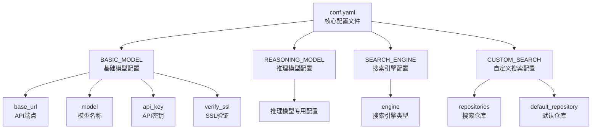
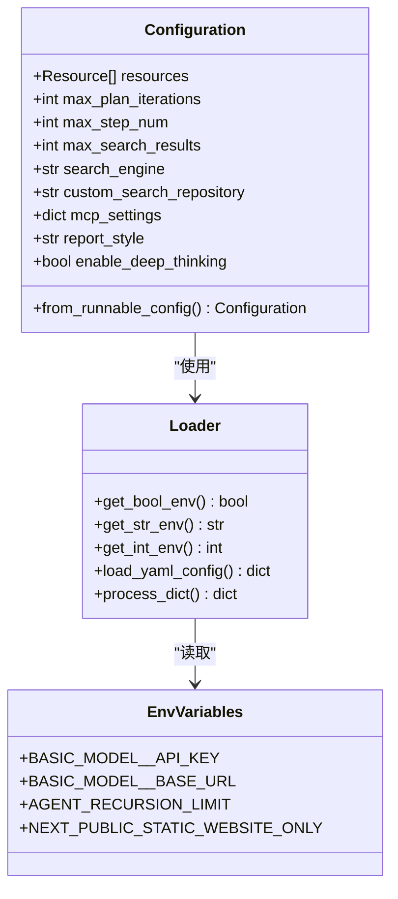
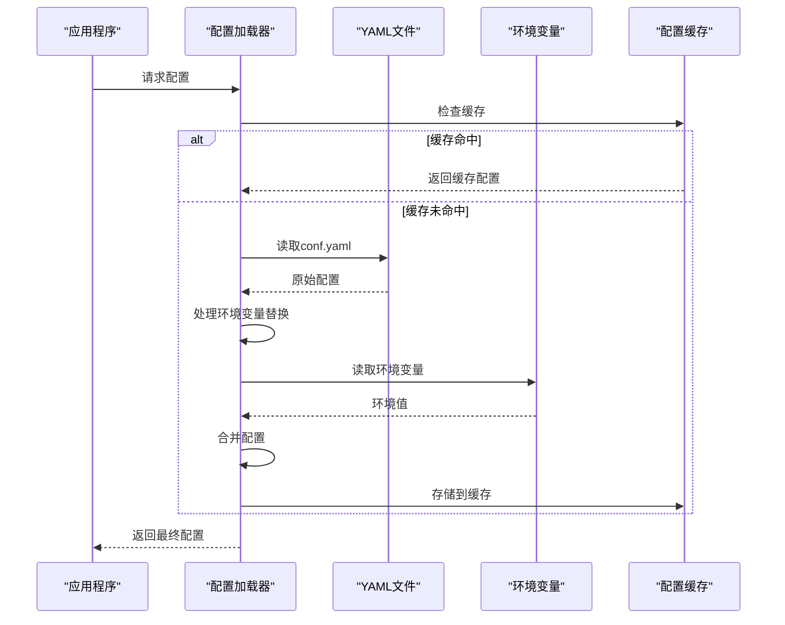
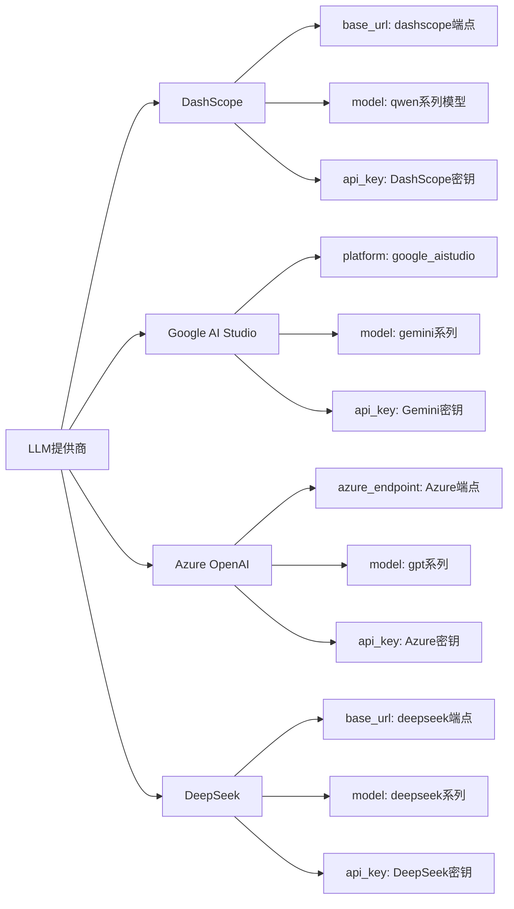
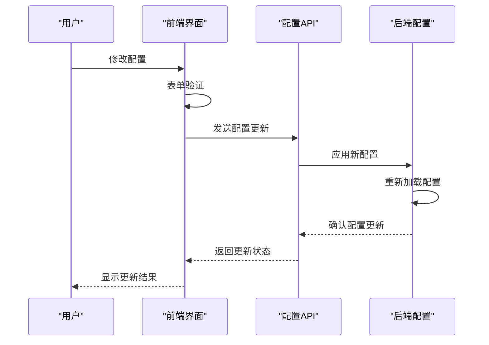
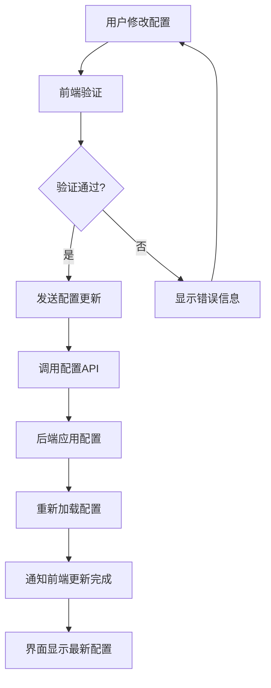
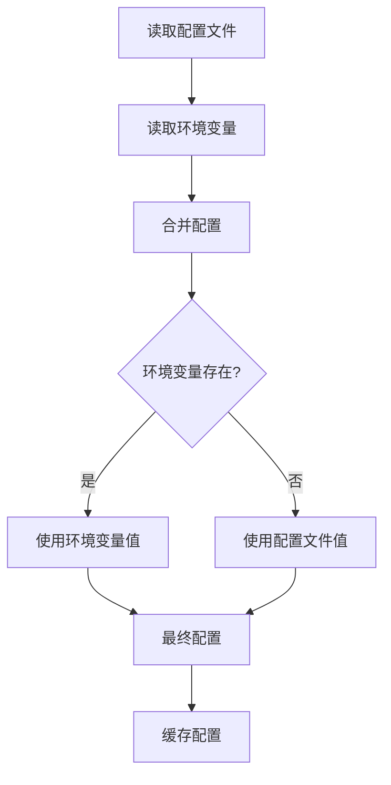
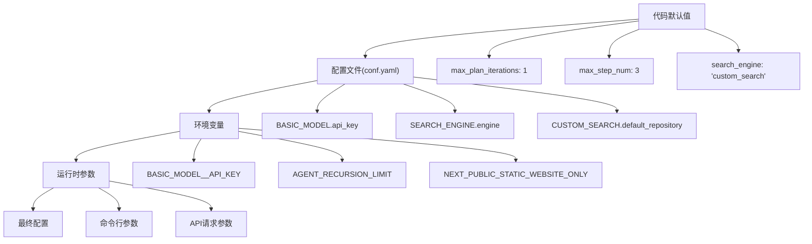

# 系统配置

<cite>
**本文档中引用的文件**
- [conf.yaml](file://conf.yaml)
- [src/config/configuration.py](file://src/config/configuration.py)
- [src/config/loader.py](file://src/config/loader.py)
- [web/src/app/settings/tabs/general-tab.tsx](file://web/src/app/settings/tabs/general-tab.tsx)
- [src/llms/llm.py](file://src/llms/llm.py)
- [src/llms/providers/dashscope.py](file://src/llms/providers/dashscope.py)
- [src/server/config_request.py](file://src/server/config_request.py)
- [main.py](file://main.py)
</cite>

## 目录
1. [简介](#简介)
2. [配置文件结构](#配置文件结构)
3. [配置加载机制](#配置加载机制)
4. [LLM提供商配置](#llm提供商配置)
5. [全局参数配置](#全局参数配置)
6. [Web界面配置映射](#web界面配置映射)
7. [环境变量覆盖机制](#环境变量覆盖机制)
8. [配置优先级](#配置优先级)
9. [配置示例](#配置示例)
10. [故障排除](#故障排除)

## 简介

deer-flow 是一个基于 Python 和 Next.js 的智能研究系统，采用分层配置架构来管理各种设置。系统通过 `conf.yaml` 核心配置文件和 Python 配置模块实现灵活的配置管理，支持多种 LLM 提供商、搜索引擎配置以及 Web 界面设置。

## 配置文件结构

### 核心配置文件

deer-flow 使用 YAML 格式的 `conf.yaml` 文件作为主要配置入口：



**图表来源**
- [conf.yaml](file://conf.yaml#L1-L69)

### Python 配置模块

配置系统通过 Python 模块实现动态配置管理和类型安全：



**图表来源**
- [src/config/configuration.py](file://src/config/configuration.py#L25-L70)
- [src/config/loader.py](file://src/config/loader.py#L1-L78)

**章节来源**
- [conf.yaml](file://conf.yaml#L1-L69)
- [src/config/configuration.py](file://src/config/configuration.py#L1-L71)
- [src/config/loader.py](file://src/config/loader.py#L1-L79)

## 配置加载机制

### 加载流程

deer-flow 采用多层配置加载机制，确保配置的灵活性和可扩展性：



**图表来源**
- [src/config/loader.py](file://src/config/loader.py#L50-L78)

### 配置处理函数

配置加载器提供了专门的函数来处理不同类型的数据：

```python
# 字符串环境变量获取
def get_str_env(name: str, default: str = "") -> str:
    val = os.getenv(name)
    return default if val is None else str(val).strip()

# 整数环境变量获取
def get_int_env(name: str, default: int = 0) -> int:
    val = os.getenv(name)
    if val is None:
        return default
    try:
        return int(val.strip())
    except ValueError:
        print(f"Invalid integer value for {name}: {val}. Using default {default}.")
        return default

# 布尔环境变量获取
def get_bool_env(name: str, default: bool = False) -> bool:
    val = os.getenv(name)
    if val is None:
        return default
    return str(val).strip().lower() in {"1", "true", "yes", "y", "on"}
```

**章节来源**
- [src/config/loader.py](file://src/config/loader.py#L10-L40)

## LLM提供商配置

### DashScope 配置

deer-flow 默认支持阿里云 DashScope 平台，配置包括 API 密钥、模型名称和端点设置：

```yaml
BASIC_MODEL:
  base_url: http://192.168.0.106:8088/v1
  model: qwen3-0.6
  api_key: xxxx
  verify_ssl: false
```

### 支持的LLM提供商

系统支持多种 LLM 提供商，每种都有特定的配置要求：



**图表来源**
- [conf.yaml](file://conf.yaml#L1-L20)
- [src/llms/llm.py](file://src/llms/llm.py#L107-L151)

### 环境变量配置

系统支持通过环境变量覆盖配置文件中的设置：

```bash
# 基础模型配置
export BASIC_MODEL__API_KEY="your_api_key"
export BASIC_MODEL__BASE_URL="https://api.example.com/v1"
export BASIC_MODEL__MODEL="custom-model-name"

# 推理模型配置
export REASONING_MODEL__API_KEY="reasoning_api_key"
export REASONING_MODEL__BASE_URL="https://reasoning.example.com/v1"

# 其他配置
export AGENT_RECURSION_LIMIT="50"
export NEXT_PUBLIC_STATIC_WEBSITE_ONLY="true"
```

**章节来源**
- [conf.yaml](file://conf.yaml#L1-L69)
- [src/llms/llm.py](file://src/llms/llm.py#L37-L75)

## 全局参数配置

### 基本配置参数

deer-flow 提供了丰富的全局配置参数来控制系统行为：

```python
@dataclass(kw_only=True)
class Configuration:
    """可配置字段类。"""
    
    resources: list[Resource] = field(default_factory=list)
    max_plan_iterations: int = 1  # 计划迭代最大次数
    max_step_num: int = 3  # 计划中最大步骤数
    max_search_results: int = 3  # 最大搜索结果数
    search_engine: str = "custom_search"  # 使用的搜索引擎
    custom_search_repository: Optional[str] = None  # 自定义搜索仓库ID
    mcp_settings: dict = None  # MCP设置，包括动态加载工具
    report_style: str = ReportStyle.ACADEMIC.value  # 报告样式
    enable_deep_thinking: bool = False  # 是否启用深度思考
```

### 配置参数详解

| 参数名 | 类型 | 默认值 | 描述 |
|--------|------|--------|------|
| `max_plan_iterations` | int | 1 | 计划执行的最大迭代次数 |
| `max_step_num` | int | 3 | 单个计划中的最大步骤数 |
| `max_search_results` | int | 3 | 搜索引擎返回的最大结果数 |
| `search_engine` | str | "custom_search" | 搜索引擎类型 |
| `report_style` | str | "academic" | 报告输出格式 |
| `enable_deep_thinking` | bool | False | 是否启用深度思考模式 |

**章节来源**
- [src/config/configuration.py](file://src/config/configuration.py#L25-L70)

## Web界面配置映射

### 前端配置组件

Web 界面通过 `general-tab.tsx` 组件提供配置管理功能，与后端配置系统紧密集成：



**图表来源**
- [web/src/app/settings/tabs/general-tab.tsx](file://web/src/app/settings/tabs/general-tab.tsx#L1-L282)

### 配置表单结构

前端配置表单包含以下主要配置项：

```typescript
const generalFormSchema = z.object({
  autoAcceptedPlan: z.boolean(),
  maxPlanIterations: z.number().min(1),
  maxStepNum: z.number().min(1),
  maxSearchResults: z.number().min(1),
  searchEngine: z.enum([
    "tavily", "duckduckgo", "brave_search", 
    "arxiv", "wikipedia", "custom_search"
  ]),
  customSearchRepository: z.string().optional(),
  enableBackgroundInvestigation: z.boolean(),
  enableDeepThinking: z.boolean(),
  reportStyle: z.enum(["academic", "popular_science", "news", "social_media"]),
});
```

### 配置同步机制

前端配置与后端配置保持实时同步：



**图表来源**
- [web/src/app/settings/tabs/general-tab.tsx](file://web/src/app/settings/tabs/general-tab.tsx#L100-L150)

**章节来源**
- [web/src/app/settings/tabs/general-tab.tsx](file://web/src/app/settings/tabs/general-tab.tsx#L1-L282)

## 环境变量覆盖机制

### 环境变量命名规范

deer-flow 使用特定的命名规范来支持环境变量覆盖：

```
# LLM模型配置
BASIC_MODEL__API_KEY
BASIC_MODEL__BASE_URL
BASIC_MODEL__MODEL
BASIC_MODEL__MAX_RETRIES

# 系统配置
AGENT_RECURSION_LIMIT
NEXT_PUBLIC_STATIC_WEBSITE_ONLY
ENABLE_DEBUG_LOGGING

# 搜索引擎配置
SEARCH_ENGINE__TYPE
SEARCH_ENGINE__API_KEY
```

### 配置合并策略

当同时存在配置文件和环境变量时，系统采用以下合并策略：



**图表来源**
- [src/llms/llm.py](file://src/llms/llm.py#L50-L75)

### 环境变量优先级

1. **环境变量**：最高优先级，完全覆盖配置文件中的对应值
2. **配置文件**：次高优先级，用于提供默认值
3. **代码默认值**：最低优先级，仅在前两者都不存在时使用

**章节来源**
- [src/llms/llm.py](file://src/llms/llm.py#L37-L75)

## 配置优先级

### 配置加载顺序

deer-flow 的配置系统遵循严格的优先级顺序：



### 配置缓存机制

为提高性能，系统实现了配置缓存机制：

```python
_config_cache: Dict[str, Dict[str, Any]] = {}

def load_yaml_config(file_path: str) -> Dict[str, Any]:
    """加载并处理YAML配置文件。"""
    # 检查缓存中是否已存在配置
    if file_path in _config_cache:
        return _config_cache[file_path]
    
    # 如果缓存中不存在，则加载并处理配置
    with open(file_path, "r") as f:
        config = yaml.safe_load(f)
    processed_config = process_dict(config)
    
    # 将处理后的配置存入缓存
    _config_cache[file_path] = processed_config
    return processed_config
```

**章节来源**
- [src/config/loader.py](file://src/config/loader.py#L50-L78)

## 配置示例

### 切换到其他LLM提供商

#### Google AI Studio 配置

```yaml
BASIC_MODEL:
  platform: "google_aistudio"
  model: "gemini-2.5-flash"
  api_key: your_gemini_api_key
  max_retries: 3
```

#### Azure OpenAI 配置

```yaml
BASIC_MODEL:
  azure_endpoint: "https://your-resource.openai.azure.com/"
  model: "gpt-4"
  api_key: your_azure_api_key
  api_version: "2024-02-01"
```

#### DeepSeek 配置

```yaml
BASIC_MODEL:
  base_url: "https://api.deepseek.com/v1"
  model: "deepseek-chat"
  api_key: your_deepseek_api_key
```

### 自定义搜索配置

```yaml
CUSTOM_SEARCH:
  repositories:
    aggregation_search:
      name: "聚合搜索"
      description: "聚合多个数据源的搜索服务"
      repository: "aggregation-search"
      channel_id: "0"
    vector_search:
      name: "向量库"
      description: "基于向量相似度的搜索服务"
      repository: "euvd-searchByChannelId"
      channel_id: "0"
    dynamic_search:
      name: "交行知道"
      description: "交通银行内部知识库搜索"
      repository: "okic-dynamicSearch"
      channel_id: "0"
  default_repository: "dynamic_search"
```

### 完整配置示例

```yaml
# 基础模型配置
BASIC_MODEL:
  base_url: http://192.168.0.106:8088/v1
  model: qwen3-0.6
  api_key: xxxx
  verify_ssl: false
  max_retries: 3

# 推理模型配置（可选）
REASONING_MODEL:
  base_url: https://ark.cn-beijing.volces.com/api/v3
  model: "doubao-1-5-thinking-pro-m-250428"
  api_key: xxxx
  max_retries: 3

# 搜索引擎配置
SEARCH_ENGINE:
  engine: tavily
  include_domains:
    - example.com
    - trusted-news.com
    - reliable-source.org
    - gov.cn
    - edu.cn
  exclude_domains:
    - example.com

# 自定义搜索配置
CUSTOM_SEARCH:
  repositories:
    aggregation_search:
      name: "聚合搜索"
      description: "聚合多个数据源的搜索服务"
      repository: "aggregation-search"
      channel_id: "0"
    vector_search:
      name: "向量库"
      description: "基于向量相似度的搜索服务"
      repository: "euvd-searchByChannelId"
      channel_id: "0"
  default_repository: "aggregation_search"
```

**章节来源**
- [conf.yaml](file://conf.yaml#L1-L69)

## 故障排除

### 常见配置问题

#### 1. 配置文件未生效

**问题症状**：修改 `conf.yaml` 后，系统仍然使用旧配置

**解决方案**：
- 确保修改的是正确的配置文件路径
- 重启 deer-flow 服务以使配置生效
- 检查配置文件语法是否正确（YAML格式）

#### 2. 环境变量覆盖失败

**问题症状**：设置了环境变量但配置未被覆盖

**解决方案**：
- 检查环境变量命名是否符合规范
- 确保环境变量名称大小写正确
- 验证环境变量值格式是否正确

#### 3. LLM连接失败

**问题症状**：无法连接到指定的LLM提供商

**解决方案**：
- 验证 API 密钥是否正确
- 检查网络连接和防火墙设置
- 确认模型名称和端点URL正确
- 查看 SSL 验证设置

#### 4. 配置缓存问题

**问题症状**：配置更改后未立即生效

**解决方案**：
- 清除配置缓存或重启服务
- 检查 `_config_cache` 是否正常工作
- 验证文件权限设置

### 调试配置

启用调试模式查看配置加载过程：

```bash
# 启动调试模式
python main.py --debug

# 或者设置环境变量
export ENABLE_DEBUG_LOGGING=true
```

### 配置验证

使用内置的配置验证功能检查配置有效性：

```python
# 在代码中验证配置
from src.config.loader import load_yaml_config
from src.config.configuration import Configuration

# 加载配置
config = load_yaml_config("conf.yaml")

# 创建配置实例
try:
    cfg = Configuration.from_runnable_config({"configurable": config})
    print("配置验证成功")
except Exception as e:
    print(f"配置验证失败: {e}")
```

**章节来源**
- [src/config/loader.py](file://src/config/loader.py#L50-L78)
- [src/config/configuration.py](file://src/config/configuration.py#L50-L70)