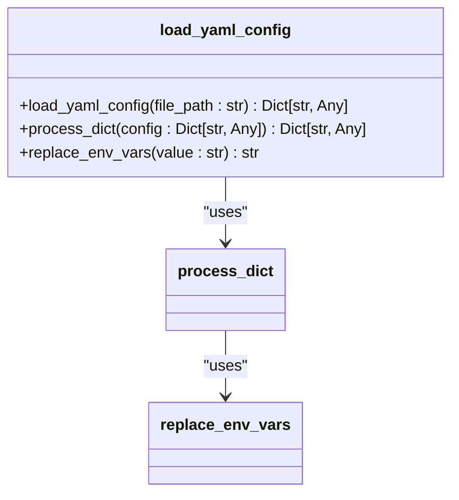
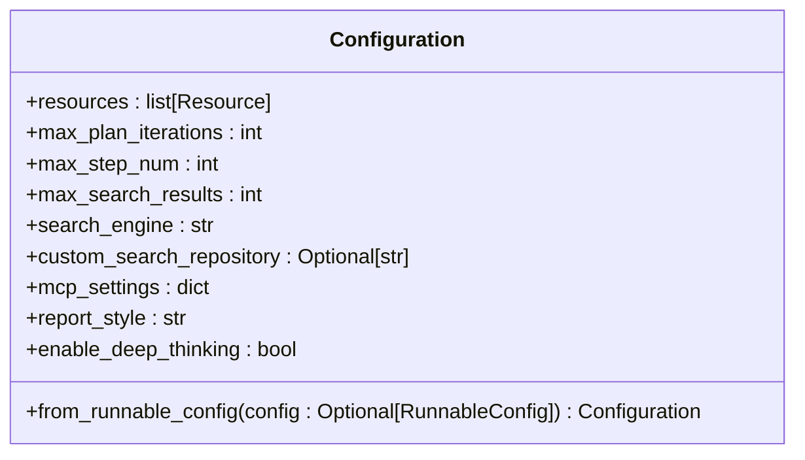
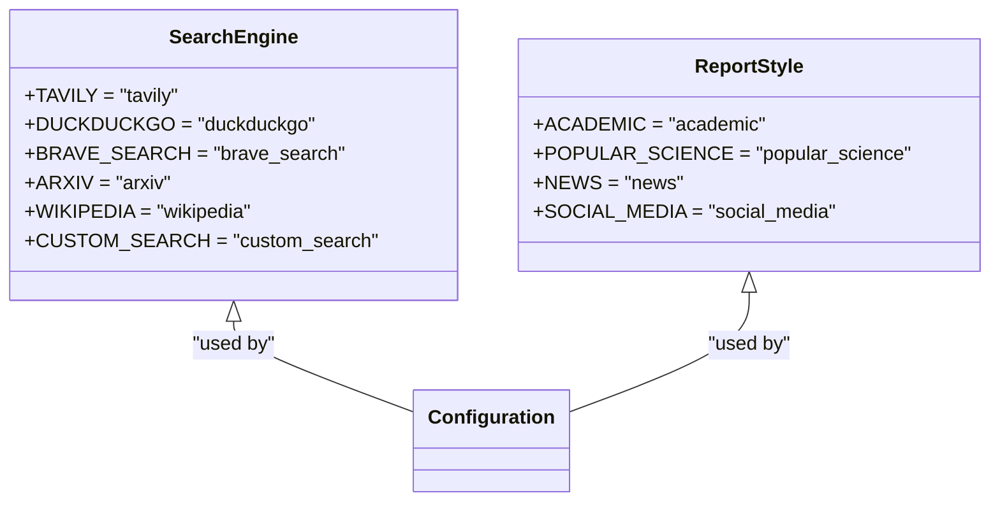
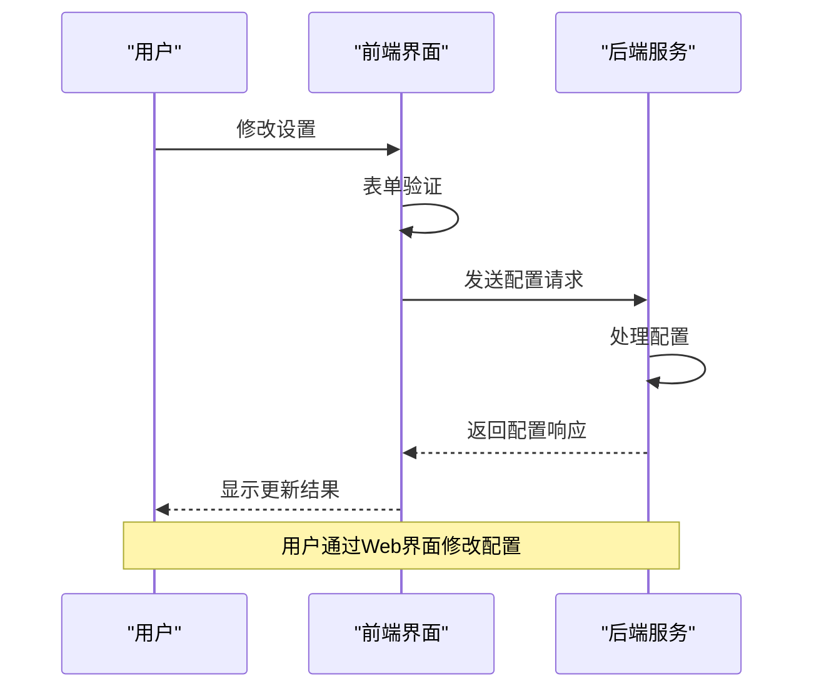
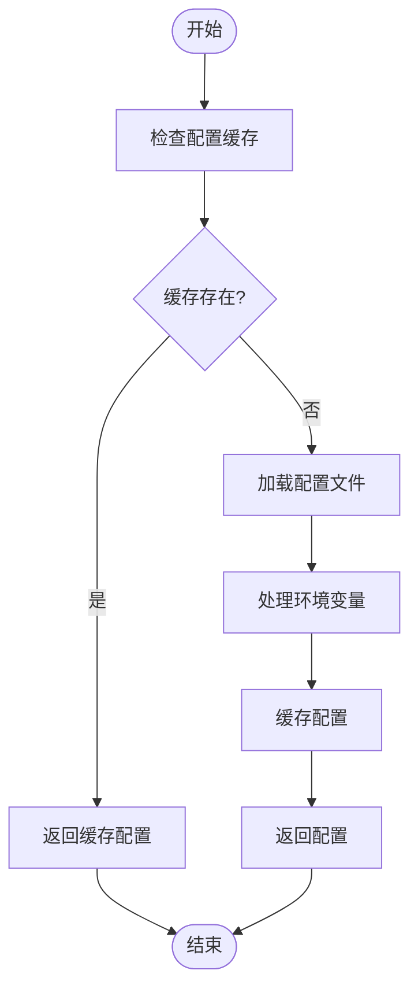

# 配置指南

<cite>
**本文档中引用的文件**  
- [conf.yaml](file://conf.yaml)
- [src/config/loader.py](file://src/config/loader.py)
- [src/config/configuration.py](file://src/config/configuration.py)
- [src/config/tools.py](file://src/config/tools.py)
- [src/config/custom_search.py](file://src/config/custom_search.py)
- [src/server/app.py](file://src/server/app.py)
- [src/server/config_request.py](file://src/server/config_request.py)
- [web/src/app/settings/tabs/general-tab.tsx](file://web/src/app/settings/tabs/general-tab.tsx)
- [src/config/report_style.py](file://src/config/report_style.py)
</cite>

## 目录
1. [简介](#简介)
2. [主配置文件详解](#主配置文件详解)
3. [Python配置模块与加载机制](#python配置模块与加载机制)
4. [前端配置界面](#前端配置界面)
5. [配置示例](#配置示例)
6. [配置生效方式](#配置生效方式)

## 简介
本指南旨在为用户提供deer-flow系统的全面配置说明。文档详细解释了`conf.yaml`主配置文件的每一项参数，包括LLM提供商设置、智能体行为参数、工具启用开关和RAG相关配置。同时介绍了`src/config/`目录下Python配置模块的作用和加载机制，并结合前端设置页面（`general-tab.tsx`）的UI元素，阐述用户如何通过Web界面修改配置。最后提供了不同场景下的配置示例。

## 主配置文件详解

`conf.yaml`是deer-flow系统的核心配置文件，定义了系统运行所需的各种参数。该文件采用YAML格式，结构清晰，易于编辑。

### LLM提供商设置

`conf.yaml`文件中的`BASIC_MODEL`和`REASONING_MODEL`部分用于配置LLM（大语言模型）提供商。

```yaml
BASIC_MODEL:
  base_url: http://192.168.0.106:8088/v1
  model: qwen3-0.6
  api_key: xxxx
  verify_ssl: false
```

- `base_url`: LLM服务的API基础URL。用户可以根据需要切换到不同的LLM服务，如本地部署的模型或云服务。
- `model`: 指定使用的模型名称。例如，可以将`qwen3-0.6`替换为其他支持的模型。
- `api_key`: 认证密钥，用于访问LLM服务。必须替换为用户自己的有效凭证。
- `verify_ssl`: 是否验证SSL证书。当LLM服务器使用自签名证书时，应设置为`false`。

此外，系统还支持Google Ai Studio等其他平台，可以通过注释/取消注释相应配置块来切换：

```yaml
# BASIC_MODEL:
#   platform: "google_aistudio"
#   model: "gemini-2.5-flash"
#   api_key: your_gemini_api_key
```

`REASONING_MODEL`部分可选，用于配置专门的推理模型，以增强规划能力。

**Section sources**
- [conf.yaml](file://conf.yaml#L1-L30)

### 智能体行为参数

智能体行为参数控制deer-flow系统中各个智能体的工作方式和限制。

```yaml
max_plan_iterations: 1
max_step_num: 3
max_search_results: 3
enable_deep_thinking: false
```

- `max_plan_iterations`: 最大计划迭代次数，控制智能体重新规划的次数。
- `max_step_num`: 单个计划中的最大步骤数，限制任务分解的复杂度。
- `max_search_results`: 每次搜索返回的最大结果数，影响信息收集的广度。
- `enable_deep_thinking`: 是否启用深度思考模式，影响智能体的推理深度。

这些参数在`src/config/configuration.py`中定义为`Configuration`类的字段，可通过环境变量或运行时配置进行覆盖。

**Section sources**
- [src/config/configuration.py](file://src/config/configuration.py#L40-L55)

### 工具启用开关

工具启用开关控制系统中各种功能模块的激活状态。

```yaml
SEARCH_ENGINE:
  engine: tavily
  include_domains:
    - example.com
    - trusted-news.com
  exclude_domains:
    - example.com
```

- `engine`: 指定使用的搜索引擎，支持`tavily`、`duckduckgo`、`brave_search`等多种选项。
- `include_domains`: 仅包含来自这些域名的搜索结果，用于限定信息来源。
- `exclude_domains`: 排除来自这些域名的搜索结果，用于过滤不可靠信息源。

这些设置通过`src/config/tools.py`中的`SearchEngine`枚举类进行管理，确保了类型安全和代码可维护性。

**Section sources**
- [conf.yaml](file://conf.yaml#L50-L60)
- [src/config/tools.py](file://src/config/tools.py#L10-L18)

### RAG相关配置

RAG（检索增强生成）相关配置定义了系统如何从外部知识库中检索信息。

```yaml
CUSTOM_SEARCH:
  repositories:
    aggregation_search:
      name: "聚合搜索"
      description: "聚合多个数据源的搜索服务"
      repository: "aggregation-search"
      channel_id: "0"
    vector_search:
      name: "向量库"
      description: "基于向量相似度的搜索服务"
      repository: "euvd-searchByChannelId"
      channel_id: "0"
  default_repository: "dynamic_search"
```

- `repositories`: 定义了可用的自定义搜索仓库，每个仓库都有唯一的ID、名称、描述和内部标识。
- `default_repository`: 指定默认使用的搜索仓库。

这些配置通过`src/config/custom_search.py`中的`CustomSearchConfig`类进行管理，提供了加载、查询和重新加载配置的功能。

**Section sources**
- [conf.yaml](file://conf.yaml#L61-L68)
- [src/config/custom_search.py](file://src/config/custom_search.py#L20-L119)

## Python配置模块与加载机制

`src/config/`目录下的Python模块构成了deer-flow系统的配置管理核心。

### 配置加载器

`src/config/loader.py`模块提供了配置文件的加载和处理功能。



**Diagram sources**
- [src/config/loader.py](file://src/config/loader.py#L42-L77)

`load_yaml_config`函数负责加载YAML配置文件，并通过`process_dict`和`replace_env_vars`函数递归处理环境变量替换。配置加载器还实现了缓存机制，避免重复读取和解析同一文件。

### 配置类

`src/config/configuration.py`模块定义了`Configuration`数据类，用于表示运行时配置。



**Diagram sources**
- [src/config/configuration.py](file://src/config/configuration.py#L40-L55)

该类使用`@dataclass`装饰器，提供了类型安全的配置字段。`from_runnable_config`类方法可以从LangChain的`RunnableConfig`对象创建配置实例，支持环境变量和可配置参数的优先级处理。

### 枚举与常量

`src/config/tools.py`和`src/config/report_style.py`模块定义了系统使用的枚举类型。



**Diagram sources**
- [src/config/tools.py](file://src/config/tools.py#L10-L18)
- [src/config/report_style.py](file://src/config/report_style.py#L4-L8)

这些枚举确保了配置值的类型安全和一致性，避免了字符串硬编码带来的错误。

**Section sources**
- [src/config/loader.py](file://src/config/loader.py#L1-L78)
- [src/config/configuration.py](file://src/config/configuration.py#L1-L70)
- [src/config/tools.py](file://src/config/tools.py#L1-L31)
- [src/config/report_style.py](file://src/config/report_style.py#L1-L8)

## 前端配置界面

`web/src/app/settings/tabs/general-tab.tsx`文件定义了Web界面中的通用设置选项卡。

### UI元素与配置映射

前端界面通过React组件与后端配置进行交互，实现了可视化配置管理。



**Diagram sources**
- [web/src/app/settings/tabs/general-tab.tsx](file://web/src/app/settings/tabs/general-tab.tsx#L1-L281)
- [src/server/config_request.py](file://src/server/config_request.py#L1-L27)

### 表单结构

`general-tab.tsx`使用Zod进行表单验证，确保用户输入的配置值符合要求。

```typescript
const generalFormSchema = z.object({
  autoAcceptedPlan: z.boolean(),
  maxPlanIterations: z.number().min(1),
  maxStepNum: z.number().min(1),
  maxSearchResults: z.number().min(1),
  searchEngine: z.enum(["tavily", "duckduckgo", "brave_search", "arxiv", "wikipedia", "custom_search"]),
  customSearchRepository: z.string().optional(),
  enableBackgroundInvestigation: z.boolean(),
  enableDeepThinking: z.boolean(),
  reportStyle: z.enum(["academic", "popular_science", "news", "social_media"]),
});
```

该表单结构与后端配置参数一一对应，确保了前后端配置的一致性。

**Section sources**
- [web/src/app/settings/tabs/general-tab.tsx](file://web/src/app/settings/tabs/general-tab.tsx#L30-L70)

## 配置示例

本节提供不同场景下的配置示例，帮助用户快速上手。

### 切换LLM模型

要切换到不同的LLM模型，只需修改`BASIC_MODEL`部分：

```yaml
BASIC_MODEL:
  base_url: https://api.openai.com/v1
  model: gpt-4-turbo
  api_key: your_openai_api_key
  verify_ssl: true
```

此配置将系统从本地部署的Qwen模型切换到OpenAI的GPT-4 Turbo模型。

**Section sources**
- [conf.yaml](file://conf.yaml#L1-L30)

### 配置自定义搜索引擎

要配置自定义搜索引擎，需要在`CUSTOM_SEARCH`部分添加新的仓库：

```yaml
CUSTOM_SEARCH:
  repositories:
    my_company_knowledge:
      name: "公司知识库"
      description: "公司内部文档和知识"
      repository: "company-knowledge-base"
      channel_id: "12345"
    public_documents:
      name: "公开文档"
      description: "政府和公共机构发布的文档"
      repository: "public-docs"
      channel_id: "67890"
  default_repository: "my_company_knowledge"
```

此配置添加了两个新的自定义搜索仓库，并将"公司知识库"设为默认。

**Section sources**
- [conf.yaml](file://conf.yaml#L61-L68)

### 调整智能体规划策略

要调整智能体的规划策略，可以修改相关参数：

```yaml
max_plan_iterations: 3
max_step_num: 10
max_search_results: 5
enable_deep_thinking: true
```

此配置允许智能体进行最多3次重新规划，单个计划最多包含10个步骤，每次搜索返回最多5个结果，并启用深度思考模式，使智能体能够进行更复杂的推理。

**Section sources**
- [src/config/configuration.py](file://src/config/configuration.py#L40-L55)

## 配置生效方式

了解配置更改后的生效方式对于系统管理至关重要。

### 配置重载机制

deer-flow系统采用缓存机制来提高配置加载效率。`load_yaml_config`函数在首次加载配置文件后会将其缓存，后续调用直接返回缓存的配置对象。



**Diagram sources**
- [src/config/loader.py](file://src/config/loader.py#L50-L77)

### 重启需求

根据`conf.yaml`文件中的注释，每次更改`config.yaml`文件后都需要重启服务才能使配置生效。

```yaml
# A restart is required every time you change the `config.yaml` file.
```

这是因为系统在启动时一次性加载配置并缓存，运行时不会自动检测文件变化。这种设计保证了配置的一致性和性能，但要求用户在修改配置后手动重启服务。

**Section sources**
- [conf.yaml](file://conf.yaml#L7)
- [src/config/loader.py](file://src/config/loader.py#L60-L65)