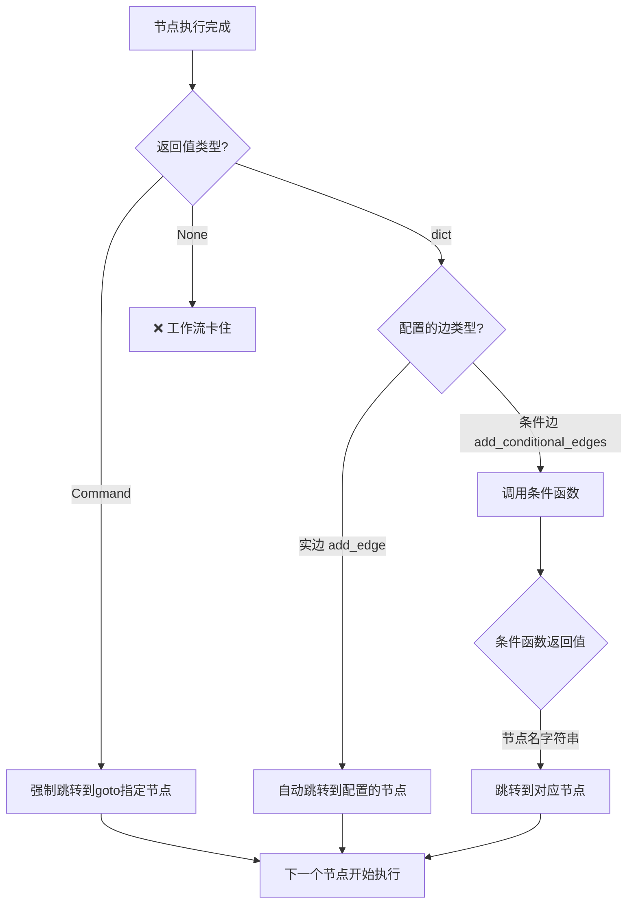

# LangGraph 路由机制速查表

## 🎯 三种触发方式对比



## 📋 核心对照表

| 路由类型 | 配置方式 | 节点返回值 | 触发机制 | 使用场景 |
|---------|---------|-----------|---------|---------|
| **实边** | `add_edge("A", "B")` | `dict` 或 `Command(goto=...)` | 自动跳转到B | 固定流程 |
| **条件边** | `add_conditional_edges("A", func, [nodes])` | `dict` (触发条件函数) | func(state)返回节点名 | 多路分支 |
| **Command** | 无需配置 | `Command(goto="B")` | 强制跳转到B | 节点自决策 |

## ⚠️ 关键注意事项

### ✅ 正确示例

```python
# ✅ 触发实边/条件边
def node_with_edge(state):
    return {}  # 或 {"key": "value"}

# ✅ 强制跳转
def node_with_command(state):
    return Command(goto="target_node")

# ✅ 强制跳转+更新状态
def node_full_command(state):
    return Command(
        update={"result": "data"},
        goto="target_node"
    )
```

### ❌ 错误示例

```python
# ❌ 返回None - 工作流卡住
def bad_node_1(state):
    pass

# ❌ 返回非dict非Command
def bad_node_2(state):
    return "some string"

# ❌ 条件函数返回非字符串
def bad_condition(state):
    return None  # 应该返回节点名字符串
```

## 🔄 DeerFlow的research_team循环

```mermaid
graph LR
    A[research_team] -->|return {}| B[条件边函数]
    B -->|有未完成步骤| C[researcher]
    B -->|所有完成| D[reporter]
    C -->|Command goto research_team| A
```

**关键代码:**

```python
# ✅ 路由节点 - 必须返回{}触发条件边
def research_team_node(state: State):
    return {}  # 不能返回None!

# ✅ 条件边函数 - 返回节点名字符串
def continue_to_running_research_team(state: State):
    if 所有步骤完成:
        return "reporter"
    else:
        return "researcher"

# ✅ 执行节点 - 返回Command跳回路由节点
async def researcher_node(state: State, config: RunnableConfig):
    # ... 执行研究 ...
    current_step.execution_res = result  # 标记完成
    return Command(goto="research_team")  # 跳回路由节点
```

## 🐛 卡住问题排查清单

- [ ] 节点是否返回了None? (检查是否有return语句)
- [ ] 条件边函数是否返回了字符串节点名?
- [ ] 返回的节点名是否在`add_conditional_edges`的列表中?
- [ ] execution_res字段是否正确更新?
- [ ] 日志中是否有"NODE_EXIT"但没有"NODE_ENTRY"?

## 📊 调试日志模板

```python
def my_node(state: State):
    logger.info(f"🔄 NODE_ENTRY | my_node | 开始执行")
    
    # ... 业务逻辑 ...
    result = {"data": "value"}
    
    logger.info(f"✅ NODE_EXIT | my_node | 返回类型: {type(result)}")
    return result

def my_condition(state: State):
    logger.info(f"🔀 TRANSITION_LOGIC | my_node | 开始评估")
    
    next_node = "target_a" if condition else "target_b"
    
    logger.info(f"🔀 TRANSITION_DECISION | my_node → {next_node} | 原因: XXX")
    return next_node
```

## 🎓 记忆口诀

```
节点必返值,不然就卡住
实边自动跳,条件看函数
Command强制走,goto定乾坤
字典触发边,空字典也行
```

---

**完整指南**: 查看 [`LANGGRAPH_ROUTING_GUIDE.md`](LANGGRAPH_ROUTING_GUIDE.md)
