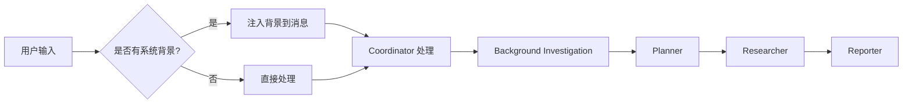

# 系统背景上下文功能说明

## 📋 功能概述

系统背景上下文功能允许在用户输入之前自动注入预设的背景信息，使得所有研究和查询都基于特定的业务场景或组织背景进行。

## 🎯 使用场景

- **企业内部使用**：自动添加公司名称作为背景（如"交通银行"）
- **特定领域研究**：预设研究领域或行业背景
- **定制化服务**：为不同客户提供定制化的背景上下文

## 🔧 实现方式

### 1. 自动注入机制

当用户发送查询时，系统会自动在用户消息前添加背景信息：

**原始用户输入**：
```
手机银行的操作步骤
```

**实际处理的内容**：
```
[系统背景上下文: 交通银行]

手机银行的操作步骤
```

### 2. 修改的文件

#### ✅ `/home/llm/zhangle/deer-flow/src/graph/types.py`
- 在 `State` 类中添加 `system_context` 字段
- 该字段会在整个工作流中传递

#### ✅ `/home/llm/zhangle/deer-flow/src/config/configuration.py`
- 在 `Configuration` 类中添加 `system_context` 配置项
- 支持从环境变量或配置中读取

#### ✅ `/home/llm/zhangle/deer-flow/src/server/app.py`
- `_astream_workflow_generator` 函数：添加 `system_context` 参数
- 自动在用户消息前注入系统背景
- 将背景信息传递给工作流配置
- 所有 API 端点都支持系统背景注入

### 3. 核心代码逻辑

```python
# 在 _astream_workflow_generator 中
if system_context and messages:
    # 在第一条用户消息中添加系统背景
    enhanced_logger.logger.info(f"🏛️ SYSTEM_CONTEXT | 注入系统背景上下文: {system_context}")
    first_user_message = messages[0]
    if isinstance(first_user_message, dict) and first_user_message.get("role") == "user":
        original_content = first_user_message.get("content", "")
        # 将系统背景添加在用户问题之前
        first_user_message["content"] = f"[系统背景上下文: {system_context}]\n\n{original_content}"
        enhanced_logger.logger.info(f"✅ CONTEXT_INJECTED | [系统背景上下文: {system_context}] 背景已注入到用户消息中")
```

## 📊 当前配置

### 默认系统背景
```python
system_context="交通银行"
```

所有通过以下接口的请求都会自动添加"交通银行"背景：
- `/api/chat/stream`
- `/api/research/simple/stream`
- `/api/research/simple/stream/openai`

## 🔄 工作流程



## 📝 日志输出

启用系统背景后，你会在日志中看到：

```bash
🏛️ SYSTEM_CONTEXT | 注入系统背景上下文: 交通银行
✅ CONTEXT_INJECTED | 背景已注入到用户消息中
```

## ⚙️ 自定义配置

### 方法 1：修改代码中的默认值

在 `/home/llm/zhangle/deer-flow/src/server/app.py` 中找到并修改：

```python
system_context="交通银行"  # 修改为你想要的背景
```

### 方法 2：通过环境变量配置

在 `.env` 文件中添加：

```bash
SYSTEM_CONTEXT=交通银行
```

### 方法 3：通过 API 请求传递（未来扩展）

可以在请求体中添加 `system_context` 字段来动态指定：

```json
{
  "messages": [{"role": "user", "content": "手机银行操作步骤"}],
  "system_context": "交通银行"
}
```

## 🎯 效果示例

### 示例 1：查询手机银行操作

**用户输入**：
```
手机银行的操作步骤
```

**系统实际处理**：
```
[系统背景上下文: 交通银行]

手机银行的操作步骤
```

**AI 理解**：
AI 会自动理解这是关于"交通银行手机银行"的操作步骤查询，而不是泛泛的手机银行概念。

### 示例 2：查询业务流程

**用户输入**：
```
信用卡申请流程
```

**系统实际处理**：
```
[系统背景上下文: 交通银行]

信用卡申请流程
```

**AI 理解**：
AI 会查询和返回交通银行的信用卡申请流程，而不是通用的信用卡申请流程。

## 💡 优势

1. **自动化**：无需每次都在问题中提及"交通银行"
2. **一致性**：确保所有查询都基于相同的业务背景
3. **用户友好**：用户可以直接问业务问题，无需重复背景信息
4. **可配置**：支持灵活配置不同的背景上下文

## 🚀 未来扩展

- [ ] 支持多个背景上下文层级（如：交通银行 > 零售业务 > 信用卡部门）
- [ ] 支持从数据库动态加载背景信息
- [ ] 支持用户级别的个性化背景设置
- [ ] 支持背景上下文的国际化

## 📌 注意事项

1. 系统背景会添加到消息中，可能会稍微增加 token 使用量
2. 确保背景信息简洁明了，避免过长影响性能
3. 所有智能体（coordinator、planner、researcher、reporter）都会看到这个背景
4. 背景信息会影响搜索引擎的查询结果

## 🔍 故障排查

### 问题：背景没有注入

**检查**：
1. 查看日志中是否有 `🏛️ SYSTEM_CONTEXT` 标记
2. 确认 `system_context` 参数不为空
3. 确认消息列表不为空

### 问题：背景注入但没有效果

**检查**：
1. 查看实际发送给 LLM 的消息内容
2. 检查 coordinator 的提示词是否正确处理了背景信息
3. 确认背景信息格式正确

## 📞 支持

如有问题，请查看：
- 增强日志系统：`ENHANCED_LOGGING.md`
- 配置说明：`src/config/configuration.py`
- 状态定义：`src/graph/types.py`
