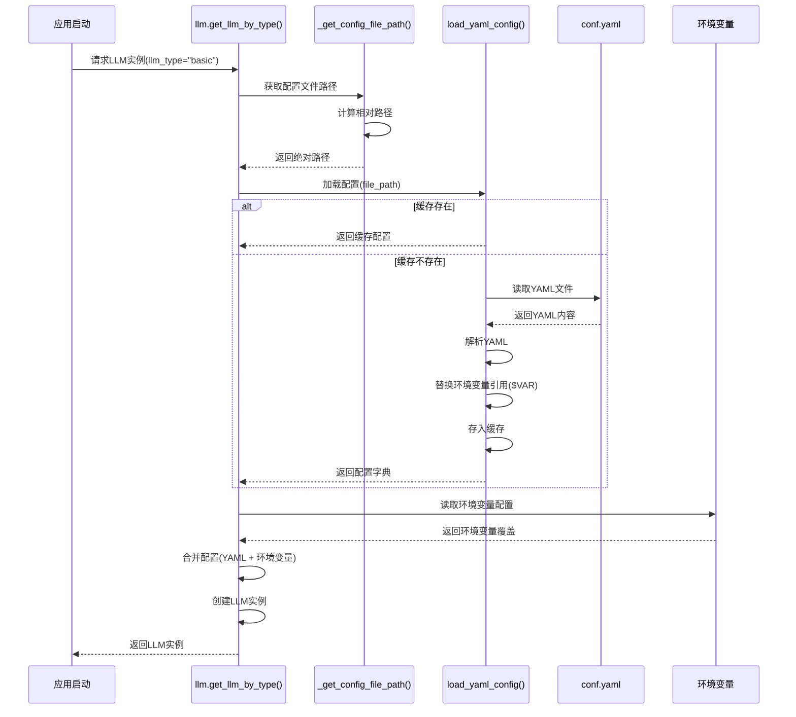
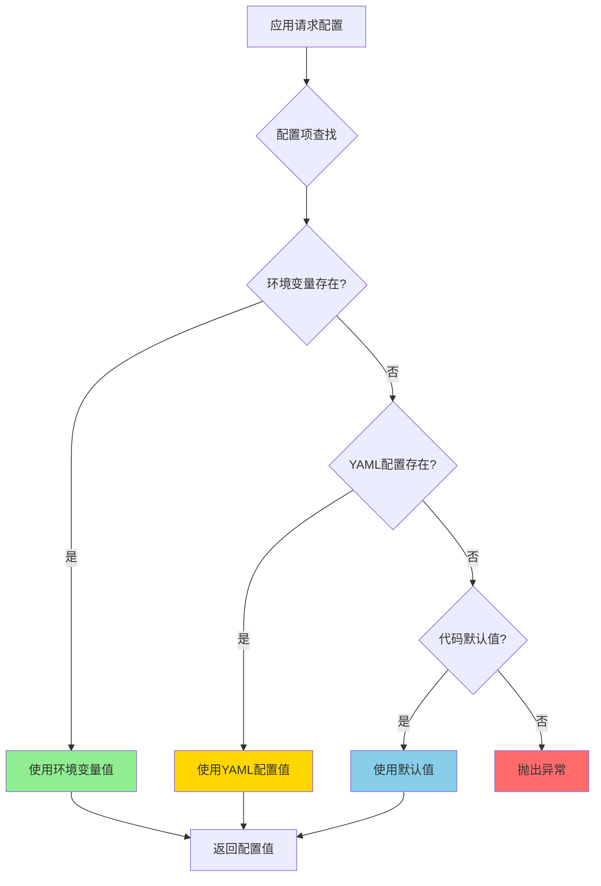

# 配置文件位置与读取机制详解

## 📁 配置文件保存位置

### 1. 项目根目录 - conf.yaml

**完整路径**: `/home/llm/zhangle/deer-flow/conf.yaml`

**位置说明**:
```
deer-flow/                          ← 项目根目录
├── conf.yaml                       ← ⭐ 主配置文件（实际使用）
├── conf.yaml.example               ← 配置模板（提交到Git）
├── .env                            ← 环境变量配置（实际使用）
├── .env.example                    ← 环境变量模板（提交到Git）
├── src/                            ← 源代码目录
│   ├── config/                     ← 配置相关代码
│   │   ├── loader.py              ← 配置加载器
│   │   ├── configuration.py       ← Configuration类
│   │   └── custom_search.py       ← 自定义搜索配置
│   └── llms/
│       └── llm.py                 ← LLM配置读取逻辑
├── pyproject.toml
└── README.md
```

### 2. 为什么放在项目根目录？

✅ **优点**:
1. **易于访问** - 运行目录通常是项目根目录
2. **Docker映射方便** - 直接挂载到容器
3. **版本管理清晰** - 配置与代码分离
4. **部署简单** - 修改配置不需要进入代码目录

### 3. 配置文件层次结构

```
配置系统
├── conf.yaml                       主配置文件（YAML格式）
│   ├── BASIC_MODEL                LLM模型配置
│   ├── REASONING_MODEL            推理模型配置
│   ├── SEARCH_ENGINE              搜索引擎配置
│   └── CUSTOM_SEARCH              自定义搜索配置
│
├── .env                           环境变量（键值对）
│   ├── DEBUG                      调试模式
│   ├── LOG_LEVEL                  日志级别
│   ├── SEARCH_API                 搜索引擎类型
│   └── BASIC_MODEL__API_KEY       LLM API密钥（覆盖YAML）
│
└── 运行时参数                      API请求参数
    └── configurable               RunnableConfig.configurable字段
```

---

## 🔍 代码如何知道配置文件位置？

### 核心机制：相对路径计算

**关键代码**: `src/llms/llm.py` 第193-195行

```python
def _get_config_file_path() -> str:
    """Get the path to the configuration file."""
    return str((Path(__file__).parent.parent.parent / "conf.yaml").resolve())
```

### 路径计算详解

#### 步骤分解

```python
Path(__file__)                      # 当前文件路径
    ↓
/home/llm/zhangle/deer-flow/src/llms/llm.py

.parent                             # 上一级目录
    ↓
/home/llm/zhangle/deer-flow/src/llms/

.parent                             # 再上一级
    ↓
/home/llm/zhangle/deer-flow/src/

.parent                             # 再上一级
    ↓
/home/llm/zhangle/deer-flow/

/ "conf.yaml"                       # 拼接文件名
    ↓
/home/llm/zhangle/deer-flow/conf.yaml

.resolve()                          # 解析为绝对路径
    ↓
/home/llm/zhangle/deer-flow/conf.yaml

str(...)                            # 转为字符串
    ↓
"/home/llm/zhangle/deer-flow/conf.yaml"
```

#### 可视化路径计算

```mermaid
graph TB
    A[llm.py文件] -->|Path__file__| B[/src/llms/llm.py]
    B -->|.parent| C[/src/llms/]
    C -->|.parent| D[/src/]
    D -->|.parent| E[项目根目录 /deer-flow/]
    E -->|/ 'conf.yaml'| F[/deer-flow/conf.yaml]
    F -->|.resolve| G[绝对路径]
    G -->|str| H[字符串路径]
    
    style E fill:#90EE90
    style F fill:#FFD700
    style H fill:#87CEEB
```

### 为什么使用相对路径而不是绝对路径？

| 方式 | 优点 | 缺点 | 适用场景 |
|------|------|------|----------|
| **相对路径** | ✅ 可移植<br>✅ 跨平台<br>✅ Docker友好 | ⚠️ 依赖文件结构 | ⭐ 推荐使用 |
| **绝对路径** | ✅ 明确<br>✅ 不依赖位置 | ❌ 不可移植<br>❌ 部署困难 | 仅开发调试 |
| **环境变量** | ✅ 灵活<br>✅ 可配置 | ⚠️ 需要额外设置 | 特殊部署场景 |

**当前方案**采用相对路径，因为：
1. 代码文件位置固定（`src/llms/llm.py`）
2. 配置文件位置固定（项目根目录）
3. 相对关系稳定（3层parent）

---

## 📖 配置读取完整流程

### 流程图



### 代码执行流程

#### 1️⃣ **应用启动，请求LLM实例**

```python
# src/graph/nodes.py 或其他文件
from src.llms.llm import get_llm_by_type

llm = get_llm_by_type("basic")  # 请求基础模型
```

#### 2️⃣ **获取配置文件路径**

```python
# src/llms/llm.py - 第311行
conf = load_yaml_config(_get_config_file_path())

# _get_config_file_path() 返回:
# "/home/llm/zhangle/deer-flow/conf.yaml"
```

#### 3️⃣ **加载YAML配置（带缓存）**

```python
# src/config/loader.py - 第60-77行
def load_yaml_config(file_path: str) -> Dict[str, Any]:
    """Load and process YAML configuration file."""
    
    # 1. 检查文件是否存在
    if not os.path.exists(file_path):
        return {}
    
    # 2. 检查缓存
    if file_path in _config_cache:
        return _config_cache[file_path]  # 直接返回缓存
    
    # 3. 读取并解析YAML
    with open(file_path, "r") as f:
        config = yaml.safe_load(f)
    
    # 4. 处理环境变量引用
    processed_config = process_dict(config)
    
    # 5. 存入缓存
    _config_cache[file_path] = processed_config
    
    return processed_config
```

**返回的配置字典**:
```python
{
    "BASIC_MODEL": {
        "base_url": "https://api.deepseek.com/v1",
        "model": "deepseek-chat",
        "api_key": "sk-1bdd889cbd3e46a6a454cb4bb322cf60",
        "verify_ssl": False
    },
    "REASONING_MODEL": { ... },
    "SEARCH_ENGINE": { ... },
    "CUSTOM_SEARCH": { ... }
}
```

#### 4️⃣ **读取环境变量覆盖**

```python
# src/llms/llm.py - 第208-220行
def _get_env_llm_conf(llm_type: str) -> Dict[str, Any]:
    """
    从环境变量获取LLM配置
    格式: {LLM_TYPE}_MODEL__{KEY}
    """
    prefix = f"{llm_type.upper()}_MODEL__"  # "BASIC_MODEL__"
    conf = {}
    
    for key, value in os.environ.items():
        if key.startswith(prefix):
            # BASIC_MODEL__API_KEY -> api_key
            conf_key = key[len(prefix):].lower()
            conf[conf_key] = value
    
    return conf
```

**环境变量示例**:
```bash
# .env
BASIC_MODEL__API_KEY=sk-production-key
BASIC_MODEL__MODEL=gpt-4-turbo
```

**返回的环境变量配置**:
```python
{
    "api_key": "sk-production-key",
    "model": "gpt-4-turbo"
}
```

#### 5️⃣ **合并配置**

```python
# src/llms/llm.py - 第238-240行
llm_conf = conf.get("BASIC_MODEL", {})    # YAML配置
env_conf = _get_env_llm_conf("basic")     # 环境变量配置

# 环境变量优先级更高
merged_conf = {**llm_conf, **env_conf}
```

**合并后的配置**:
```python
{
    "base_url": "https://api.deepseek.com/v1",  # 来自YAML
    "model": "gpt-4-turbo",                     # 环境变量覆盖
    "api_key": "sk-production-key",             # 环境变量覆盖
    "verify_ssl": False                         # 来自YAML
}
```

#### 6️⃣ **创建LLM实例**

```python
# src/llms/llm.py - 第296行
return ChatOpenAI(**merged_conf)
```

---

## 🌍 不同场景下的配置文件位置

### 场景1: 本地开发

**项目结构**:
```
/home/user/projects/deer-flow/
├── conf.yaml              ← 直接读取
├── src/llms/llm.py       ← 代码位置
└── ...
```

**路径计算**:
```python
__file__ = "/home/user/projects/deer-flow/src/llms/llm.py"
.parent.parent.parent = "/home/user/projects/deer-flow"
/ "conf.yaml" = "/home/user/projects/deer-flow/conf.yaml"
```

✅ **工作正常**

### 场景2: Docker容器部署

**docker-compose.yml配置**:
```yaml
services:
  backend:
    image: deer-flow-backend:latest
    volumes:
      - ./conf.yaml:/app/conf.yaml:ro  # 挂载配置文件
```

**容器内路径**:
```
/app/                      ← 容器工作目录
├── conf.yaml              ← 从宿主机挂载
├── src/llms/llm.py       ← 代码位置
└── ...
```

**路径计算**:
```python
__file__ = "/app/src/llms/llm.py"
.parent.parent.parent = "/app"
/ "conf.yaml" = "/app/conf.yaml"
```

✅ **工作正常**

### 场景3: Python包安装（假设）

如果项目作为包安装，需要调整策略：

**不推荐的方式**（当前实现）:
```python
Path(__file__).parent.parent.parent / "conf.yaml"
# 可能指向 site-packages/deer-flow/conf.yaml（不存在）
```

**推荐的方式**（如需支持包安装）:
```python
# 方案1: 使用环境变量
config_path = os.getenv("DEER_FLOW_CONFIG", "conf.yaml")

# 方案2: 使用当前工作目录
config_path = Path.cwd() / "conf.yaml"

# 方案3: 使用配置目录
config_path = Path.home() / ".deer-flow" / "conf.yaml"
```

⚠️ **当前项目不支持包安装，仅支持源码部署**

---

## 🔧 其他配置读取位置

### 1. 自定义搜索配置

**文件**: `src/config/custom_search.py`

```python
class CustomSearchConfig:
    def __init__(self, config_file: str = "conf.yaml"):
        self.config_file = config_file
        self._load_config()
    
    def _load_config(self) -> None:
        config = load_yaml_config(self.config_file)
        # 读取 CUSTOM_SEARCH 配置
```

**默认使用**: `"conf.yaml"` （相对路径，基于当前工作目录）

### 2. 搜索引擎配置

**文件**: `src/tools/search.py`

```python
def get_search_config():
    config = load_yaml_config("conf.yaml")  # 相对路径
    search_config = config.get("SEARCH_ENGINE", {})
    return search_config
```

**问题**: 使用相对路径 `"conf.yaml"`，依赖运行时工作目录

**建议**: 统一使用绝对路径计算

```python
# 推荐改进
from pathlib import Path

CONFIG_FILE = str(Path(__file__).parent.parent.parent / "conf.yaml")

def get_search_config():
    config = load_yaml_config(CONFIG_FILE)
    # ...
```

### 3. 调试脚本配置

**文件**: `middlewares/llm/debug_llm_connection.py`

```python
config_path = Path(__file__).parent / "conf.yaml"
```

**路径**: `middlewares/conf.yaml` （相对于调试脚本）

**注意**: 这是调试脚本的本地配置，与主配置文件分离

---

## 📊 配置文件优先级总结

### 优先级层次



### 优先级表格

| 优先级 | 来源 | 格式 | 示例 | 用途 |
|--------|------|------|------|------|
| 🥇 最高 | 环境变量 | `KEY=value` | `BASIC_MODEL__API_KEY=sk-xxx` | 敏感信息、环境差异 |
| 🥈 中等 | YAML配置 | `KEY: value` | `BASIC_MODEL:\n  api_key: sk-xxx` | 结构化配置、默认值 |
| 🥉 最低 | 代码默认值 | `param: int = 3` | `max_step_num: int = 3` | 兜底默认值 |

### 实际示例

**conf.yaml**:
```yaml
BASIC_MODEL:
  base_url: https://api.deepseek.com/v1
  model: deepseek-chat
  api_key: sk-yaml-key
  max_retries: 3
```

**.env**:
```bash
BASIC_MODEL__API_KEY=sk-env-key
BASIC_MODEL__MODEL=gpt-4-turbo
```

**最终生效**:
```python
{
    "base_url": "https://api.deepseek.com/v1",  # YAML
    "model": "gpt-4-turbo",                     # 环境变量覆盖 ✓
    "api_key": "sk-env-key",                    # 环境变量覆盖 ✓
    "max_retries": 3                            # YAML
}
```

---

## 🛠️ 常见问题与解决方案

### Q1: 配置文件找不到怎么办？

**错误现象**:
```python
FileNotFoundError: [Errno 2] No such file or directory: 'conf.yaml'
```

**原因**:
1. 配置文件不存在
2. 工作目录不正确
3. 使用相对路径但路径错误

**解决方案**:

```bash
# 1. 检查配置文件是否存在
ls -la /home/llm/zhangle/deer-flow/conf.yaml

# 2. 如果不存在，从模板创建
cd /home/llm/zhangle/deer-flow
cp conf.yaml.example conf.yaml

# 3. 检查当前工作目录
pwd
# 应该输出: /home/llm/zhangle/deer-flow

# 4. 从正确的目录启动应用
cd /home/llm/zhangle/deer-flow
python server.py
```

### Q2: 如何验证配置文件路径是否正确？

**调试代码**:
```python
from src.llms.llm import _get_config_file_path
import os

config_path = _get_config_file_path()
print(f"配置文件路径: {config_path}")
print(f"文件存在: {os.path.exists(config_path)}")

# 读取配置
from src.config.loader import load_yaml_config
config = load_yaml_config(config_path)
print(f"配置内容: {list(config.keys())}")
```

**预期输出**:
```
配置文件路径: /home/llm/zhangle/deer-flow/conf.yaml
文件存在: True
配置内容: ['BASIC_MODEL', 'REASONING_MODEL', 'SEARCH_ENGINE', 'CUSTOM_SEARCH']
```

### Q3: Docker容器中配置文件位置不对？

**检查挂载**:
```yaml
# docker-compose.yml
services:
  backend:
    volumes:
      - ./conf.yaml:/app/conf.yaml:ro  # ✓ 正确
      # - ./conf.yaml:/conf.yaml:ro    # ✗ 错误（位置不对）
```

**验证挂载**:
```bash
# 进入容器
docker exec -it deer-flow-backend bash

# 检查配置文件
ls -la /app/conf.yaml
cat /app/conf.yaml
```

### Q4: 配置缓存导致修改不生效？

**问题**: 修改了 `conf.yaml` 但配置未更新

**原因**: `load_yaml_config` 使用缓存

**解决方案**:

```bash
# 方案1: 重启应用（推荐）
docker-compose restart backend

# 方案2: 清除缓存（代码中）
from src.config.loader import _config_cache
_config_cache.clear()
```

### Q5: 如何支持自定义配置文件路径？

**当前不支持**，如需支持可以添加环境变量：

```python
# 改进建议 - src/llms/llm.py
def _get_config_file_path() -> str:
    """Get the path to the configuration file."""
    # 优先使用环境变量
    config_path = os.getenv("DEER_FLOW_CONFIG_PATH")
    if config_path:
        return config_path
    
    # 否则使用默认相对路径
    return str((Path(__file__).parent.parent.parent / "conf.yaml").resolve())
```

**使用方式**:
```bash
# .env
DEER_FLOW_CONFIG_PATH=/custom/path/to/conf.yaml
```

---

## 📝 最佳实践

### 1. 配置文件管理

✅ **推荐做法**:
```bash
# 1. 使用模板创建配置
cp conf.yaml.example conf.yaml

# 2. 不提交实际配置到Git
echo "conf.yaml" >> .gitignore

# 3. 提交模板供参考
git add conf.yaml.example
```

### 2. 环境变量使用

✅ **推荐做法**:
```bash
# .env - 本地开发
BASIC_MODEL__API_KEY=sk-dev-key

# .env.production - 生产环境
BASIC_MODEL__API_KEY=sk-prod-key
```

### 3. Docker部署

✅ **推荐做法**:
```yaml
# docker-compose.yml
services:
  backend:
    volumes:
      - ./conf.yaml:/app/conf.yaml:ro     # 只读挂载
    env_file:
      - .env                               # 加载环境变量
```

### 4. 配置验证

✅ **推荐做法**:
```python
# 启动时验证配置
def validate_config():
    config_path = _get_config_file_path()
    
    if not os.path.exists(config_path):
        raise FileNotFoundError(f"配置文件不存在: {config_path}")
    
    config = load_yaml_config(config_path)
    
    if "BASIC_MODEL" not in config:
        raise ValueError("配置文件缺少 BASIC_MODEL 配置")
    
    # 验证必需字段
    required_fields = ["base_url", "model", "api_key"]
    for field in required_fields:
        if field not in config["BASIC_MODEL"]:
            raise ValueError(f"BASIC_MODEL 配置缺少 {field}")
```

---

## 🎯 总结

### 关键要点

1. **配置文件位置**: 固定在项目根目录 `deer-flow/conf.yaml`
2. **路径计算方式**: 通过相对路径 `Path(__file__).parent.parent.parent / "conf.yaml"`
3. **配置优先级**: 环境变量 > YAML配置 > 代码默认值
4. **缓存机制**: 配置文件加载后会被缓存，修改需重启
5. **Docker部署**: 通过volume挂载配置文件到 `/app/conf.yaml`

### 核心代码位置

| 功能 | 文件 | 关键函数/行号 |
|------|------|---------------|
| 配置文件路径计算 | `src/llms/llm.py` | `_get_config_file_path()` (193-195行) |
| YAML配置加载 | `src/config/loader.py` | `load_yaml_config()` (60-77行) |
| 环境变量读取 | `src/llms/llm.py` | `_get_env_llm_conf()` (208-220行) |
| 配置合并 | `src/llms/llm.py` | `_create_llm_use_conf()` (223-295行) |

### 快速参考

**查看配置文件路径**:
```python
from src.llms.llm import _get_config_file_path
print(_get_config_file_path())
# 输出: /home/llm/zhangle/deer-flow/conf.yaml
```

**检查配置是否加载**:
```python
from src.config.loader import load_yaml_config, _config_cache
config = load_yaml_config(_get_config_file_path())
print("已缓存配置:", list(_config_cache.keys()))
```

**清除配置缓存**:
```python
from src.config.loader import _config_cache
_config_cache.clear()
```
