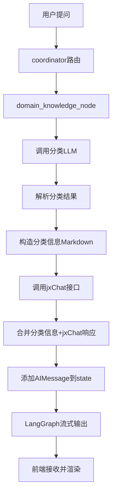

# 分类模型输出到前端功能实现

## 需求背景

用户希望在前端能看到 `domain_knowledge_node` 中分类模型的输出结果，包括：
- 场景代码（scene_code）
- 置信度（confidence）
- 分类理由（reason）
- 分类耗时

## 问题分析

### 原始实现的问题

[`domain_knowledge_node`](file:///home/llm/zhangle/deer-flow/src/graph/nodes.py#L314-L482) 的分类模型调用存在以下问题：

1. **分类LLM调用是非流式的**
   ```python
   resp_cls = llm_cls.invoke([{"role": "user", "content": classification_prompt}])
   ```
   - 使用 `invoke()` 而非流式调用
   - LangGraph 不会自动捕获这个调用的输出

2. **只记录到日志**
   ```python
   enhanced_logger.logger.info(
       f"🎯 CLASSIFICATION_LLM_OUTPUT | 分类模型响应 | 耗时: {classification_duration:.2f}s\n"
       f"{'='*80}\n{raw_content_cls}\n{'='*80}"
   )
   ```
   - 仅在后端日志中可见
   - 前端无法获取这些信息

3. **节点返回时没有包含分类信息**
   ```python
   # 之前的实现
   return Command(
       update={
           "final_report": final_text,  # 只有 jxChat 的响应
       },
       goto="__end__"
   )
   ```

## 解决方案

### 方案选择

考虑了以下几种方案：

#### ❌ 方案1：使用 reasoning_content
- 需要特定的 LLM 支持（如 QwQ）
- 需要修改 LLM 调用方式
- 较复杂

#### ❌ 方案2：改为流式调用
- 需要重构分类逻辑
- 可能影响性能
- 改动较大

#### ✅ 方案3：手动添加消息到 state（采用）
- 简单直接
- 不影响现有逻辑
- 前端可以立即看到结果

### 实现细节

#### 1. 构造分类信息

```python
# 第392-400行
classification_info = (
    f"---\n"
    f"**📊 问题分类结果**\n\n"
    f"- 场景代码: `{scene_code}`\n"
    f"- 置信度: `{confidence:.2%}`\n"
    f"- 分类理由: {reason}\n"
    f"- 分类耗时: `{classification_duration:.2f}秒`\n"
    f"\n---\n\n"
)
```

**格式说明**：
- 使用 Markdown 格式，前端会自动渲染
- 使用分隔线（`---`）使内容更清晰
- 使用代码块（`` ` ``）高亮显示关键信息
- 百分比格式显示置信度

#### 2. 添加消息到 state

```python
# 第465-475行
from langchain_core.messages import AIMessage
final_output = classification_info + final_text if classification_info else final_text
return Command(
    update={
        "messages": [
            AIMessage(
                content=final_output,
                name="domain_knowledge_node"
            )
        ],
        "final_report": final_output,
    },
    goto="__end__"
)
```

**关键点**：
- 使用 `AIMessage` 创建消息
- 设置 `name="domain_knowledge_node"` 标识来源
- 将分类信息和 jxChat 响应合并到一起
- 同时更新 `final_report` 保持一致性

## 工作流程

### 完整执行流程



### 数据流转

1. **后端生成分类信息**
   ```
   classification_info = "---\n**📊 问题分类结果**\n\n- 场景代码: `FIN_001`..."
   ```

2. **合并到完整输出**
   ```
   final_output = classification_info + final_text
   ```

3. **添加到 state.messages**
   ```python
   AIMessage(content=final_output, name="domain_knowledge_node")
   ```

4. **LangGraph 流式输出**
   - LangGraph 检测到 messages 更新
   - 通过 SSE 发送 `message_chunk` 事件

5. **前端接收并渲染**
   - 接收 `event: message_chunk`
   - 解析 `agent: domain_knowledge_node`
   - Markdown 组件渲染分类信息

## 前端显示效果

### 预期显示格式

```markdown
---
**📊 问题分类结果**

- 场景代码: `FIN_LOAN_INQUIRY`
- 置信度: `85.00%`
- 分类理由: 用户询问贷款相关问题，匹配贷款查询场景
- 分类耗时: `0.45秒`

---

[jxChat 的响应内容...]
```

### 渲染效果

前端会将上述 Markdown 渲染为：

---
**📊 问题分类结果**

- 场景代码: `FIN_LOAN_INQUIRY`
- 置信度: `85.00%`
- 分类理由: 用户询问贷款相关问题，匹配贷款查询场景
- 分类耗时: `0.45秒`

---

[jxChat 的响应内容...]

## 相关文件

### 后端修改
- [`/src/graph/nodes.py`](file:///home/llm/zhangle/deer-flow/src/graph/nodes.py#L392-L475) - domain_knowledge_node 函数

### 前端处理
- [`/web/src/core/messages/merge-message.ts`](file:///home/llm/zhangle/deer-flow/web/src/core/messages/merge-message.ts) - 消息合并逻辑
- [`/web/src/app/chat/components/message-list-view.tsx`](file:///home/llm/zhangle/deer-flow/web/src/app/chat/components/message-list-view.tsx) - 消息列表渲染

### 后端流式处理
- [`/src/server/app.py`](file:///home/llm/zhangle/deer-flow/src/server/app.py#L315-L340) - SSE 流式输出

## 测试验证

### 测试步骤

1. **启动服务**
   ```bash
   # 后端
   cd /home/llm/zhangle/deer-flow
   python -m src.server.app
   
   # 前端
   cd web
   npm run dev
   ```

2. **发送测试问题**
   - 问题类型：银行业务相关（会触发 domain_knowledge_node）
   - 例如："我想了解贷款利率"

3. **观察前端显示**
   - 检查是否显示分类结果卡片
   - 检查场景代码、置信度、理由、耗时是否正确
   - 检查分类信息和 jxChat 响应是否都显示

### 预期结果

✅ **成功标志**：
- 前端能看到完整的分类结果信息
- 分类信息显示在 jxChat 响应之前
- 格式美观，Markdown 正确渲染
- 信息完整（场景代码、置信度、理由、耗时）

❌ **失败情况**：
- 只看到 jxChat 响应，没有分类信息
- 分类信息格式错乱
- 缺少某些字段

## 技术要点

### 1. 非流式调用的输出方式

对于非流式的 LLM 调用（如分类模型），需要**手动添加消息到 state**：

```python
# ✅ 正确做法
return Command(
    update={
        "messages": [AIMessage(content=result, name="node_name")],
        ...
    },
    goto="next_node"
)

# ❌ 错误做法：直接 invoke 不会被捕获
result = llm.invoke(prompt)
# LangGraph 不会自动输出这个结果到前端
```

### 2. 消息命名规范

使用 `name` 参数标识消息来源：

```python
AIMessage(
    content=...,
    name="domain_knowledge_node"  # 与节点名称对应
)
```

前端可以根据 `agent` 字段识别：
```typescript
if (message.agent === "domain_knowledge_node") {
    // 特殊处理
}
```

### 3. Markdown 格式规范

- 使用标准 Markdown 语法
- 代码块使用反引号（`` ` ``）
- 分隔线使用 `---`
- 粗体使用 `**text**`
- 列表使用 `-` 或 `*`

## 注意事项

### ⚠️ 避免双重输出

与之前修复的问题相同，如果节点中有**流式 LLM 调用**，不要手动添加 messages：

```python
# ✅ 流式调用 - 不添加 messages
answer = llm.stream(prompt)  # LangGraph 自动捕获
return Command(
    update={"final_report": answer},
    goto="__end__"
)

# ❌ 非流式调用 - 必须手动添加 messages
result = llm.invoke(prompt)  # LangGraph 不会捕获
return Command(
    update={
        "messages": [AIMessage(content=result)],  # 必须手动添加
        "final_report": result
    },
    goto="__end__"
)
```

### ⚠️ 消息内容格式

确保消息内容是字符串：

```python
# ✅ 正确
content = f"分类结果: {scene_code}"

# ❌ 错误：不要传入字典
content = {"scene_code": scene_code}  # 会导致前端解析错误
```

## 扩展建议

### 1. 添加折叠功能

如果分类信息太长，可以添加折叠功能：

```markdown
<details>
<summary>📊 查看问题分类详情</summary>

- 场景代码: `FIN_001`
- 置信度: `85%`
...

</details>
```

### 2. 添加可视化图表

对于置信度，可以使用进度条可视化：

```markdown
**置信度**: 85% ████████████████████░░░░
```

### 3. 条件显示

只在置信度较低时显示分类信息（作为警告）：

```python
if confidence < 0.7:
    classification_info = f"⚠️ **低置信度分类** ({confidence:.2%})..."
```

## 总结

通过手动添加 `AIMessage` 到 state，成功实现了分类模型输出到前端的功能。这个方案：

- ✅ 实现简单，改动最小
- ✅ 不影响现有流式逻辑
- ✅ 前端无需修改，自动支持
- ✅ 格式美观，用户体验好

---

**实现日期**：2025-11-17  
**修改文件**：`/src/graph/nodes.py`  
**验证状态**：待用户测试
