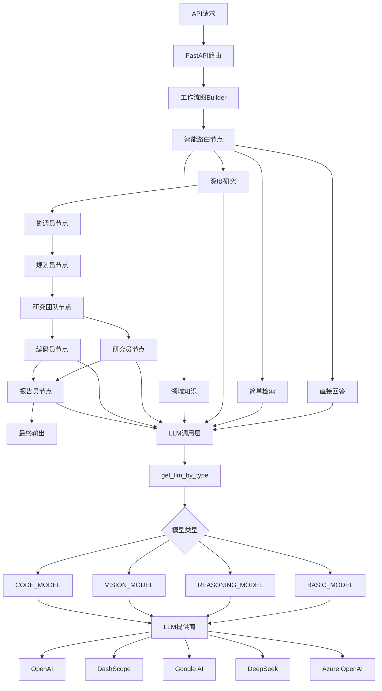

# DeerFlow 模型调用全流程与新增模型指南

## 📚 目录

1. [概述](#概述)
2. [模型调用全流程](#模型调用全流程)
3. [核心组件详解](#核心组件详解)
4. [如何添加新模型](#如何添加新模型)
5. [支持的模型类型](#支持的模型类型)
6. [配置示例](#配置示例)
7. [故障排查](#故障排查)

---

## 概述

DeerFlow 是一个基于 LangGraph 的多智能体研究框架，支持多种 LLM 提供商。本文档详细说明了模型调用的完整流程，以及如何添加新的 LLM 模型。

### 架构图



---

## 模型调用全流程

### 1️⃣ 用户请求入口

用户通过以下API发起请求：

```bash
POST /api/chat/stream
```

**关键文件：** [`src/server/app.py`](../src/server/app.py)

```python
@app.post("/api/chat/stream")
async def chat_stream(request: ChatRequest):
    # 生成thread_id
    thread_id = request.thread_id or str(uuid4())
    
    # 获取系统上下文
    system_context = get_str_env("SYSTEM_CONTEXT", "")
    
    # 启动工作流流式生成器
    return StreamingResponse(
        _astream_workflow_generator(...),
        media_type="text/event-stream"
    )
```

---

### 2️⃣ 工作流图构建

**关键文件：** [`src/graph/builder.py`](../src/graph/builder.py)

系统使用 LangGraph 构建状态机工作流：

```python
def _build_base_graph():
    builder = StateGraph(State)
    
    # 起始节点为智能路由器
    builder.add_edge(START, "router")
    builder.add_node("router", router_node)
    
    # 四种处理路径
    builder.add_node("direct_answer_node", direct_answer_node)      # 直接回答
    builder.add_node("simple_search_node", simple_search_node)      # 简单检索
    builder.add_node("domain_knowledge_node", domain_knowledge_node) # 领域知识
    
    # 深度研究路径
    builder.add_node("coordinator", coordinator_node)
    builder.add_node("planner", planner_node)
    builder.add_node("researcher", researcher_node)
    builder.add_node("reporter", reporter_node)
    
    return builder
```

---

### 3️⃣ 智能路由决策

**关键文件：** [`src/graph/nodes.py`](../src/graph/nodes.py) - `router_node`

路由节点根据查询复杂度决定处理路径：

```python
def router_node(state: State, config: RunnableConfig):
    user_query = state.get("research_topic")
    user_department = state.get("user_department", "general")
    
    # 调用分类模型
    route_decision = classify_request(
        query=user_query,
        department=user_department,
        enable_smart_routing=enable_smart_routing
    )
    
    # 路由到不同节点
    if route_decision.path == "direct_answer":
        return Command(goto="direct_answer_node")
    elif route_decision.path == "simple_search":
        return Command(goto="simple_search_node")
    elif route_decision.path == "deep_research":
        return Command(goto="coordinator")
    else:
        return Command(goto="domain_knowledge_node")
```

---

### 4️⃣ 智能体创建

**关键文件：** [`src/agents/agents.py`](../src/agents/agents.py)

每个节点通过 `create_agent` 工厂函数创建智能体：

```python
def create_agent(agent_name: str, agent_type: str, tools: list, prompt_template: str):
    # 1. 根据智能体类型获取对应的LLM
    llm = get_llm_by_type(AGENT_LLM_MAP[agent_type])
    
    # 2. 解包增强日志包装器，获取原始LLM
    raw_llm = llm
    if hasattr(llm, 'llm'):
        raw_llm = getattr(llm, 'llm', llm)
    
    # 3. 创建 ReAct Agent
    return create_react_agent(
        name=agent_name,
        model=cast(BaseChatModel, raw_llm),
        tools=tools,
        prompt=lambda state: apply_prompt_template(prompt_template, state)
    )
```

---

### 5️⃣ 智能体与模型类型映射

**关键文件：** [`src/config/agents.py`](../src/config/agents.py)

```python
# 定义支持的LLM类型
LLMType = Literal["basic", "reasoning", "vision", "code"]

# 智能体与LLM类型的映射关系
AGENT_LLM_MAP: dict[str, LLMType] = {
    "coordinator": "basic",        # 协调员使用基础模型
    "planner": "basic",            # 规划员使用基础模型
    "researcher": "reasoning",     # 研究员使用推理模型（深度思考）
    "coder": "basic",              # 编码员使用基础模型
    "reporter": "basic",           # 报告员使用基础模型
    "podcast_script_writer": "basic",
    "ppt_composer": "basic",
    "prose_writer": "basic",
    "prompt_enhancer": "basic",
}
```

---

### 6️⃣ LLM 实例获取

**关键文件：** [`src/llms/llm.py`](../src/llms/llm.py)

```python
def get_llm_by_type(llm_type: LLMType) -> Union[BaseChatModel, 'EnhancedLLMWrapper']:
    # 1. 检查缓存
    if llm_type in _llm_cache:
        return _llm_cache[llm_type]
    
    # 2. 加载配置
    conf = load_yaml_config(_get_config_file_path())
    
    # 3. 创建LLM实例
    llm = _create_llm_use_conf(llm_type, conf)
    
    # 4. 缓存实例
    _llm_cache[llm_type] = llm
    
    # 5. 包装增强日志功能
    wrapped_llm = EnhancedLLMWrapper(llm, llm_type)
    
    return wrapped_llm
```

---

### 7️⃣ LLM 实例创建

**核心逻辑：** [`src/llms/llm.py`](../src/llms/llm.py) - `_create_llm_use_conf`

```python
def _create_llm_use_conf(llm_type: LLMType, conf: Dict[str, Any]) -> BaseChatModel:
    # 1. 获取配置键（BASIC_MODEL, REASONING_MODEL等）
    config_key = _get_llm_type_config_keys().get(llm_type)
    
    # 2. 从配置文件加载配置
    llm_conf = conf.get(config_key, {})
    
    # 3. 从环境变量加载配置（优先级更高）
    env_conf = _get_env_llm_conf(llm_type)
    merged_conf = {**llm_conf, **env_conf}
    
    # 4. 根据平台类型创建相应的LLM实例
    platform = merged_conf.get("platform", "").lower()
    
    # Google AI Studio
    if platform == "google_aistudio":
        return ChatGoogleGenerativeAI(**merged_conf)
    
    # Azure OpenAI
    if "azure_endpoint" in merged_conf:
        return AzureChatOpenAI(**merged_conf)
    
    # DashScope (阿里云通义千问)
    if "dashscope." in merged_conf.get("base_url", ""):
        if llm_type == "reasoning":
            merged_conf["extra_body"] = {"enable_thinking": True}
        return ChatDashscope(**merged_conf)
    
    # DeepSeek (推理模型)
    if llm_type == "reasoning":
        return ChatDeepSeek(**merged_conf)
    
    # OpenAI兼容接口（默认）
    return ChatOpenAI(**merged_conf)
```

---

### 8️⃣ 模型调用与日志记录

**增强包装器：** [`src/llms/llm.py`](../src/llms/llm.py) - `EnhancedLLMWrapper`

```python
class EnhancedLLMWrapper:
    def invoke(self, messages, **kwargs):
        start_time = time.time()
        prompt_length = self._calculate_prompt_length(messages)
        
        # 记录调用开始
        self.enhanced_logger.logger.info(
            f"🤖 LLM_INVOKE | {self.llm_type} | 开始思考 | 提示长度: {prompt_length}"
        )
        
        # 调用实际LLM
        result = self.llm.invoke(messages, **kwargs)
        
        duration = time.time() - start_time
        response_length = len(str(result.content))
        
        # 记录调用结果
        self.enhanced_logger.log_llm_thinking(
            self.llm_type, prompt_length, response_length, duration
        )
        
        return result
```

---

### 9️⃣ 流式输出处理

**关键文件：** [`src/server/app.py`](../src/server/app.py) - `_astream_workflow_generator`

```python
async def _astream_workflow_generator(...):
    # 异步流式执行工作流
    async for event in graph.astream(initial_state, config=config):
        # 处理不同类型的事件
        if "messages" in event:
            for message in event["messages"]:
                # 提取智能体名称
                agent_name = _get_agent_name(message.metadata)
                
                # 过滤：仅reporter智能体的输出返回前端
                if agent_name == "reporter":
                    # 创建SSE事件流
                    event_data = {
                        "thread_id": thread_id,
                        "agent": agent_name,
                        "content": message.content,
                        ...
                    }
                    yield f"data: {json.dumps(event_data)}\n\n"
```

---

## 核心组件详解

### 1. 配置文件结构

**文件位置：** [`conf.yaml`](../conf.yaml)

```yaml
# 基础模型配置（必需）
BASIC_MODEL:
  base_url: https://api.deepseek.com/v1
  model: deepseek-chat
  api_key: sk-xxx
  verify_ssl: false

# 推理模型配置（可选，用于复杂推理任务）
REASONING_MODEL:
  base_url: https://api.deepseek.com/v1
  model: deepseek-reasoner
  api_key: sk-xxx
  verify_ssl: false

# 视觉模型配置（可选）
# VISION_MODEL:
#   base_url: https://api.openai.com/v1
#   model: gpt-4o
#   api_key: sk-xxx

# 代码模型配置（可选）
# CODE_MODEL:
#   base_url: http://localhost:8088/v1
#   model: qwen-coder
#   api_key: xxx
```

---

### 2. 环境变量配置

环境变量优先级 **高于** 配置文件：

```bash
# 基础模型配置
export BASIC_MODEL__API_KEY="your_api_key"
export BASIC_MODEL__BASE_URL="https://api.example.com/v1"
export BASIC_MODEL__MODEL="custom-model-name"

# 推理模型配置
export REASONING_MODEL__API_KEY="reasoning_api_key"
export REASONING_MODEL__BASE_URL="https://reasoning.example.com/v1"

# 其他配置
export AGENT_RECURSION_LIMIT="50"
export SYSTEM_CONTEXT="你是一个专业的AI助手"
```

---

### 3. 模型类型配置映射

**代码位置：** [`src/llms/llm.py`](../src/llms/llm.py)

```python
def _get_llm_type_config_keys() -> dict[str, str]:
    return {
        "reasoning": "REASONING_MODEL",  # 推理模型
        "basic": "BASIC_MODEL",          # 基础模型
        "vision": "VISION_MODEL",        # 视觉模型
        "code": "CODE_MODEL",            # 代码模型
    }
```

---

### 4. 自定义LLM提供商

**DashScope示例：** [`src/llms/providers/dashscope.py`](../src/llms/providers/dashscope.py)

```python
class ChatDashscope(ChatOpenAI):
    """扩展ChatOpenAI模型以支持推理能力"""
    
    def _create_chat_result(self, response, generation_info=None):
        chat_result = super()._create_chat_result(response, generation_info)
        
        # 提取推理内容（reasoning_content）
        if hasattr(response.choices[0].message, "reasoning_content"):
            reasoning_content = response.choices[0].message.reasoning_content
            if reasoning_content:
                chat_result.generations[0].message.additional_kwargs[
                    "reasoning_content"
                ] = reasoning_content
        
        return chat_result
```

---

## 如何添加新模型

### 方式一：使用OpenAI兼容接口（推荐）

大多数现代LLM都支持OpenAI兼容的API格式，可以直接配置使用。

#### 步骤：

1️⃣ **在 `conf.yaml` 中添加配置**

```yaml
BASIC_MODEL:
  base_url: https://your-llm-provider.com/v1  # 替换为你的API地址
  model: your-model-name                       # 替换为模型名称
  api_key: your_api_key                        # 替换为API密钥
  max_retries: 3
  verify_ssl: true  # 如果使用自签名证书，设置为false
```

2️⃣ **重启服务**

```bash
# 停止现有服务
pkill -f "python.*server.py"

# 启动新服务
python server.py
```

3️⃣ **测试验证**

```bash
curl -X POST http://localhost:8000/api/chat/stream \
  -H "Content-Type: application/json" \
  -d '{
    "messages": [{"role": "user", "content": "你好"}],
    "search_engine": "custom_search"
  }'
```

---

### 方式二：添加新的LLM提供商类

如果模型需要特殊处理（如推理内容、视觉输入等），需要自定义提供商类。

#### 步骤：

1️⃣ **创建提供商类**

在 `src/llms/providers/` 目录下创建新文件，例如 `your_provider.py`：

```python
# src/llms/providers/your_provider.py
from typing import Any, Dict, List, Optional
from langchain_core.messages import BaseMessage
from langchain_openai import ChatOpenAI

class ChatYourProvider(ChatOpenAI):
    """自定义LLM提供商"""
    
    def _create_chat_result(self, response, generation_info=None):
        # 调用父类方法
        chat_result = super()._create_chat_result(response, generation_info)
        
        # 添加自定义处理逻辑
        # 例如：提取特殊字段
        if hasattr(response.choices[0].message, "custom_field"):
            custom_data = response.choices[0].message.custom_field
            chat_result.generations[0].message.additional_kwargs[
                "custom_field"
            ] = custom_data
        
        return chat_result
    
    def _stream(self, messages, stop=None, run_manager=None, **kwargs):
        # 如果需要自定义流式处理逻辑
        kwargs["stream"] = True
        # ... 实现流式逻辑
        yield from super()._stream(messages, stop, run_manager, **kwargs)
```

2️⃣ **在 `llm.py` 中集成**

修改 [`src/llms/llm.py`](../src/llms/llm.py) 中的 `_create_llm_use_conf` 函数：

```python
from src.llms.providers.your_provider import ChatYourProvider

def _create_llm_use_conf(llm_type: LLMType, conf: Dict[str, Any]) -> BaseChatModel:
    # ... 现有代码 ...
    
    # 检测你的提供商特征
    if "your-provider-domain.com" in merged_conf.get("base_url", ""):
        return ChatYourProvider(**merged_conf)
    
    # ... 其他提供商逻辑 ...
```

3️⃣ **配置和测试**

```yaml
BASIC_MODEL:
  base_url: https://api.your-provider-domain.com/v1
  model: your-model-name
  api_key: your_api_key
```

---

### 方式三：添加新的模型类型

如果需要添加全新的模型类型（如 `EMBEDDING_MODEL`），需要修改核心配置。

#### 步骤：

1️⃣ **扩展 `LLMType` 类型定义**

修改 [`src/config/agents.py`](../src/config/agents.py)：

```python
# 添加新类型
LLMType = Literal["basic", "reasoning", "vision", "code", "embedding"]

# 更新映射关系
AGENT_LLM_MAP: dict[str, LLMType] = {
    # ... 现有映射 ...
    "embedder": "embedding",  # 新增智能体
}
```

2️⃣ **添加配置键映射**

修改 [`src/llms/llm.py`](../src/llms/llm.py) 中的 `_get_llm_type_config_keys`：

```python
def _get_llm_type_config_keys() -> dict[str, str]:
    return {
        "reasoning": "REASONING_MODEL",
        "basic": "BASIC_MODEL",
        "vision": "VISION_MODEL",
        "code": "CODE_MODEL",
        "embedding": "EMBEDDING_MODEL",  # 新增
    }
```

3️⃣ **在配置文件中添加配置**

```yaml
EMBEDDING_MODEL:
  base_url: https://api.openai.com/v1
  model: text-embedding-3-large
  api_key: sk-xxx
```

4️⃣ **创建使用新模型的智能体**

```python
from src.llms.llm import get_llm_by_type

# 获取嵌入模型
embedding_llm = get_llm_by_type("embedding")
```

---

## 支持的模型类型

### 1. 基础模型 (BASIC_MODEL) - 必需

- **用途：** 常规对话、简单任务、协调工作
- **智能体：** coordinator, planner, coder, reporter
- **推荐模型：**
  - GPT-4o
  - DeepSeek-Chat
  - Qwen-Plus
  - Claude-3-5-Sonnet

### 2. 推理模型 (REASONING_MODEL) - 可选

- **用途：** 复杂推理、深度分析、研究任务
- **智能体：** researcher
- **推荐模型：**
  - DeepSeek-R1
  - GPT-o1
  - Qwen-Thinking
  - 豆包思考模型

### 3. 视觉模型 (VISION_MODEL) - 可选

- **用途：** 图像理解、视觉问答
- **推荐模型：**
  - GPT-4o
  - Claude-3-5-Sonnet
  - Qwen-VL-Max

### 4. 代码模型 (CODE_MODEL) - 可选

- **用途：** 代码生成、调试、优化
- **推荐模型：**
  - GPT-4o
  - DeepSeek-Coder
  - Qwen-Coder

---

## 配置示例

### OpenAI

```yaml
BASIC_MODEL:
  base_url: https://api.openai.com/v1
  model: gpt-4o
  api_key: sk-xxx
  max_retries: 3

REASONING_MODEL:
  base_url: https://api.openai.com/v1
  model: o1-preview
  api_key: sk-xxx
```

---

### DeepSeek

```yaml
BASIC_MODEL:
  base_url: https://api.deepseek.com/v1
  model: deepseek-chat
  api_key: sk-xxx
  verify_ssl: false

REASONING_MODEL:
  base_url: https://api.deepseek.com/v1
  model: deepseek-reasoner
  api_key: sk-xxx
  verify_ssl: false
```

---

### 阿里云 DashScope（通义千问）

```yaml
BASIC_MODEL:
  base_url: https://dashscope.aliyuncs.com/compatible-mode/v1
  model: qwen-plus
  api_key: sk-xxx
  verify_ssl: false

REASONING_MODEL:
  base_url: https://dashscope.aliyuncs.com/compatible-mode/v1
  model: qwen-plus
  api_key: sk-xxx
  extra_body:
    enable_thinking: true
```

---

### Google AI Studio（Gemini）

```yaml
BASIC_MODEL:
  platform: google_aistudio
  model: gemini-2.5-flash
  api_key: xxx  # 从 https://aistudio.google.com/app/apikey 获取
  max_retries: 3
```

---

### Azure OpenAI

```yaml
BASIC_MODEL:
  azure_endpoint: https://your-resource.openai.azure.com/
  model: gpt-4
  api_key: xxx
  api_version: "2024-02-01"
```

---

### 本地部署模型（vLLM/Ollama）

```yaml
BASIC_MODEL:
  base_url: http://localhost:8088/v1
  model: qwen2.5:14b
  api_key: not-needed
  verify_ssl: false
```

**注意：** 如需 Function Call 支持，vLLM 启动时需添加：

```bash
vllm serve your-model \
  --enable-auto-tool-choice \
  --tool-call-parser hermes
```

---

## 故障排查

### 问题1：SSL证书验证失败

**症状：**
```
SSL: CERTIFICATE_VERIFY_FAILED
```

**解决：**
```yaml
BASIC_MODEL:
  # ... 其他配置 ...
  verify_ssl: false  # 禁用SSL验证
```

---

### 问题2：模型未配置

**症状：**
```
ValueError: No configuration found for LLM type: reasoning
```

**解决：**
- 确保在 `conf.yaml` 中配置了对应的模型类型
- 或通过环境变量配置：
  ```bash
  export REASONING_MODEL__BASE_URL="https://api.example.com/v1"
  export REASONING_MODEL__MODEL="model-name"
  export REASONING_MODEL__API_KEY="your-key"
  ```

---

### 问题3：API密钥失效

**症状：**
```
401 Unauthorized
```

**解决：**
- 检查API密钥是否正确
- 确认密钥权限和配额
- 更新配置后重启服务

---

### 问题4：模型不支持Function Call

**症状：**
- 工具调用失败
- 智能体无法使用搜索工具

**解决：**
- 确认模型支持 Function Call 功能
- vLLM部署时添加必要参数：
  ```bash
  --enable-auto-tool-choice --tool-call-parser hermes
  ```

---

### 问题5：推理内容丢失

**症状：**
- DeepSeek推理模型的思考过程未显示

**解决：**
- 确保使用 `ChatDashscope` 或 `ChatDeepSeek` 类
- 检查 `_create_chat_result` 方法是否正确提取 `reasoning_content`

---

### 问题6：日志输出异常

**症状：**
- 终端无彩色输出
- 日志格式错误

**解决：**
```python
# 在 app.py 中确认日志初始化
setup_enhanced_logging(level=logging.INFO, enable_colors=True)
```

---

## 调试技巧

### 1. 查看详细日志

```bash
# 设置日志级别为DEBUG
export LOG_LEVEL=DEBUG

# 启动服务
python server.py
```

### 2. 测试LLM连接

```bash
# 使用调试脚本
python middlewares/llm/debug_llm_connection.py
```

### 3. 检查配置加载

```python
from src.llms.llm import get_configured_llm_models

# 查看已配置的模型
configured = get_configured_llm_models()
print(configured)
# 输出示例: {'basic': ['deepseek-chat'], 'reasoning': ['deepseek-reasoner']}
```

---

## 最佳实践

### 1. 模型选择建议

- **协调和规划：** 使用快速的基础模型（如 GPT-4o-mini, Qwen-Plus）
- **研究任务：** 使用推理模型（如 DeepSeek-R1, GPT-o1）
- **报告生成：** 使用高质量基础模型（如 GPT-4o, Claude-3.5-Sonnet）

### 2. 成本优化

```yaml
# 使用不同价格的模型组合
BASIC_MODEL:
  model: gpt-4o-mini  # 低成本模型用于简单任务

REASONING_MODEL:
  model: deepseek-reasoner  # 高性能模型用于复杂任务
```

### 3. 安全配置

```bash
# 使用环境变量保护敏感信息
export BASIC_MODEL__API_KEY="${YOUR_SECRET_KEY}"

# 不要在配置文件中硬编码密钥
```

### 4. 容错配置

```yaml
BASIC_MODEL:
  max_retries: 3  # 自动重试
  timeout: 60     # 超时时间（秒）
```

---

## 参考资源

### 核心文件

- [`src/llms/llm.py`](../src/llms/llm.py) - LLM核心实现
- [`src/config/agents.py`](../src/config/agents.py) - 智能体配置
- [`src/agents/agents.py`](../src/agents/agents.py) - 智能体工厂
- [`src/graph/builder.py`](../src/graph/builder.py) - 工作流构建
- [`src/graph/nodes.py`](../src/graph/nodes.py) - 节点实现
- [`src/server/app.py`](../src/server/app.py) - API服务

### 配置文件

- [`conf.yaml`](../conf.yaml) - 主配置文件
- [`.env`](../.env) - 环境变量配置

### 测试文件

- [`tests/unit/llms/`](../tests/unit/llms/) - LLM单元测试
- [`middlewares/llm/debug_llm_connection.py`](../middlewares/llm/debug_llm_connection.py) - 连接调试

---

## 常见问题 (FAQ)

### Q1: 可以同时使用多个不同的模型提供商吗？

**A:** 可以！例如：

```yaml
BASIC_MODEL:
  base_url: https://api.openai.com/v1
  model: gpt-4o
  api_key: sk-xxx

REASONING_MODEL:
  base_url: https://api.deepseek.com/v1
  model: deepseek-reasoner
  api_key: sk-yyy
```

### Q2: 如何临时切换模型而不修改配置文件？

**A:** 使用环境变量：

```bash
export BASIC_MODEL__MODEL="gpt-4o-mini"
python server.py
```

### Q3: 推理模型的思考过程在哪里查看？

**A:** 
- 思考过程通过 `reasoning_content` 字段返回
- 在API响应的 `additional_kwargs` 中
- 前端可通过SSE事件流接收并显示

### Q4: 如何禁用某个智能体类型？

**A:** 修改 `AGENT_LLM_MAP`，指向已配置的模型类型：

```python
AGENT_LLM_MAP = {
    # 将researcher从reasoning改为basic（禁用推理能力）
    "researcher": "basic",
}
```

### Q5: 本地模型如何启用Function Call？

**A:** vLLM启动示例：

```bash
vllm serve Qwen/Qwen2.5-7B-Instruct \
  --enable-auto-tool-choice \
  --tool-call-parser hermes \
  --port 8088
```

---

## 版本历史

- **v0.1.0** (2025-01) - 初始版本
  - 支持 OpenAI, DeepSeek, DashScope, Google AI, Azure OpenAI
  - 四种模型类型：basic, reasoning, vision, code
  - 增强日志系统集成

---

## 贡献指南

欢迎提交Issue和PR！

如需添加新的模型提供商支持：

1. Fork本仓库
2. 在 `src/llms/providers/` 创建新文件
3. 修改 `src/llms/llm.py` 中的 `_create_llm_use_conf`
4. 添加配置示例到本文档
5. 提交PR

---

## 许可证

Copyright (c) 2025 Bytedance Ltd. and/or its affiliates  
SPDX-License-Identifier: MIT
