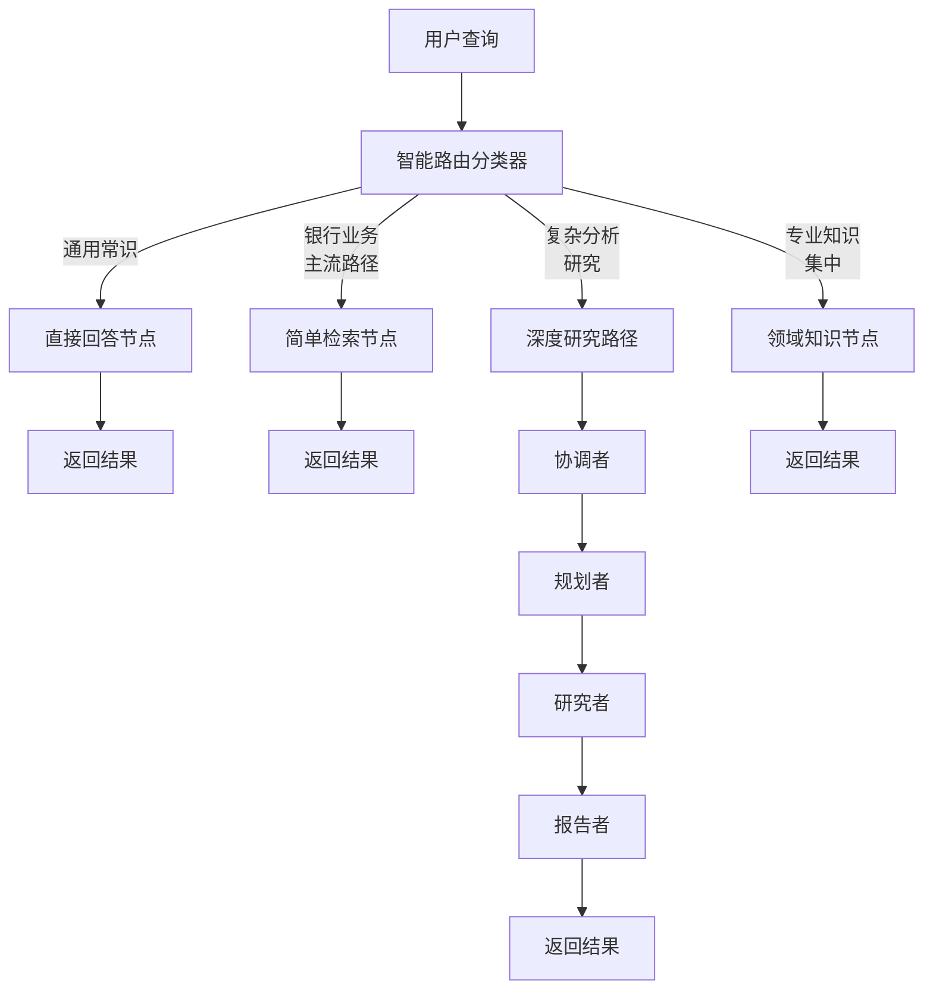

# DeerFlow 智能路由系统 - 4种路径设计

## 概述

DeerFlow 智能路由系统已从原有的3种路径升级为4种路径，专为银行业务场景优化设计。新的路由系统能够更精准地识别用户意图，并选择最合适的处理路径。

## 4种路径详解

### 1. 直接回答 (direct_answer)

**适用场景：**
- ✅ 通用常识性问题，不需要外部检索
- ✅ 基础概念、定义类问题（如"什么是汽车"、"什么是互联网"）
- ✅ 简单数学计算、日期时间查询
- ✅ 非银行业务相关的通用知识
- ✅ LLM训练数据中包含的基础知识

**特点：**
- 不走检索，直接使用LLM的通用知识回答
- 响应速度最快
- 适用于非专业领域的基础问题

**示例：**
```
用户: "什么是汽车？"
系统: [直接回答路径] → 使用LLM通用知识回答
```

**节点：** `direct_answer_node`

### 2. 简单检索 (simple_search) - **主流路径**

**适用场景：**
- ✅ 银行业务相关的常规问题
- ✅ 金融产品介绍、业务流程查询
- ✅ 专业度适中，主流业务知识
- ✅ 单次检索即可获得答案
- ✅ 信息相对集中，不需要多源对比

**特点：**
- **默认主流路径** - 大部分银行业务查询走这个路径
- 单次检索，快速响应
- 结合检索结果和LLM生成答案
- 平衡了准确性和效率

**示例：**
```
用户: "信用卡如何申请？"
系统: [简单检索路径] → 检索相关信息 → 生成回答
```

**节点：** `simple_search_node`

### 3. 深度研究 (deep_research)

**适用场景：**
- ✅ 需要多维度分析的复杂问题
- ✅ 需要综合多个来源的信息
- ✅ 趋势分析、对比研究类问题
- ✅ 知识比较分散，需要多次检索
- ✅ 研究性、分析性问题

**特点：**
- 使用完整的研究流程（原有的深度研究路径）
- 通过 coordinator → planner → researcher → reporter
- 支持多轮迭代、计划制定、深度分析
- 生成详细的研究报告

**示例：**
```
用户: "分析金融科技对传统银行的影响趋势"
系统: [深度研究路径] → 制定计划 → 多轮研究 → 生成报告
```

**节点：** `coordinator` (入口)

### 4. 领域知识 (domain_knowledge)

**适用场景：**
- ✅ 高度专业化的银行内部知识
- ✅ 特定产品规则、内部流程
- ✅ 专业术语、监管要求
- ✅ 知识高度集中但专业性强
- ✅ 需要特定领域知识库

**特点：**
- 优先使用本地知识库/专业数据源
- 适合高度专业化但知识集中的场景
- 提供详细的专业解答（400-600字）
- 包含具体规则、条款和技术细节

**示例：**
```
用户: "交通银行沃德财富卡的积分规则"
系统: [领域知识路径] → 查询专业知识库 → 详细解答
```

**节点：** `domain_knowledge_node`

## 路由决策流程



## 分类规则

### 1. 优先级
```
直接回答 < 简单检索(主流) < 深度研究 < 领域知识
```

### 2. 默认原则
有疑问时选择 **"simple_search"（简单检索）**

### 3. 复杂度判断
- `simple`: 通用常识，不需检索
- `medium`: 主流业务，单次检索
- `complex`: 分析研究，多次检索
- `expert`: 专业知识，领域检索

### 4. 检索判断
| 路径 | needs_search | 说明 |
|------|--------------|------|
| direct_answer | false | 不需要检索 |
| simple_search | true | 单次检索 |
| deep_research | true | 多次检索 |
| domain_knowledge | true | 专业检索 |

### 5. 置信度
- 0.9-1.0: 非常明确
- 0.7-0.9: 较为明确
- 0.5-0.7: 一般明确（默认simple_search）
- <0.5: 不确定（默认simple_search）

## 分类器实现

### 主分类器
- **文件：** `src/graph/classifier.py`
- **核心函数：** `classify_request(query, department, enable_smart_routing)`
- **返回模型：** `RouteDecision`

### RouteDecision 模型
```python
class RouteDecision(BaseModel):
    path: Literal["direct_answer", "simple_search", "deep_research", "domain_knowledge"]
    complexity: Literal["simple", "medium", "complex", "expert"]
    needs_search: bool
    confidence: float  # 0-1之间
    reasoning: str
```

### 分类方法
1. **LLM智能分类（主方法）**
   - 使用LLM分析查询内容
   - 结合银行业务场景的详细提示词
   - 生成结构化的路由决策

2. **规则后备分类（备用方法）**
   - 基于关键词的启发式规则
   - 在LLM分类失败时使用
   - 确保系统稳定性

## 关键文件修改

### 1. src/graph/classifier.py
- ✅ 更新 `RouteDecision` 模型为4种路径
- ✅ 修改分类提示词，针对银行业务场景
- ✅ 重写 `_fallback_classification` 函数
- ✅ 将 `department_match` 字段改为 `needs_search`

### 2. src/graph/nodes.py
- ✅ 更新 `router_node` 支持4种路径
- ✅ 新增 `direct_answer_node` 节点
- ✅ 重命名 `simple_qa_node` 为 `simple_search_node`
- ✅ 新增 `domain_knowledge_node` 节点
- ✅ 保留 `department_node` 作为兼容

### 3. src/graph/builder.py
- ✅ 导入新的节点函数
- ✅ 在图中注册4种路径节点
- ✅ 配置各节点的边和终止条件

### 4. src/graph/types.py
- ℹ️ State 类型定义保持不变（已兼容）

## 使用示例

### 基本调用
```python
from src.graph.classifier import classify_request

# 直接回答示例
result = classify_request("什么是汽车？")
# result.path == "direct_answer"

# 简单检索示例
result = classify_request("信用卡如何申请？")
# result.path == "simple_search"

# 深度研究示例
result = classify_request("分析金融科技对传统银行的影响趋势")
# result.path == "deep_research"

# 领域知识示例
result = classify_request("SWIFT报文MT103的字段说明")
# result.path == "domain_knowledge"
```

### 完整工作流
```python
from src.graph.builder import graph

# 配置
config = {
    "configurable": {
        "thread_id": "test_thread_001",
        "enable_smart_routing": True,
        "user_department": "general"
    }
}

# 调用图
result = graph.invoke(
    {
        "messages": [{"role": "user", "content": "信用卡如何申请？"}],
        "research_topic": "信用卡如何申请？"
    },
    config=config
)

print(result["final_report"])
```

## 测试

### 运行测试脚本
```bash
# 测试4种路径的分类
python test_routing_paths.py
```

### 预期测试结果
- 直接回答：识别通用常识问题
- 简单检索：识别主流银行业务查询（主流路径）
- 深度研究：识别分析、研究类复杂问题
- 领域知识：识别高度专业的银行知识

## 优势与特点

### 1. 精准路由
- 根据问题特性自动选择最优处理路径
- 避免简单问题走复杂流程
- 避免复杂问题处理不当

### 2. 效率优化
- 简单问题快速响应（直接回答/简单检索）
- 复杂问题深度分析（深度研究）
- 专业问题精准解答（领域知识）

### 3. 资源优化
- 不同复杂度使用不同资源
- 避免过度检索和计算
- 降低系统负载

### 4. 用户体验
- 简单问题秒级响应
- 复杂问题深度解答
- 专业问题准确可靠

### 5. 可扩展性
- 每种路径独立节点，易于维护
- 可针对特定路径优化
- 支持添加新路径类型

## 配置选项

### 启用/禁用智能路由
```python
# 启用智能路由（默认）
config = {"enable_smart_routing": True}

# 禁用智能路由（使用默认simple_search）
config = {"enable_smart_routing": False}
```

### 指定用户部门
```python
config = {"user_department": "credit_card"}  # 信用卡部门
```

## 监控与日志

系统使用 `enhanced_logger` 记录详细的路由决策过程：

```
🔍 CLASSIFIER_START | 查询: '信用卡如何申请？' | 部门: general
✅ CLASSIFIER_RESULT | 路径: simple_search | 复杂度: medium | 置信度: 0.85
🎯 ROUTING_DECISION | 路径: simple_search | 理由: 查询包含业务关键词
```

## 未来优化方向

1. **动态阈值调整**
   - 根据历史数据优化分类阈值
   - 提高分类准确率

2. **用户反馈学习**
   - 收集用户对路由结果的反馈
   - 持续优化分类模型

3. **多模态支持**
   - 支持图片、文件等输入
   - 根据输入类型选择路径

4. **性能监控**
   - 统计各路径的使用频率
   - 监控响应时间和成功率

## 常见问题

### Q1: 如何判断某个查询应该走哪个路径？
A1: 系统会自动分析查询内容，但基本原则是：
- 通用常识 → 直接回答
- 银行业务常规问题 → 简单检索（主流）
- 需要分析研究 → 深度研究
- 高度专业知识 → 领域知识

### Q2: 简单检索和领域知识的区别是什么？
A2: 
- 简单检索：适用于主流银行业务，单次检索，信息相对集中
- 领域知识：适用于高度专业化知识，需要专业知识库，详细解答

### Q3: 如果分类错误怎么办？
A3: 
- 系统有规则后备方案，确保基本可用
- 可通过日志分析分类错误原因
- 未来会添加用户反馈机制

### Q4: 为什么简单检索是主流路径？
A4: 因为大部分银行业务查询都是常规问题，单次检索就能解决，既保证了准确性又提高了效率。

## 总结

DeerFlow的4种路径智能路由系统为银行业务场景提供了精准、高效的问题处理机制：

1. **直接回答** - 快速处理通用常识
2. **简单检索** - 主流路径，处理常规银行业务
3. **深度研究** - 复杂分析，多轮迭代
4. **领域知识** - 专业解答，知识库支撑

通过智能分类和精准路由，系统能够在保证答案质量的同时，最大化响应速度和资源利用率。
