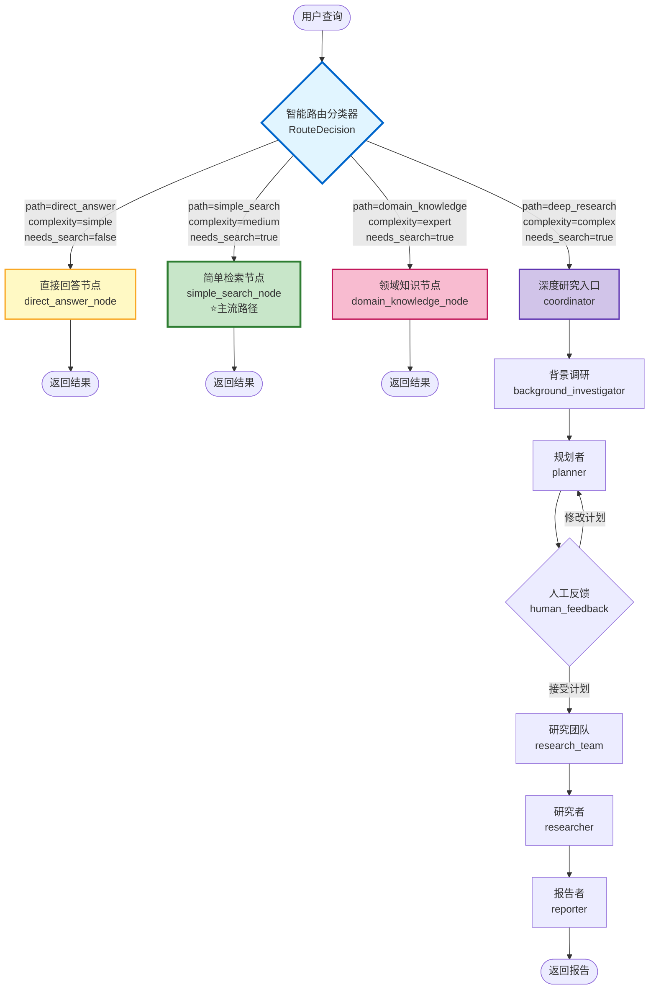
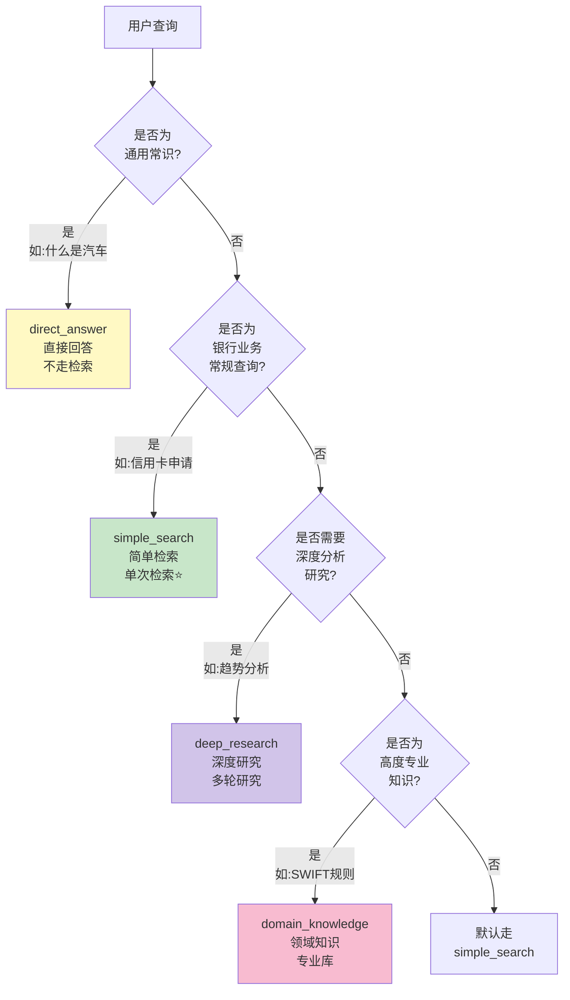
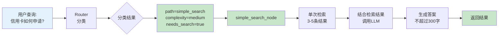
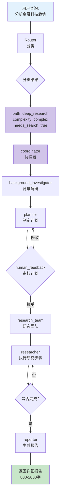
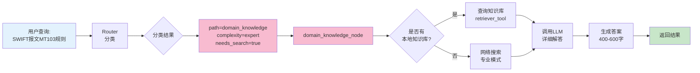
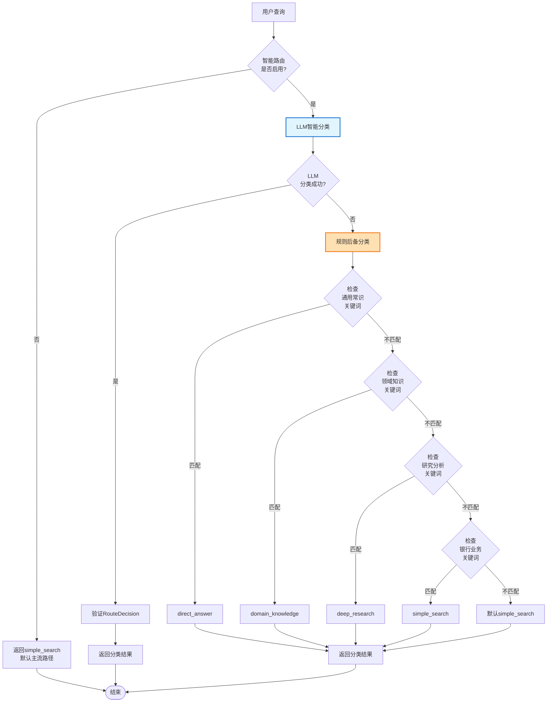
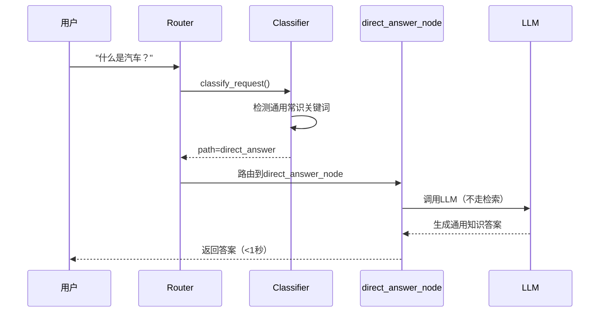
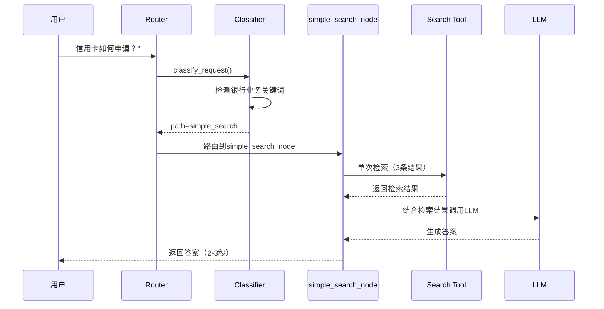
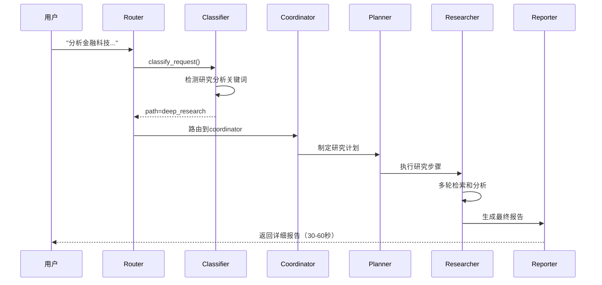
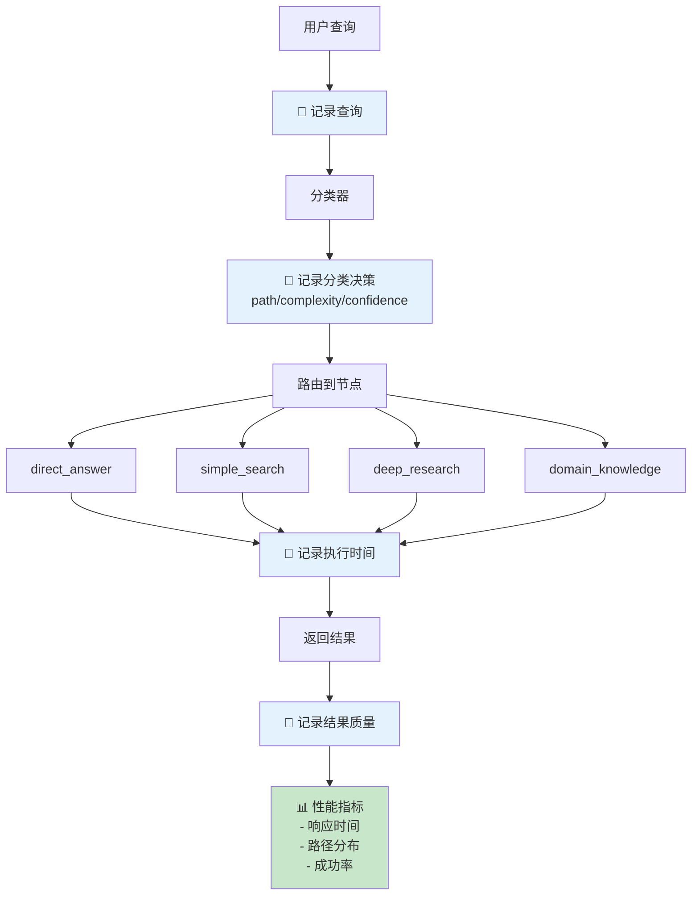

# DeerFlow 智能路由系统流程图

## 整体架构流程

## 路由分类决策树

## 4种路径详细流程

### 路径1: 直接回答 (direct_answer)

**特点:**
- ⚡ 最快速度（不走检索）
- 📚 使用LLM通用知识
- 🎯 适合基础概念问题

### 路径2: 简单检索 (simple_search) - 主流路径

**特点:**
- ⭐ **主流路径**（65%查询）
- 🔍 单次检索，快速响应
- 🏦 专为银行业务优化

### 路径3: 深度研究 (deep_research)

**特点:**
- 🔬 最完整的研究流程
- 📊 多轮迭代，深度分析
- 📄 生成详细报告

### 路径4: 领域知识 (domain_knowledge)

**特点:**
- 🎓 高度专业化
- 📚 优先使用知识库
- 📝 详细的专业解答

## 分类器内部逻辑

## 典型查询示例流程

### 示例1: "什么是汽车？"

### 示例2: "信用卡如何申请？"

### 示例3: "分析金融科技对传统银行的影响"

## 性能对比流程

### 改造前的流程（3路径）

**问题:** 通用问题也走检索，浪费资源

### 改造后的流程（4路径）

**优化:** 直接回答，节省检索成本

## 监控和日志流程

## 总结

### 4种路径的典型特征

| 路径 | 响应时间 | 检索次数 | 答案长度 | 使用频率 |
|------|----------|----------|----------|----------|
| direct_answer | <1s | 0 | 100-300字 | 10% |
| simple_search | 2-3s | 1次 | 200-300字 | **65%** ⭐ |
| deep_research | 30-60s | 多次 | 800-2000字 | 15% |
| domain_knowledge | 3-5s | 1次 | 400-600字 | 10% |

### 关键设计原则

1. **效率优先** - 简单问题快速处理
2. **准确为本** - 复杂问题深度分析
3. **专业保障** - 领域知识精准解答
4. **智能路由** - 自动选择最优路径

---

**流程图版本:** v2.0  
**更新日期:** 2025-11-04  
**状态:** ✅ 已完成
